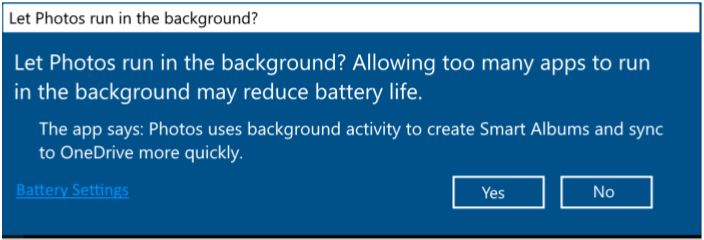

<!-- Method syntax.
public IAsyncOperation<bool> BackgroundExecutionManager.RequestAccessKindAsync(BackgroundAccessRequestKind requestedAccess, String reason)
-->

# Windows.ApplicationModel.Background.BackgroundExecutionManager.RequestAccessKindAsync

## -description

Prompts the user whether they consent to allow the app to perform the specified level of background activity in the background. On the Desktop OS Edition this may present a prompt to the user for their consent.

## -parameters
### -param requestedAccess
The type of background activity the app wishes to perform.

### -param reason
The string to display in the prompt that the system will raise to the user to describe why the app is requesting to run in the background. For example, the string that appears after "The app says:"

## -returns

**True** indicates that the user or the system approved the requested background activity; **false**, otherwise.

## -remarks

## -see-also

## -examples
