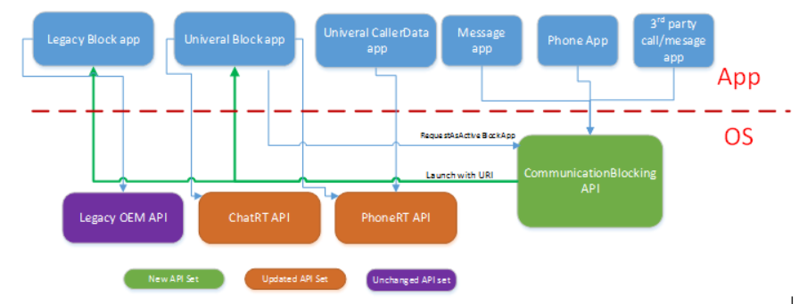

# Windows.ApplicationModel.CommunicationBlocking

## -description

Enables applications to support blocking calls and messages.

## -remarks

This API can be used by messaging and phone call applications in order to block incoming calls and messages. This API also enables you to pull up the app responsible for handling communication blocking. The following diagram shows how different applications interact with the communication blocking API.


The CommunicationBlockingAccessManager class is used to determine whether or not call and message blocking is currently active and display a collection of user interfaces. This includes showing the blocked calls and messages, presenting the user an option to block a number, and enabling the user to unblock a number.

A user can install multiple applications that are capable of filtering messages and calls. However, only one of these blocking applications can be active at a time. Use [CommunicationBlockingAppManager](communicationblockingappmanager.md) to determine whether or not your application is the currently active blocking app. You can also use [CommunicationBlockingAppManager](communicationblockingappmanager.md) to pull up a user interface so the user can select the currently active blocking app. When an application is selected to be the active call blocking app, it will be notified by [CommunicationBlockingAppSetAsActiveTrigger](../windows.applicationmodel.background/communicationblockingappsetasactivetrigger.md).

All functions that show interfaces are modeled as app-to-app calls.

You need to register for the following triggers in your application if you want it to be shown in the list of blocking applications.

+ [CommunicationBlockingAppSetAsActiveTrigger](../windows.applicationmodel.background/communicationblockingappsetasactivetrigger.md)
+ [PhoneTrigger](../windows.applicationmodel.background/phonetrigger.md) with a [TriggerType](../windows.applicationmodel.background/phonetrigger_triggertype.md) of **CallBlocked**.
+ [ChatMessageNotificationTrigger](../windows.applicationmodel.background/chatmessagenotificationtrigger.md)
+ [ChatMessageReceivedNotificationTrigger](../windows.applicationmodel.background/chatmessagereceivednotificationtrigger.md)

In order to use this API, you will need to define a new category in your application manifest file.

```
<Extension Category="windows.CommunicationBlockingProvider" />
```

In order to access blocked messages, you need to define a new capability in your application manifest file.

```
<Capabilities>
    <DeviceCapability Name="blockedChatMessage" />
</Capabilities>
```

For a sample of how to implement this in your app, see [Communication blocking and filtering](https://github.com/microsoft/Windows-universal-samples/tree/main/archived/CommunicationBlockAndFilter).

## -examples

## -see-also

[Communication blocking and filtering sample (Windows 10)](https://github.com/microsoft/Windows-universal-samples/tree/main/archived/CommunicationBlockAndFilter)
