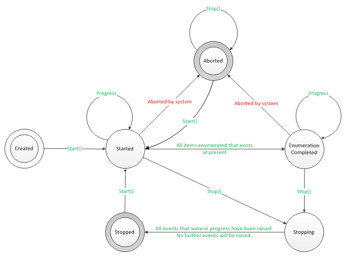

<!-- Method syntax
public void Start()
-->

# Windows.Devices.Enumeration.Pnp.PnpObjectWatcher.Start

## -description

> [!IMPORTANT]
> We no longer recommend that you use the types in the **Windows.Devices.Enumeration.Pnp** namespace. Instead, the types in the [Windows.Devices.Enumeration](/uwp/api/windows.devices.enumeration) namespace implement a modern, and better maintained, superset of the functionality of **Windows.Devices.Enumeration.Pnp**.
>
> The alternative to **PnpObjectType** is the [Windows.Devices.Enumeration.DeviceInformationKind](/uwp/api/windows.devices.enumeration.deviceinformationkind) enum, which you can pass as a parameter to **Windows.Devices.Enumeration** APIs. For example, instead of using **PnpObjectType** when you create a **PnpObjectWatcher**, use **DeviceInformationKind** when you create a [DeviceWatcher](/uwp/api/windows.devices.enumeration.devicewatcher).

Starts raising the events to inform the client that a [PnpObject](pnpobject.md) has been added, updated, or removed.

## -remarks
An app calls Start to begin the search for devices. During this initial enumeration, the [PnpObjectWatcher](pnpobjectwatcher.md) raises an [Added](pnpobjectwatcher_added.md) event for each device that's found, until all devices are found. The [PnpObjectWatcher](pnpobjectwatcher.md) raises an [EnumerationCompleted](pnpobjectwatcher_enumerationcompleted.md) event when the initial enumeration is complete, and continues to raise events if a device is added, updated, or removed.

The Start method can only be called when the [PnpObjectWatcher](pnpobjectwatcher.md) is in the **Created**, **Stopped** or **Aborted** state. The [Status](pnpobjectwatcher_status.md) property indicates the [PnpObjectWatcher](pnpobjectwatcher.md) state. When re-starting the watcher, wait for the [Stopped](pnpobjectwatcher_stopped.md) event before calling Start.

The following diagram shows how the [PnpObjectWatcher](pnpobjectwatcher.md) transitions between the states represented by [DeviceWatcherStatus](../windows.devices.enumeration/devicewatcherstatus.md) enumeration.

</img>

## -examples

## -see-also
