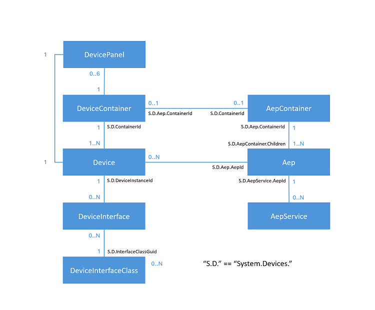
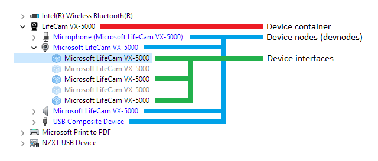
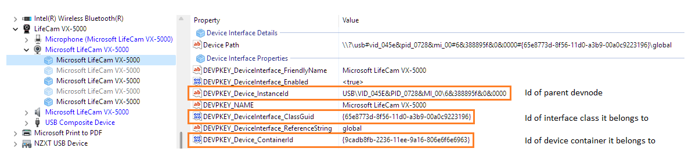
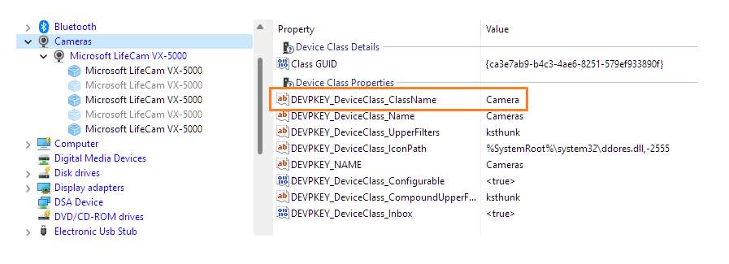
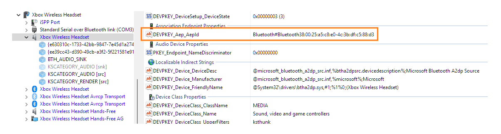
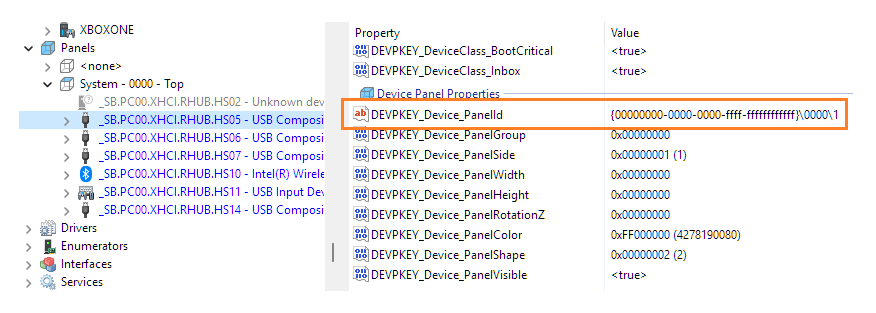

<!-- Enumeration syntax
public enum Windows.Devices.Enumeration.DeviceInformationKind : int
-->

# DeviceInformationKind

## -description

Defines constants that specify a kind of [DeviceInformation](deviceinformation.md) object.

## -enum-fields

### -field Unknown:0

The object is of an unknown type. This value is not used.

### -field DeviceInterface:1

The [DeviceInformation](deviceinformation.md) object represents a PnP device interface. These are exposed by device drivers to enable an app to talk to the device, typically using device IOCTLS (input output controls).

This type of [DeviceInformation](deviceinformation.md) object contains all the properties of the PnP *DeviceInterface* object plus some properties from the parent PnP *DeviceContainer* object. This combination of properties can be presented to the user when the user needs to select a device to complete an app scenario. A *DeviceInterface* object can only be a child to one *DeviceContainer* object.

This is the default DeviceInformationKind when enumerating devices without specifying a specific kind.

The [Id](deviceinformation_id.md) for this object is the device interface id, or the device interface path.

### -field DeviceContainer:2

The [DeviceInformation](deviceinformation.md) object represents a device container. *DeviceContainer* objects describe a collection of device objects that exist in the same physical device. For example, a multi-function printer may have several different devices included, but they would all exist as part of the parent *DeviceContainer* object.

The [Id](deviceinformation_id.md) for this object is the device container [GUID](/windows/win32/api/guiddef/ns-guiddef-guid) as a string.

### -field Device:3

The [DeviceInformation](deviceinformation.md) object represents a device object. This could also be referred to as a devnode. These devices are objects that represent a piece of the device functionality and optionally have drivers loaded on them. When a physical device is paired with windows, multiple *Device* objects are created for it. A device contains 0 or more *DeviceInterface* objects, is a child to one *DeviceContainer* object, and is related to 0 or 1 *AssociationEndpoint* objects.

The [Id](deviceinformation_id.md) for this object is the device instance id for this object.

### -field DeviceInterfaceClass:4

The [DeviceInformation](deviceinformation.md) object represents a device interface class. Every *DeviceInterface* object belongs to a certain *DeviceInterfaceClass*. This is similar to a contract definition. These contracts are represented with an id and properties, just like every other PnP object. *DeviceInterfaceClass* objects contain little more information than a unique identifier and possibly a name.

The [Id](deviceinformation_id.md) for this object is the device interface class [GUID](/windows/win32/api/guiddef/ns-guiddef-guid) as a string.

### -field AssociationEndpoint:5

The [DeviceInformation](deviceinformation.md) object represents a device association endpoint (AEP). AEPs usually represent a device discovered over a wireless or network protocol. Some of these endpoints can be used without needing to first pair the device. Use [CanPair](deviceinformationpairing_canpair.md) to determine if a device supports pairing and [IsPaired](deviceinformationpairing_ispaired.md) to determine if a device is already paired with the system. Only *AssociationEndpoint* objects have a non-NULL value for [Pairing](deviceinformation_pairing.md). For more information about pairing over a network, see [Enumerate devices over a network](/windows/uwp/devices-sensors/enumerate-devices-over-a-network). An *AssociationEndpoint* object is a child of a single *AssociationEndpointContainer* object and can contain 0 or more *AssociationEndpointService* objects.

The [Id](deviceinformation_id.md) for this object.

### -field AssociationEndpointContainer:6

The [DeviceInformation](deviceinformation.md) object represents an association endpoint (AEP) container. An *AssociationEndpointContainer* object represents a single physical device that might have more than one *AssociationEndpoint* objects associated with it. For example, if a television supports two different network protocols, the *AssociationEndpointContainer* would be the television. It would also have two *AssociationEndpoint* objects to represent each protocol.

The [Id](deviceinformation_id.md) for this object is the AEP container [GUID](/windows/win32/api/guiddef/ns-guiddef-guid) as a string.

### -field AssociationEndpointService:7

The [DeviceInformation](deviceinformation.md) object represents an association endpoint (AEP) Service. An *AssociationEndpointService* object represents a functional service contract exposed by the device. Not all protocols support AEP services. An *AssociationEndpointService* can have a single parent *AssociationEndpointContainer* object.

The [Id](deviceinformation_id.md) for this object as a string.

### -field DevicePanel:8

The [DeviceInformation](deviceinformation.md) object represents a single physical face of a device enclosure.

The [Id](deviceinformation_id.md) for this object as a string.

### -field AssociationEndpointProtocol:9

The [DeviceInformation](deviceinformation.md) object represents a protocol through which association endpoints (AEPs) can be discovered. You can scope an association endpoint discovery to specific protocols by using the protocol ID. For example, the following selector scopes discovery to Bluetooth LE or Bluetooth Classic.

See **Remarks** for more info.

## -remarks

A **DeviceInformationKind** value can be passed to the various enumeration APIs to indicate the specific kind of device you want to enumerate. In most scenarios, you will receive the [DeviceInformation](deviceinformation.md) from the device selector. To see how to enumerate over specific kinds of devices using DeviceInformationKind, see [Enumerate devices](/windows/uwp/devices-sensors/enumerate-devices).

The following diagram shows how the different device types interact with each other. It also indicates the properties that tie the relationships together. For performance reasons, many of the relationship connections go in only one direction. The exception to this is **AepContainer**. It contains a list of its child objects thanks to **System.Devices.AepContainer.Children**.



Each line in the diagram above represents how the relationships between the object types are defined. A primary object has a *core object Id*. And then there's a property on the related object whose value equals that core object Id.

For example, there are 0 to N **DeviceInterface** objects for a **DeviceInterfaceClass**. So 0 to N **DeviceInterface** objects exist that are of the device interface class represented by the **DeviceInterfaceClass** object. The **DeviceInterfaceClass** object's core object Id is a device interface class GUID. **DeviceInterface** objects in turn have a property named *DEVPKEY_DeviceInterface_ClassGuid*. The value of that property (a GUID) indicates what the **DeviceInterface** object's device interface class is (that is, what type of interface it is). And of course that value is equal to the core object Id of the related **DeviceInterfaceClass** object.

Let's see some more examples. Below is an example of how the device objects map on a webcam. You can see one container, four device nodes (devnodes for short), and the expanded devnode has five device interfaces (three of which are enabled).



Looking at the properties of the selected (highlighted) device interface, you can see how the properties are used to tie the object model together. The key names shown are in fact the Win32 versions (for example, *DEVPKEY_DeviceInterface_ClassGuid*). In the Windows Runtime (WinRT), the properties are mapped by the property system (see [Devices (Windows Property System)](/windows/win32/properties/devices-bumper)), So the equivalent of *DEVPKEY_DeviceInterface_ClassGuid* is *System.Device.InterfaceClassGuid*.



For example, if you know a device interface class Id (also known as the Class GUID), then you can find the device interface class object with that Id (which is its core Id). In the illustration below, you can see that it just happens to be a *Cameras* device interface class; and you can see more info about that device interface class. Any device interface that's in this device interface class will have a *DEVPKEY_DeviceInterface_ClassGuid* property value equal to the the Class GUID shown below.



Here's another example; this time of a Bluetooth headset. The devnode is selected. And highlighted is the AEP Id that it maps to for the association endpoint object. This illustrates the relationship between **Device** objects and **Aep** objects. *DEVPKEY_Aep_AepId* (Win32) or **System.Devices.Aep.AepId** (WinRT) is the way to match those two object types together. The devnode will have a *DEVPKEY_Aep_AepId* property value if it's from a paired device. You can then use that value to find an **Aep** object whose core Id matches the value.



And here's an example of a devnode that shows what panel it belongs to, together with its Id. The panel represents the USB ports on the top of a personal computer's chassis. This illustrates the relationship between **DevicePanel** (at the top of the illustration) and **Device** (or devnode; at the bottom of the illustration). Devnodes and device interfaces can have a *System.Devices.Panel.PanelId* property value. You can then use that value to find a **DevicePanel** object whose core Id matches the value.




For the **AssociationEndpointProtocol** constant, an example AQS selector string is:

`System.Devices.Aep.ProtocolId:="{e0cbf06c-cd8b-4647-bb8a-263b43f0f974}"` (for Bluetooth Classic) or `System.Devices.Aep.ProtocolId:=:"{bb7bb05e-5972-42b5-94fc-76eaa7084d49}"` (for Bluetooth LE).

System.Devices.Aep.ProtocolId is the protocol's name in propsys; and DEVPKEY_Aep_ProtocolId is the Win32 DEVPKEY.

Here's a representative example of what enumerating a protocol looks like, and how it matches up to the AEP properties (with annotations inside square brackets).

```console
> pairtool /enum-protocols
...
Protocol ID:                Bluetooth [DEVPKEY_Aep_ProviderName]
Protocol Provider Name:     Bluetooth
Protocol Name:              Bluetooth Classic
Universal Protocol ID:      {e0cbf06c-cd8b-4647-bb8a-263b43f0f974} [DEVPKEY_Aep_ProtocolId // <propertyDescription name="System.Devices.Aep.ProtocolId" formatID="{3B2CE006-5E61-4FDE-BAB8-9B8AAC9B26DF}" propID="5">]
Protocol Provider Class ID: {4aa383d6-337a-43d3-a3fa-c14b26004130}

Protocol ID:                BluetoothLE [DEVPKEY_Aep_ProviderName]
Protocol Provider Name:     BluetoothLE
Protocol Name:              Bluetooth Low Energy
Universal Protocol ID:      {bb7bb05e-5972-42b5-94fc-76eaa7084d49} [DEVPKEY_Aep_ProtocolId]
Protocol Provider Class ID: {0829c308-d361-49f4-828b-506d552029ef} 
...
> pairtool /enum-endpoints

BluetoothLE#BluetoothLEdc:46:28:6a:16:01-20:4c:03:45:07:ca
  1)DEVPKEY_Aep_ContainerId [SYS] (null) DEVPROP_TYPE_GUID 16 {72888bff-567a-54f9-861a-73a3f2df469c} 
...
  30)DEVPKEY_Aep_ProviderName [SYS] (null) DEVPROP_TYPE_STRING 24 "BluetoothLE"
  33)DEVPKEY_Aep_ProtocolId [SYS] (null) DEVPROP_TYPE_GUID 16 {bb7bb05e-5972-42b5-94fc-76eaa7084d49}
```

### Version history

| Windows version | SDK version | Value added |
| -- | -- | -- |
| 1809 | 17763 | DevicePanel |

## -examples

## -see-also

[DeviceInformation.Kind](deviceinformation_kind.md), [DeviceInformationUpdate.Kind](deviceinformationupdate_kind.md), [CreateFromIdAsync(System.String deviceId, Windows.Foundation.Collections.IIterable<System.String> additionalProperties, Windows.Devices.Enumeration.DeviceInformationKind kind)](deviceinformation_createfromidasync_270724983.md), [CreateWatcher(System.String,Windows.Foundation.Collections.IIterable{System.String},Windows.Devices.Enumeration.DeviceInformationKind)](deviceinformation_createwatcher_990788373.md), [FindAllAsync(System.String,Windows.Foundation.Collections.IIterable{System.String},Windows.Devices.Enumeration.DeviceInformationKind)](deviceinformation_findallasync_1907805458.md), [devicepairingresultstatus.md](devicepairingresultstatus.md)
