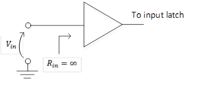
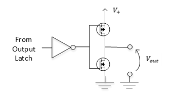
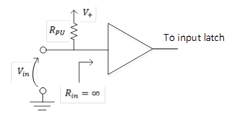
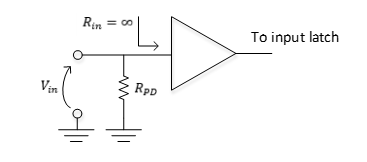
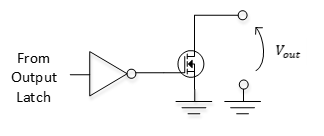
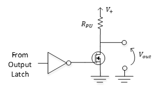
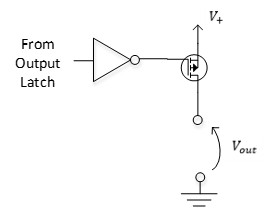
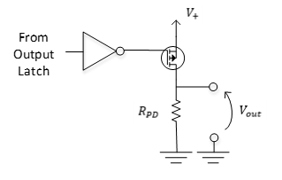

<!-- Enumeration syntax
public enum Windows.Devices.Gpio.GpioPinDriveMode : int
-->

# GpioPinDriveMode

## -description
Describes whether a general-purpose I/O (GPIO) pin is configured as an input or an output, and how values are driven onto the pin.

## -enum-fields
### -field Input:0
Configures the GPIO pin in floating mode, with high impedance.

If you call the [GpioPin.Read](gpiopin_read_431746835.md) method for this pin, the method returns the current state of the pin as driven externally.

If you call the [GpioPin.Write](gpiopin_write_1817827092.md) method, the method sets the latched output value for the pin. The pin takes on this latched output value when the pin is changed to an output.

### -field Output:1
Configures the GPIO pin in strong drive mode, with low impedance.

If you call the [GpioPin.Write](gpiopin_write_1817827092.md) method for this pin with a value of **GpioPinValue.High**, the method produces a low-impedance high value for the pin. If you call the [GpioPin.Write](gpiopin_write_1817827092.md) method for this pin with a value of **GpioPinValue.Low**, the method produces a low-impedance low value for the pin.

If you call the [GpioPin.Read](gpiopin_read_431746835.md) method for this pin, the method returns the value previously written to the pin.

### -field InputPullUp:2
Configures the GPIO pin as high impedance with a pull-up resistor to the voltage charge connection (VCC).

If you call the [GpioPin.Read](gpiopin_read_431746835.md) method for this pin, the method returns the value previously written to the pin.

### -field InputPullDown:3
Configures the GPIO pin as high impedance with a pull-down resistor to ground.

If you call the [GpioPin.Read](gpiopin_read_431746835.md) method for this pin, the method returns the current value of the pin as driven externally.

### -field OutputOpenDrain:4
Configures the GPIO in open drain mode.

If you call the [GpioPin.Write](gpiopin_write_1817827092.md) method for this pin with a value of **GpioPinValue.Low**, the method drives a value of low to the pin. If you call the [GpioPin.Write](gpiopin_write_1817827092.md) method for this pin with a value of **GpioPinValue.High**, the method places the pin in floating mode.

### -field OutputOpenDrainPullUp:5
Configures the GPIO pin in open drain mode with resistive pull-up mode.

If you call the [GpioPin.Write](gpiopin_write_1817827092.md) method for this pin with a value of **GpioPinValue.Low**, the method produces a low-impedance low state. If you call the [GpioPin.Write](gpiopin_write_1817827092.md) method for this pin with a value of **GpioPinValue.High**, the method configures the pin as high impedance with a pull-up resistor to VCC.

### -field OutputOpenSource:6
Configures the GPIO pin in open collector mode.

If you call the [GpioPin.Write](gpiopin_write_1817827092.md) method for this pin with a value of **GpioPinValue.High**, the method drives a value of high onto the pin. If you call the [GpioPin.Write](gpiopin_write_1817827092.md) method for this pin with a value of **GpioPinValue.Low**, the method configures the pin in floating mode.

### -field OutputOpenSourcePullDown:7
Configures the GPIO pin in open collector mode with resistive pull-down mode.

If you call the [GpioPin.Write](gpiopin_write_1817827092.md) method for this pin with a value of **GpioPinValue.High**, the method drives a value of high onto the pin. If you call the [GpioPin.Write](gpiopin_write_1817827092.md) method for this pin with a value of **GpioPinValue.Low**, the method configures the pin as high impedance with a pull-down resistor to ground.

## -remarks

## -examples

## -see-also
[GpioPin.GetDriveMode](gpiopin_getdrivemode_1456675415.md), [GpioPin.SetDriveMode](gpiopin_setdrivemode_419000462.md), [GpioPin.Read](gpiopin_read_431746835.md), [GpioPin.Write](gpiopin_write_1817827092.md)