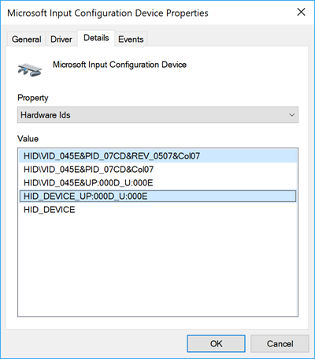

<!-- Class syntax.
public class HidDevice : Windows.Devices.HumanInterfaceDevice.IHidDevice, Windows.Foundation.IClosable
-->

# Windows.Devices.HumanInterfaceDevice.HidDevice

## -description

Represents a top-level collection and the corresponding device.

## -remarks

For more information about using this class, including limitations, see [Supporting human interface devices (HID)](/previous-versions/windows/apps/dn263140(v=win.10)) and [Custom HID device sample](https://github.com/microsoft/Windows-universal-samples/tree/master/Samples/CustomHidDeviceAccess).

Apps that use this class to access a HID device must include specific **DeviceCapability** data in the **Capabilities** node of its manifest. This data identifies the device and its purpose (or function). For more information, see [How to specify device capabilities for HID](/uwp/schemas/appxpackage/how-to-specify-device-capabilities-for-hid).

## -examples

For a complete sample that demonstrates how to use this class, see [Custom HID device sample](https://github.com/microsoft/Windows-universal-samples/tree/master/Samples/CustomHidDeviceAccess).

The following example demonstrates how a UWP app built with XAML and C# uses the [GetDeviceSelector](hiddevice_getdeviceselector_1541481733.md) method to create a selector for a specific HID device (in this case, Microsoft Input Configuration Device) and then uses [FromIdAsync](hiddevice_fromidasync_1634380010.md) method to open a connection to that device.

> [!NOTE]
> This snippet attempts to find a HID device that might not be present on your system. To successfully test the code on your system, you should update vendorId, productId, usagePage, usageId with valid values.
> 1. Open **Device Manager**
> 2. Expand **Human Interface Devices**
> 3. Locate a HID device (for this example we chose *Microsoft Input Configuration Device*)
> 4. Right click the device and select **Properties**
> 5. In Properties, select the **Details** tab
> 6. On the Details tab, select **Hardware Ids** from the **Property** drop down
> 7. The HID details are displayed in the **Value** box:



```csharp
using System;
using System.Linq;
using Windows.Devices.Enumeration;
using Windows.Devices.HumanInterfaceDevice;
using Windows.Storage;
using Windows.UI.Xaml.Controls;

namespace HIDdeviceTest
{
    public sealed partial class MainPage : Page
    {
        public MainPage()
        {
            this.InitializeComponent();
            EnumerateHidDevices();
        }

        // Find HID devices.
        private async void EnumerateHidDevices()
        {
            // Microsoft Input Configuration Device.
            ushort vendorId = 0x045E;
            ushort productId = 0x07CD;
            ushort usagePage = 0x000D;
            ushort usageId = 0x000E;

            // Create the selector.
            string selector = 
                HidDevice.GetDeviceSelector(usagePage, usageId, vendorId, productId);

            // Enumerate devices using the selector.
            var devices = await DeviceInformation.FindAllAsync(selector);

            if (devices.Any())
            {
                // At this point the device is available to communicate with
                // So we can send/receive HID reports from it or 
                // query it for control descriptions.
                info.Text = "HID devices found: " + devices.Count;

                // Open the target HID device.
                HidDevice device = 
                    await HidDevice.FromIdAsync(devices.ElementAt(0).Id,
                    FileAccessMode.ReadWrite);

                if (device != null)
                {
                    // Input reports contain data from the device.
                    device.InputReportReceived += async (sender, args) =>
                    {
                        HidInputReport inputReport = args.Report;
                        IBuffer buffer = inputReport.Data;

                        // Create a DispatchedHandler as we are interracting with the UI directly and the
                        // thread that this function is running on might not be the UI thread; 
                        // if a non-UI thread modifies the UI, an exception is thrown.

                        await this.Dispatcher.RunAsync(
                            CoreDispatcherPriority.Normal,
                            new DispatchedHandler(() =>
                            {
                                info.Text += "\nHID Input Report: " + inputReport.ToString() + 
                                "\nTotal number of bytes received: " + buffer.Length.ToString();
                            }));
                    };
                }

            }
            else
            {
                // There were no HID devices that met the selector criteria.
                info.Text = "HID device not found";
            }
        }
    }
}
```

## -see-also

[How to specify device capabilities for HID](/uwp/schemas/appxpackage/how-to-specify-device-capabilities-for-hid), [Supporting human interface devices (HID)](/previous-versions/windows/apps/dn263140(v=win.10)), [Custom HID device sample](https://github.com/microsoft/Windows-universal-samples/tree/master/Samples/CustomHidDeviceAccess)
