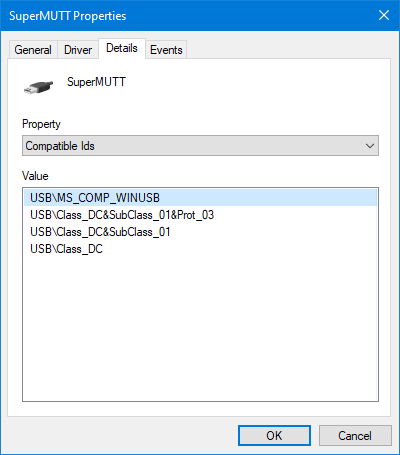

# Windows.Devices.Usb

## -description

This namespace defines Windows Runtime classes that a UWP app can use to communicate with [WinUSB](/windows-hardware/drivers/usbcon/automatic-installation-of-winusb) devices.  These devices are handled by the inbox `winusb.sys` driver and are identified by a specific [Microsoft OS Descriptor](/windows-hardware/drivers/usbcon/microsoft-defined-usb-descriptors).

A valid WinUSB device will have a compatible id of `USB\MS_COMP_WINUSB`



## Device Support

This namespace supports most WinUSB devices. However, it does not provide access to USB devices with device classes of the following:

+ Audio (`0x01`)
+ HID (`0x03`)
+ Image (`0x06`)
+ Printer (`0x07`)
+ Mass Storage (`0x08`)
+ Smart Card (`0x0B`)
+ Audio/Video (`0x10`)
+ Wireless Controller (`0xE0`)

## USB Device Capabilities

A UWP app that accesses a USB device must include specific device capability data in the capabilities node of its manifest. This data identifies the device and its purpose (or function). Note that some devices may have multiple functions.

**Since Windows 10, version 1809 (October 2018 Update)**

```xml
<DeviceCapability Name="usb"/>
```

**Before Windows 10, version 1809 (October 2018 Update)**

Since 1809, the **VendorId**/**ProductId** and **function-type** no longer need to be specified and will be ignored on newer systems.  If targeting systems below 1809, then see [legacy USB device capabilities](/windows-hardware/drivers/usbcon/updating-the-app-manifest-with-usb-device-capabilities).

## Troubleshooting

+ Verify the USB capability (```usb```) is in the application manifest.
+ Verify the user has granted permission for the application to utilize USB devices.
+ Validate the device type is not one designated as inaccessible.
+ Machine-internal devices (`DEVPKEY_Device_InLocalMachineContainer == TRUE`) are generally *not* accessible unless running on a SKU with [embedded mode](/windows/iot-core/develop-your-app/EmbeddedMode) and `lowLevelDevices` capability.
+ Devices with stacks that contain upper/lower filter drivers are generally *not* accessible.  These are sometimes added by 3rd parties to enable additional functionality for [custom hardware](/windows-hardware/drivers/install/inf-addreg-directive).
  + Device restriction is partially determined by `winusb.sys` during device enumeration, which may set the device interface property `DEVPKEY_DeviceInterface_Restricted` to `TRUE` on the WinUSB Device Interface `GUID_DEVINTERFACE_WINUSB_WINRT` based on the presence of device/class filters.
  + The presence of device [UpperFilter](/windows-hardware/drivers/install/devpkey-device-upperfilters)/[LowerFilter](/windows-hardware/drivers/install/devpkey-device-lowerfilters) drivers can be determined using DeviceManager by looking for `UpperFilters` and `LowerFilters` properties.
  + The presence of WinUSB class [UpperFilter](/windows-hardware/drivers/install/devpkey-deviceclass-upperfilters)/[LowerFilter](/windows-hardware/drivers/install/devpkey-deviceclass-lowerfilters) drivers can be determined using DeviceManager by looking for `Class upper filters` and `Class lower filters` properties.
  + Device Interface properties can be inspected by calling [`CM_Get_Device_Interface_Property`](/windows/win32/api/cfgmgr32/nf-cfgmgr32-cm_get_device_interface_propertyw) where `pszDeviceInterface` is the same string as would be passed to [FromIdAsync](usbdevice_fromidasync_1322863552.md).
+ These restrictions can be bypassed when making a custom device by working with the driver-developer to create a [Hardware Support App](/windows-hardware/drivers/devapps/hardware-support-app--hsa--steps-for-app-developers)

## -remarks

## -examples

## -see-also

[Talking to USB devices, start to finish (UWP app)](/windows-hardware/drivers/usbcon/talking-to-usb-devices-start-to-finish), [Custom USB device sample (Windows 10)](https://github.com/Microsoft/Windows-universal-samples/tree/master/Samples/CustomUsbDeviceAccess)
