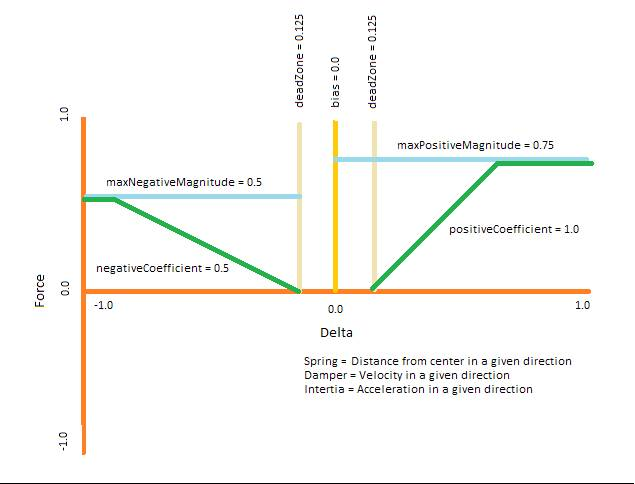

<!-- Method syntax
public void SetParameters(Windows.Foundation.Numerics.Vector3 direction, System.Single positiveCoefficient, System.Single negativeCoefficient, System.Single maxPositiveMagnitude, System.Single maxNegativeMagnitude, System.Single deadZone, System.Single bias)
-->

# Windows.Gaming.Input.ForceFeedback.ConditionForceEffect.SetParameters

## -description
Sets the parameters for the conditional force feedback effect.

## -parameters
### -param direction
A vector describing the direction and magnitude of the effect on each axis. Each individual axis has a range of -1.0 to 1.0 and is independent of the other axes. Specifying a negative value for an axis reverses the input values from the axis.

### -param positiveCoefficient
The slope of the line describing how rapidly the force increases as the input moves away from the center point in the positive direction along the specified axis. Range is from -infinity to +infinity.

### -param negativeCoefficient
The slope of the line describing how rapidly the force increases as the input moves away from the center point in the negative direction along the specified axis. Range is from -infinity to +infinity.

### -param maxPositiveMagnitude
The maximum magnitude of the force feedback as the input moves away from the center point in the positive direction along the specified axis. Range is from 0 to 1.0.

### -param maxNegativeMagnitude
The maximum magnitude of the force feedback as the input moves away from the center point in the negative direction along the specified axis. Range is from 0 to 1.0.

### -param deadZone
Specifies the value below which the force feedback is not applied. Range is from 0.0 to 1.0 and is applied asymmetrically around the center point.

### -param bias
The offset to the center point in effect calculations. Range is from -1.0 to 1.0.

## -remarks
The following image illustrates the effects of the arguments to SetParameters:


In the image, all coefficient values are positive.  A negative value for the coefficient will cause the force (the green line) to go negative below the orange axis line, effectively, reversing the direction of the force.  This is not recommended because unless done carefully it will typically result in a positive feedback loop that will cause the motor to saturate in that direction. Magnitude and dead zone values are always positive, and symmetrical about their respective axes.  (This is illustrated for the dead zone, but the magnitude works the same way – a value of 0.5 limits the feedback force to anywhere between -0.5 and +0.5.) The bias is shown here at 0.0, but changing the value just slides the medium orange line one way or the other.  Note that this does not affect the slope of the green lines, defined by the coefficient values.

## -examples
```

// Create a spring effect and load it into the device.  This is an async operation
// since it might take a brief amount of time for the driver to complete this.
ConditionForceEffect ^ springEffect = ref new ConditionForceEffect(ConditionEffectKind::Spring);
if (springEffect)
{
    IAsyncAction ^ action = motor->LoadEffectAsync(springEffect);
    concurrency::create_task(action).then([=]()
    {
        // Make sure the effect was loaded successfully.  There is a finite amount
        // of storage available for effects in the hardware, so this is expected
        // to fail if there is not enough room.  Alternatively, the motor might
        // not support the requested effect (although this is rare).
        if (action->Status == AsyncStatus::Completed)
        {
            // Set the parameters for the spring effect.  Note how the parameters
            // can be modified after the effect has been loaded into the hardware.
            springEffect->SetParameters(
                { 1.0f, 0.0f, 0.0f },   // Unit vector indicating the effect applies to the X axis
                1.0f, -1.0f,            // Full strength when the wheel is turned to its maximum angle
                0.3f, -0.3f,            // Limit the maximum feedback force to 30%
                0.025f,                 // Apply a small dead zone when the wheel is centered
                0.0f);                  // Equal force in both directions

            // Go ahead and start the effect, since we want this running all the time
            springEffect->StartEffect();
        }
    });
}          
          
```


## -see-also
