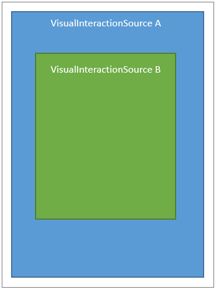

<!-- Enumeration syntax
public enum Windows.UI.Composition.Interactions.InteractionChainingMode : int
-->

# InteractionChainingMode

## -description
Defines the chaining behavior for a [VisualInteractionSource](visualinteractionsource.md). There are three options: Always chain, never chain or auto chain (let the system choose). If chaining is enabled, when an [InteractionTracker](interactiontracker.md) reaches its minimum or maximum bounds, it will instead send the input to the next ancestor [VisualInteractionSource](visualinteractionsource.md).


## -enum-fields
### -field Auto:0
Automatically determine whether to continue the manipulation.

### -field Always:1
Always continue the manipulation.

### -field Never:2
Never continue the manipulation.


## -remarks
When an InteractionTracker reaches either its minimum or maximum bounds, it will either overpan or chain the input up to its next ancestor VisualInteractionSource.

The picture below demonstrates a scenario where there may be a VisualInteractionSource (B) who is the child of another VisualInteractionSource (A). In this scenario, both elements are scrollable content – when the InteractionTracker in B reaches the boundary and chaining is enabled on B, the input will chain to A whose content will now begin to scroll.

> [!NOTE]
> In these situations with chaining enabled, the input can chain from an InteractionTracker to an InteractionTracker, from an InteractionTracker to a XAML ScrollViewer, or from an InteractionTracker to a CoreWindow.



## -examples


```csharp

void SetupInteractionSource(ContainerVisual container, InteractionTracker 	tracker)
{
  // Setup the Interaction Source
  _interactionSource = VisualInteractionSource.Create(container);
  // Define Chaining modes for X, Y, and Scale.
  _interactionSource.PositionXChainingMode = InteractionChainingMode.Never;
  _interactionSource.PositionYChainingMode = InteractionChainingMode.Always;
  _interactionSource.ScaleChainingMode = InteractionChainingMode.Auto;    
  // Attach the VisualInteractionSource to InteractionTracker
  tracker.InteractionSources.Add(_interactionSource);
}
         
```


## -see-also
