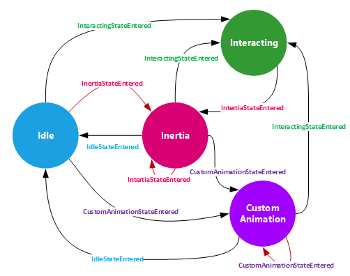

<!-- Class syntax.
public class InteractionTracker : Windows.UI.Composition.CompositionObject, Windows.UI.Composition.Interactions.IInteractionTracker
-->

# Windows.UI.Composition.Interactions.InteractionTracker

## -description

Handles the logic of input that can be used as targets in ExpressionAnimations—typically to drive the motion of visuals based on input.


## -remarks

**InteractionTracker** is a state machine that can be driven by active input, or by explicit calls to update or animate its properties. The **InteractionTracker** class is intended to enable input to drive [CompositionAnimation](../windows.ui.composition/compositionanimation.md)s for custom interaction experiences. In order to build interactive experiences, it is necessary to associate one or more [VisualInteractionSource](visualinteractionsource.md)s with the **InteractionTracker**.

### Common Scenarios

IneractionTracker is intended to be used for:

+ Adding custom swipe behavior, for example swiping ListView items or other visuals to delete/dismiss
+ Transitions tied to panning, for example swiping to transition between “closed” and “open” states
+ Input-driven animation of an effect, for example panning causes the screen to blur
+ Custom Controls, for example creating a custom implementation of a ScrollViewer with different panning speeds or the ability to be controlled programmatically

### InteractionTracker States and Transitions

The InteractionTracker is a state machine with four states:

+ Idle: No active input or animations driving the InteractionTracker
+ Interacting: Active user input is driving the InteractionTracker
+ Inertia: Active animations that are a result of active input or programmatic velocity are driving the InteractionTracker
+ CustomAnimation: A property of the InteractionTracker is being directly animated
The diagram below shows these four states and which state transitions are valid.



State transitions can happen due to user actions (such as starting or stopping a manipulation) or due to explicit calls to methods on the InteractionTracker. Any time one of these explicit calls is made, a requestID is issued for tracking whether the request is ignored or causes a state change.

An important thing to note is that InteractionTracker is running in a different process than the application that is using it. As such, all method calls on InteractionTracker and associated classes are asynchronous, as are the callbacks issued through the IInteractionTrackerOwner interface.

The following describes what triggers each state change to happen:

<table>
   <tr><th>Begin State</th><th>End State</th><th>Possible Triggers</th></tr>
   <tr><td>Idle</td><td>Interacting</td><td>This state transition only happens when a user manipulation that aligns with a VisualInteractionSource associated with the InteractionTracker is being performed.</td></tr>
   <tr><td>Idle</td><td>Inertia</td><td>This state transition only happens when the InteractionTracker is in the Idle state and TryUpdatePositionWithVelocity or TryUpdateScaleWithVelocity is called.</td></tr>
   <tr><td>Idle</td><td>CustomAnimation</td><td>This state transition happens when InteractionTracker is in the Idle state and TryUpdatePositionWithAnimation or TryUpdateScaleWithAnimation is called.</td></tr>
   <tr><td>Interacting</td><td>Inertia</td><td>This state transition only happens when a user manipulation that has been sent to the InteractionTracker completes. When the active input ends, the InteractionTracker will enter the Inertia state, and information such as the finger’s release velocity and the InertiaDecayRate will determine the behavior during the Inertia state.</td></tr>
   <tr><td>Inertia</td><td>Idle</td><td>This state transition happens when the function(s) being used to update position and/or scale are no longer resulting in change. In other words, position and scale velocity have both gotten to zero. This state transition can also happen if a call is made to explicitly update position or scale without animation or velocity. These calls will end inertia and transition to Idle with the updated property values.</td></tr>
   <tr><td>Inertia</td><td>Inertia</td><td>This state transition happens when TryUpdatePositionWithVelocity or TryUpdateScaleWithVelocity is called when already in the Inertia state. Re-entering Inertia will cause all InertiaStateEntered properties to be reevaluated.</td></tr>
   <tr><td>Inertia</td><td>CustomAnimation</td><td>This state transition happens when a call to TryUpdatePositionWithAnimation or TryUpdateScaleWithAnimation is made while in the Inertia sate.</td></tr>
   <tr><td>Inertia</td><td>Interacting</td><td>This state transition happens when active input from the user that hit-tests to the VisualInteractionSource comes in before Inertia has completed.</td></tr>
   <tr><td>CustomAnimation</td><td>Idle</td><td>This state transition happens when all animations set on the InteractionTracker’s position and scale properties have completed.</td></tr>
   <tr><td>CustomAnimation</td><td>CustomAnimation</td><td>This state transition happens when a call to TryUpdatePositionWithAnimation or TryUpdateScaleWithAnimation is made while already in the CustomAnimation state.</td></tr>
   <tr><td>CustomAnimation</td><td>Inertia</td><td>This state transition happens when a call to TryUpdatePositionWithVelocity or TryUpdateScaleWithVelocity is made when in the CustomAnimation state.</td></tr>
   <tr><td>CustomAnimation</td><td>Interacting</td><td>This state transition happens when a user manipulation that hit-tests to a VisualInteractionSource associated with the InteractionTracker is being performed.</td></tr>
</table>

Any state transition made by the InteractionTracker will produce a callback indicating the new state with args that include information relevant to that state as well as the requestID for the request that caused the state change. Active manipulations from the user will result in a requestID of 0. Any Try* call will issue a requestID that can be used for tracking which Try* call caused the state change. The first requestID during the lifetime of the application will be 1, and each subsequent call will increment the requestID, meaning that each will be unique.

### InteractionTracker Position and Scale

The two most commonly used properties of the InteractionTracker are position and scale. Whenever there is a change to one or both of these properties the ValuesChanged callback will be sent with information on the current values. Due to the asynchronous nature of InteractionTracker, values received through InteractionTracker callbacks are the best way to update application logic on the current state and values of InteractionTracker and its properties.

An important distinction about the InteractionTracker is that its position and scale are not associated with the coordinate space of any particular visual. At the time the InteractionTracker is created, its position will have the x, y and z subchannels of the vector set to 0, and scale will be set to 1. Only active input or Try* calls can cause these values to change. The minimum and maximum values for each property will dictate the range in which values can fluctuate. The one exception is the concept of “overpan” or “overzoom”, where an active manipulation can cause values to go slightly beyond the minimum or maximum during the Interacting state. When the manipulation completes, however, the values will always come to rest within the set range. CustomAnimations will always be clamped within the ranges set for position and scale.

The InteractionTracker coordinate space concept aligns with the concept of screen coordinates in that an up/left motion increases the position value and an down/right motion decreases the position value. As a result, it is very common to negate the position property when attaching it to a Visual’s Offset.

By default, the minimum and maximum position channels are all 0, and the minimum and maximum scale values are 1. If the desired behavior for either property is to allow it to change outside of these starting values, the minimum/maximum values need to be updated.

### InteractionTracker and ExpressionAnimations

InteractionTracker exposes a variety of properties that can be used in the context of [ExpressionAnimation](../windows.ui.composition/expressionanimation.md)s to drive updates to animatable properties of [CompositionObject](../windows.ui.composition/compositionobject.md) s. Due to the asynchronous nature of InteractionTracker, it is not advised to query these properties directly. Instead, you should use the properties delivered in callbacks for driving application logic, and to reference the values in an [ExpressionAnimation](../windows.ui.composition/expressionanimation.md) for updating animatable properties.

As mentioned above, the two most commonly used properties of the InteractionTracker are the [Position](interactiontracker_position.md) and Scale properties. These are the properties that will update in response to user input and Try* calls. Using these properties inside ExpressionAnimations will cause the animatable properties of CompositionObjects to update in response. For example, the InteractionTracker.position property may be tied to the Offset of a Visual. It is also common to use these properties to populate a CompositionPropertySet that tracks progress, which can in turn drive a series of coordinated animations.

### Directing Input to the InteractionTracker

After being configured, InteractionTracker still requires one last step to actually receive touch input and respond. Please see the documentation on VisualInteractionSource.[TryRedirectForManipulation](visualinteractionsource_tryredirectformanipulation_1406704629.md) for more information on configuring incoming input to flow into the InteractionTracker.

### Version history

| Windows version | SDK version | Value added |
| -- | -- | -- |
| 1703 | 15063 | ConfigureCenterPointXInertiaModifiers |
| 1703 | 15063 | ConfigureCenterPointYInertiaModifiers |
| 1709 | 16299 | ConfigureVector2PositionInertiaModifiers |
| 1809 | 17763 | IsInertiaFromImpulse |
| 1809 | 17763 | TryUpdatePosition(Vector3,InteractionTrackerClampingOption) |
| 1809 | 17763 | TryUpdatePositionBy(Vector3,InteractionTrackerClampingOption) |
| 1903 | 18362 | GetBindingMode |
| 1903 | 18362 | SetBindingMode |
| 2004 | 19041 | TryUpdatePosition(Vector3,InteractionTrackerClampingOption,InteractionTrackerPositionUpdateOption) |

## -examples


```csharp

void SetupSimpleInteractionTracker(Visual viewportVisual, Visual contentVisual)
{
  //
  // Create the InteractionTracker and set its min/max position and scale.  These could 
  // also be bound to expressions.  Note: The scrollable area can be changed from either 
  // the min or the max position to facilitate content updates/virtualization.
  //
 
  _tracker = InteractionTracker.Create(_compositor);
 
  _tracker.MaxPosition = new Vector3(
    contentVisual.Size.X - viewportVisual.Size.X,
    contentVisual.Size.Y - viewportVisual.Size.Y,
    0.0f);
 
  _tracker.MinScale = 0.5f;
  _tracker.MaxScale = 4.0f;
 
 
  //
  // Configure the interaction source.  Enable input with inertia on all axes.
  //
 
  var interactionSource = VisualInteractionSource.Create(viewportVisual);
 
  interactionSource.PositionXSourceMode = InteractionSourceMode.EnabledWithInertia;
  interactionSource.PositionYSourceMode = InteractionSourceMode.EnabledWithInertia;
  interactionSource.ScaleSourceMode = InteractionSourceMode.EnabledWithInertia;
 
  _tracker.InteractionSources.Add(interactionSource);
 
 
  //
  // Bind the InteractionTracker outputs to the contentVisual.
  //
 
  var positionExpression = _compositor.CreateExpressionAnimation("-tracker.Position");
  positionExpression.SetReferenceParameter("tracker", _tracker);
 
  contentVisual.StartAnimation("Offset", positionExpression);
 
 
  var scaleExpression = _compositor.CreateExpressionAnimation("Vector3(tracker.Scale, tracker.Scale, 1.0)");
 
  scaleExpression.SetReferenceParameter("tracker", _tracker);
 
  contentVisual.StartAnimation("Scale", scaleExpression);
}
  
         
         
```


## -see-also
[VisualInteractionSource](visualinteractionsource.md), [ExpressionAnimation](../windows.ui.composition/expressionanimation.md)
