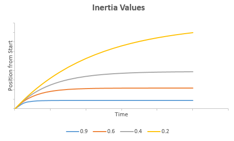

<!-- Property syntax
public Windows.Foundation.IReference<float> ScaleInertiaDecayRate { get;  set; }
-->

# Windows.UI.Composition.Interactions.InteractionTracker.ScaleInertiaDecayRate

## -description
Inertia decay rate, for scale. Range is from 0 to 1.

The ScaleInertiaDecayRate property defines the rate at which [InteractionTracker](interactiontracker.md) will slow to a stop when it has entered Inertia and scale is changing. The closer to 1, the faster [InteractionTracker](interactiontracker.md) will slow to a stop and vice versa. Unlike the [PositionInertiaDecayRate](interactiontracker_positioninertiadecayrate.md) which is defined as a Vector3, ScaleInertiaDecayRate is defined as a single float.


## -property-value
Inertia decay rate for scale. Range is from 0 to 1.

## -remarks
Below is a graph of the equation that models the ScaleInertiaDecayRate property. Note that as the value of the property approaches 1, the impact of inertia increases more significantly.

In the graph, time is on the X axis, and position from the start of the interaction is on the Y. Notice that with a much larger value (closer to 1), the position from start is much smaller and plateaus earlier.



## -examples
```csharp

void SetupInteractionTracker()
{
  // Setup InteractionTracker
  _tracker = InteractionTracker.Create(_compositor);

  // Set the ScaleInertiaDecayRate value
  _tracker.ScaleInertiaDecayRate = 0.95f;
}
          
```


## -see-also
