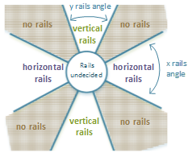

<!-- Property syntax
public bool IsPositionXRailsEnabled { get;  set; }
-->

# Windows.UI.Composition.Interactions.VisualInteractionSource.IsPositionXRailsEnabled

## -description
Indicates whether panning on the x-axis is railed.

The IsPositionXRailsEnabled property defines the railing configuration for when X-axis panning gets sent to the corresponding [InteractionTracker](interactiontracker.md). When enabled, if the initial part of the pan is angled within a particular range relative to the X-axis, the Y component of the pan is ignored and considered a perfect horizontal pan. This property is often enabled in situations where both an X and Y scrolling experience is enabled, but also requires reliable, perfect horizontal panning.


## -property-value
Boolean value indicating whether panning on the x-axis is railed.

## -remarks
When this property is enabled, the system provides more leniency in what is considered a “perfect” horizontal pan. Often times when a finger pans across the screen, it is very difficult for an end user to achieve a perfect pan in the X-direction. This property helps makes it more possible to have “perfect” horizontal panning in scenarios (such as multi-directional scrolling) where both X and Y panning is already enabled.

When enabled, pans within 22.5 degrees of the horizontal axis will get recognized as “perfect” horizontal pans – in other words, their Y components will be ignored. Note that the angle of the pan is determined within the first few millimeters of the interaction and will retain that angle until the finger is lifted. If outside the threshold of 22.5 degrees of the axis, then the Y component will then be recognized.

The diagram below shows this in a visual format:



> [!NOTE]
> When rails are enabled, this has an impact to chaining. The system will only chain up to its nearest acenstor VisualInteractionSource when the pan is within 22.5 degrees of the axis.

## -examples
```csharp

void SetupInteractionSource(ContainerVisual container, InteractionTracker 	tracker)
{
  // Setup the InteractionSource
  _interactionSource = VisualInteractionSource.Create(container);
  // Enable the property for rails on the X axis being enabled
  _interactionSource.IsPositionXRailsEnabled = true;
  // Add the InteractionSource to the InteractionTracker
  tracker.InteractionSources.Add(_interactionSource);
}
         
         
```


## -see-also
