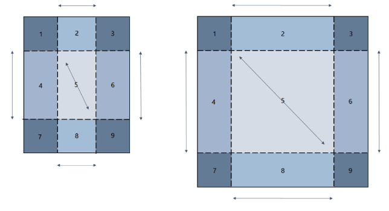
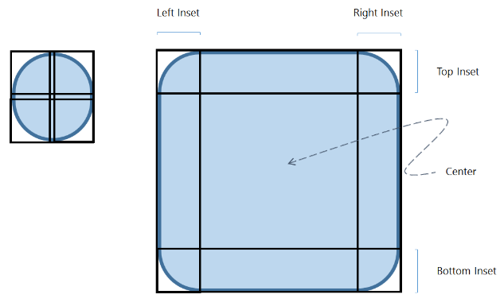

<!-- Class syntax.
public class CompositionNineGridBrush : Windows.UI.Composition.CompositionBrush, Windows.UI.Composition.ICompositionNineGridBrush
-->

# Windows.UI.Composition.CompositionNineGridBrush

## -description
Paints a [SpriteVisual](spritevisual.md) with a CompositionBrush after applying Nine-Grid Stretching to the contents of the Source brush. The source of the nine-grid stretch can by any CompositionBrush of type CompositionColorBrush, CompositionSurfaceBrush or a CompositionEffectBrush.


## -remarks
Nine-Grid stretching refers to the partitioning of visual content (the content of the source brush to be painted onto a [SpriteVisual](spritevisual.md)) into a grid of nine rectangles such that the sizes of the corner rectangles are preserved upon resizing, as shown in the diagram below:



When a [SpriteVisual](spritevisual.md) painted with a CompositionNineGridBrush is resized or scaled, the left and right margins (rectangles 4 and 6) stretch along the vertical axis, the top and bottom margins rectangles (rectangles 2 and 8) stretch along the horizontal axis, and the center (rectangle 5) is stretched along both axes while the corners (rectangles 1,3,7, and 9) do not stretch.

The **Source** property of CompositionNineGridBrush accepts brushes of one of two types:


+ [CompositionSurfaceBrush](compositionsurfacebrush.md): apply Nine-Grid Stretching to a textured image surface.
+ [CompositionColorBrush](compositioncolorbrush.md): create solid color borders.


### Notes on CompositionSurfaceBrush Source

Insets are specified as pixel values that are measured in the coordinate space of the [ICompositionSurface](icompositionsurface.md) that is associated with the [CompositionSurfaceBrush](compositionsurfacebrush.md). The relationship between an inset specified in the coordinate space of a surface and the inset as it appears when painted on a [SpriteVisual](spritevisual.md) is as follows:

```
Inset_Surface*InsetScale=Inset_SpriteVisual
```

The CompositionSurfaceBrush.[Stretch](compositionsurfacebrush_stretch.md) property specifies how the content of the center of the Nine-Grid is stretched.



<i>NineGridBrush Insets specified on a rounded rectangle asset with CompositionStretch.Fill; the Insets are specified in pixels (measured in the coordinate space of the ICompositionSurface that contains the asset)</i>

CompositionNineGridBrush is not designed to apply Nine-Grid Scaling to a [CompositionSurfaceBrush](compositionsurfacebrush.md) source that has a transformation applied through one of the following properties:

+ CompositionSurfaceBrush.AnchorPoint
+ CompositionSurfaceBrush.CenterPoint
+ CompositionSurfaceBrush.Offset
+ CompositionSurfaceBrush.RotationAngle
+ CompositionSurfaceBrush.RotationAngleInDegrees
+ CompositionSurfaceBrush.Scale
+ CompositionSurfaceBrush.TransformMatrix
No pixel content will be drawn if there is a transformation operation applied to the [CompositionSurfaceBrush](compositionsurfacebrush.md) source to a CompositionNineGridBrush.

### Applying Nine-Grid Stretching to an Opacity Mask

The contents of the [CompositionSurfaceBrush](compositionsurfacebrush.md) source may also be an opacity mask surface. The resulting CompositionNineGridBrush may then be set as [Mask](compositionmaskbrush_mask.md) to a [CompositionMaskBrush](compositionmaskbrush.md). This would allow the content being masked to scale as desired while the opacity mask is subject to Nine-Grid Stretching.

Similarly, the [Source](compositionmaskbrush_source.md) to a [CompositionMaskBrush](compositionmaskbrush.md) may also be of type CompositionNineGridBrush.

### Applying an Effect to CompositionNineGridBrush

A CompositionNineGridBrush may be set as source to a [CompositionEffectBrush](compositioneffectbrush.md) to apply an IGraphics or Windows.UI.Composition.Effect to its Nine-Grid Stretched contents.

### Notes on CompositionColorBrush Source

In conjunction with the [IsCenterHollow](compositionninegridbrush_iscenterhollow.md) property, a [CompositionColorBrush](compositioncolorbrush.md) **Source** allows for the creation of solid color borders. Note that insets for a [CompositionColorBrush](compositioncolorbrush.md) **Source** are measured in the coordinate space of the [SpriteVisual](spritevisual.md) itself.

### Notes on Inset Thickness and Inset Scale

The inset thickness of a CompositionNineGridBrush does not change if the [Size](visual_size.md) property of the associated [SpriteVisual](spritevisual.md) is changed.

The inset scale properties provide a mechanism to scale Nine-Grid Insets from the brush’s coordinate space (such as pixel space for an image) to that of the [SpriteVisual](spritevisual.md). For instance, the inset scale properties may be used to control inset thickness in response to scale transformation inherited from the [SpriteVisual](spritevisual.md) that the NineGridBrush is painted onto or an arbitrary ancestor in its Visual tree (such as in cases of DPI scale, etc.). In this case, [ExpressionAnimation](expressionanimation.md)s provide a means to dynamically update values of inset scale.

## -examples
Apply Nine-Grid Stretching to a button asset ([CompositionSurfaceBrush](compositionsurfacebrush.md) **Source**)

```csharp

private SpriteVisual CreateNineGridVisualFromImageSurface(ICompositionSurface imgSurface)
{
  CompositionSurfaceBrush sourceBrush = _compositor.CreateSurfaceBrush(imgSurface);

  // imgSurface is 50x50 pixels; nine-grid insets, as measured in the asset, are:
  // left = 1, top = 5, right = 10, bottom = 20 (in pixels)

  // create NineGridBrush to paint onto SpriteVisual
  CompositionNineGridBrush ninegridBrush = _compositor.CreateNineGridBrush();

  // set SurfaceBrush as Source to NineGridBrush
  ninegridBrush.Source = sourceBrush;

  // set Nine-Grid Insets
  ninegridBrush.SetInsets(1, 5, 10, 20);

  // set appropriate Stretch on SurfaceBrush for Center of Nine-Grid
  sourceBrush.Stretch = CompositionStretch.Fill;

  // create SpriteVisual and paint w/ NineGridBrush
  SpriteVisual visual = _compositor.CreateSpriteVisual();
  visual.Size = new Vector2(100, 75);
  visual.Brush = ninegridBrush;

  return visual;
}
         
       
```

Create a solid color border ([CompositionColorBrush](compositioncolorbrush.md) **Source**)

```csharp

private SpriteVisual CreateBorderVisual(SpriteVisual childContent, float borderThickness, Color borderColor)
{
  SpriteVisual borderVisual = _compositor.CreateSpriteVisual();
  borderVisual.Size = childContent.Size + new Vector2(2 * borderThickness);

  // create NineGridBrush w/ ColorBrush Source
  CompositionNineGridBrush ninegridBrush = _compositor.CreateNineGridBrush();
  ninegridBrush.Source = _compositor.CreateColorBrush(borderColor);
  ninegridBrush.SetInsets(borderThickness);

  // opt out of drawing Center of Nine-Grid
  ninegridBrush.IsCenterHollow = true;

  // paint SpriteVisual w/ NineGridBrush
  borderVisual.Brush = ninegridBrush;

  // set child visual appropriately; manage size/scale changed events separately
  childContent.Offset = new Vector3(borderThickness, borderThickness, 0);
  borderVisual.Children.InsertAtTop(childContent);

  return borderVisual;
}
         
         
```

Using [ExpressionAnimation](expressionanimation.md) to dynamically update inset scales

```csharp

private void CounterScaleInsets(SpriteVisual ninegridVisual)
{
  CompositionNineGridBrush ninegridBrush = (CompositionNineGridBrush)ninegridVisual.Brush;

  // use expressions to counter a scale transformation on visual so as to maintain a constant inset thickness
  ExpressionAnimation counterScaleXAnimation = _compositor.CreateExpressionAnimation("1/visual.Scale.X");
  counterScaleXAnimation.SetReferenceParameter("visual", ninegridVisual);

  ExpressionAnimation counterScaleYAnimation = _compositor.CreateExpressionAnimation("1/visual.Scale.Y"); 
  counterScaleYAnimation.SetReferenceParameter("visual", ninegridVisual);

  // start ExpressionAnimation on Nine-Grid InsetScales
  ninegridBrush.StartAnimation("LeftInsetScale", counterScaleXAnimation);
  ninegridBrush.StartAnimation("RightInsetScale", counterScaleXAnimation);

  ninegridBrush.StartAnimation("TopInsetScale", counterScaleYAnimation);
  ninegridBrush.StartAnimation("BottomInsetScale", counterScaleYAnimation);
}
         
         
```

Apply an effect to Nine-Grid Stretched content (CompositionNineGridBrush as input to a [CompositionEffectBrush](compositioneffectbrush.md))

```csharp

private void DesaturateNineGridVisual(SpriteVisual ninegridVisual)
{
  // get the NineGridBrush that the SpriteVisual is painted with
  CompositionNineGridBrush ninegridBrush = (CompositionNineGridBrush)ninegridVisual.Brush;

  // get or define IGraphicsEffect
  var saturationEffect = new SaturationEffect
  {
    Saturation = 0f,
    Source = new CompositionEffectSourceParameter("source"),
  };

  // create EffectBrush from EffectFactory
  CompositionEffectFactory saturationFactory = _compositor.CreateEffectFactory(saturationEffect);
  CompositionEffectBrush saturationBrush = saturationFactory.CreateBrush();

  // input NineGridBrush to EffectBrush
  saturationBrush.SetSourceParameter("source", ninegridBrush);

  // paint SpriteVisual with EffectBrush (w/ NineGridBrush as source parameter)
  ninegridVisual.Brush = saturationBrush;
}
         
         
```

Apply Nine-Grid Stretching to an opacity mask (CompositionNineGridBrush as input to a CompositionMaskBrush)

```csharp

private SpriteVisual CreateMaskedRoundedRectVisual(ICompositionSurface myRoundedRectMaskSurface)
{
  // ColorBrush to be set as MaskBrush.Source
  CompositionColorBrush colorBrush = _compositor.CreateColorBrush(Colors.Blue);

  // SurfaceBrush w/ opacity mask surface
  CompositionSurfaceBrush roundedRectBrush = _compositor.CreateSurfaceBrush(myRoundedRectMaskSurface);
  roundedRectBrush.Stretch = CompositionStretch.Fill; // stretch for center of nine-grid

  // NineGridBrush w/ insets on opacity mask surface
  CompositionNineGridBrush ninegridBrush = _compositor.CreateNineGridBrush();
  ninegridBrush.Source = roundedRectBrush;
  ninegridBrush.SetInsets(_cornerRadius); // the radius, in pixels, of the corner as specified on my opacity mask surface 

  // Create MaskBrush
  CompositionMaskBrush maskBrush = _compositor.CreateMaskBrush();
  maskBrush.Source = colorBrush;
  maskBrush.Mask = ninegridBrush;

  // Paint SpriteVisual with MaskBrush
  SpriteVisual sprite = _compositor.CreateSpriteVisual();
  sprite.Size = new Vector2(300, 200);
  sprite.Brush = maskBrush;
  return sprite;
}
         
```


## -see-also
[CompositionBrush](compositionbrush.md), [IClosable](../windows.foundation/iclosable.md)
