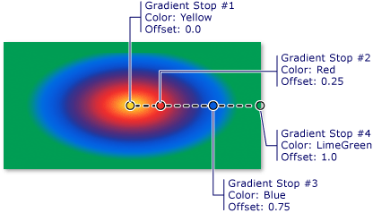

<!-- Class syntax.
public class CompositionRadialGradientBrush : CompositionGradientBrush, CompositionGradientBrush
-->

# Windows.UI.Composition.CompositionRadialGradientBrush

## -description

Represents a brush that paints an area with a radial gradient.


## -remarks

This brush paints a [SpriteVisual](spritevisual.md) with a radial gradient. 

The gradient is drawn within an ellipse that is defined by the [EllipseCenter](compositionradialgradientbrush_ellipsecenter.md) and [EllipseRadius](compositionradialgradientbrush_ellipseradius.md) properties.
Colors for the gradient start at the center of the ellipse and end at the radius.

The colors for the radial gradient are defined by color stops. Each color stop specifies a color and a location along the gradient.



## -see-also

[SpriteVisual.Brush](spritevisual_brush.md)

## -examples

### Create a radial gradient brush

This example shows how to create a radial gradient brush, add 2 color stops, and paint a SpriteVisual with it.

```csharp
// Create radial gradient brush.
CompositionRadialGradientBrush RGBrush = compositor.CreateRadialGradientBrush();

// Create the color stops by defining the offset and color.
CompositionColorGradientStop ColorStop1 = compositor.CreateColorGradientStop();
ColorStop1.Offset = 0;
ColorStop1.Color = Colors.Blue;
CompositionColorGradientStop ColorStop2 = compositor.CreateColorGradientStop();
ColorStop2.Offset = 1;
ColorStop2.Color = Colors.Yellow;

// Add the color stops to brush's ColorStops collection.
RGBrush.ColorStops.Add(ColorStop1);
RGBrush.ColorStops.Add(ColorStop2);

// Create a sprite visual and paint it with the radial gradient brush.
var visual = compositor.CreateSpriteVisual();
visual.Size = new Vector2(120, 120);
visual.Brush = RGBrush;
```

You can also condense the steps to create and add the color stops using this shorter syntax:

```csharp
RGBrush.ColorStops.Add(compositor.CreateColorGradientStop(0, Colors.Blue));
RGBrush.ColorStops.Add(compositor.CreateColorGradientStop(1, Colors.Yellow));
```

### Animate a radial gradient brush

This example shows how to animate the color of the first gradient stop of a radial gradient brush.

```csharp
private SpriteVisual GetRadialGradientVisualWithAnimation(Vector2 size,
                                                          Vector2 gradientOriginOffset,
                                                          Vector2 ellipseCenter,
                                                          Vector2 ellipseRadius)
{
    // Create radial gradient brush.
    var gradientBrush = compositor.CreateRadialGradientBrush();
    gradientBrush.GradientOriginOffset = gradientOriginOffset;
    gradientBrush.EllipseCenter = ellipseCenter;
    gradientBrush.EllipseRadius = ellipseRadius;

    // Add the color stops. The first color stop needs a name so you can refer to it later.
    CompositionColorGradientStop ColorStop1 = compositor.CreateColorGradientStop(0, Colors.Blue);
    gradientBrush.ColorStops.Add(ColorStop1);
    gradientBrush.ColorStops.Add(compositor.CreateColorGradientStop(1, Colors.Yellow));

    // Set up animation for ColorStop1's color.
    var colorAnimation = compositor.CreateColorKeyFrameAnimation();
    colorAnimation.InsertKeyFrame(0.0f, Colors.Blue);
    colorAnimation.InsertKeyFrame(0.5f, Colors.LightBlue);
    colorAnimation.InsertKeyFrame(0.75f, Colors.Navy);
    colorAnimation.InsertKeyFrame(1.0f, Colors.Blue);
    colorAnimation.Duration = TimeSpan.FromSeconds(20);
    colorAnimation.IterationBehavior = AnimationIterationBehavior.Forever;
    ColorStop1.StartAnimation("Color", colorAnimation);

    // SpriteVisual to be painted with gradated content.
    var gradientVisual = compositor.CreateSpriteVisual();
    gradientVisual.Size = size;
    // Set brush on the SpriteVisual.
    gradientVisual.Brush = gradientBrush;

    return gradientVisual;
}
```
