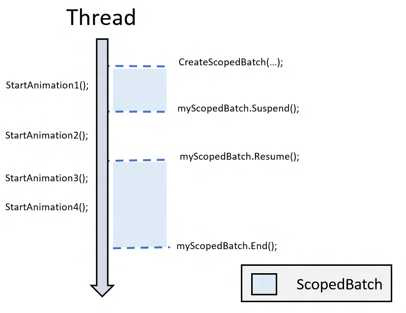

<!-- Class syntax.
public class CompositionScopedBatch : Windows.UI.Composition.CompositionObject, Windows.UI.Composition.ICompositionScopedBatch
-->

# Windows.UI.Composition.CompositionScopedBatch

## -description

An explicitly created group of active animations or effects.


## -remarks

Represents a group of active animations or effects, and triggers a callback when all members of the group have completed. A CompositionScopedBatch is explicitly created and is used to designate specific objects to be included in a single scoped batch.

Multiple CompositionScopedBatch instances can be created and objects can be aggregated in multiple batches at the same time.

## Create

To aggregate a specific group of animations or target a single animation’s completion event, you create a scoped batch. A scoped batch is explicitly created using [Compositor.CreateScopedBatch](compositor_createscopedbatch_706133524.md) and is used to designate specific objects to be included in a single batch. A scoped batch can be created on any thread and is not tied to the composition thread. Scoped batches will only aggregate objects within the thread it is created.

```cs
CompositionScopedBatch myScopedBatch = _compositor.CreateScopedBatch(CompositionBatchTypes.Animation);
``` 

## Suspend and resume

After creating a scoped batch, all started animations aggregate until the batch is explicitly suspended or ended using the Suspend or End function.

CompositionScopedBatch may be explicitly paused with [Suspend](compositionscopedbatch_suspend_1316139061.md) in order to exclude objects from that batch. When a batch is suspended it can be reopened by calling [Resume](compositionscopedbatch_resume_406343050.md). Calling the Suspend function stops aggregating animation end states until Resume is called. This allows you to explicitly exclude content from a given batch.  

In the example below, the animation targeting the Offset property of VisualA will not be included in the batch:

```cs
myScopedBatch.Suspend();
VisualA.StartAnimation("Offset", myAnimation);
myScopeBatch.Resume();
```

## End

A CompositionScopedBatch must be explicitly closed using [End](compositionscopedbatch_end_1028829999.md). Once it has been closed it cannot be suspended or resumed again. In order to complete your batch you must call End(). Without an End call, the batch will remain open forever-collecting objects.  

The following code snippet and diagram shows an example of how the batch will aggregate animations to track end states.

Note that in this example, Animations 1, 3, and 4 will have end states tracked by this Batch, but Animation 2 will not.

```cs
myScopedBatch.End();
CompositionScopedBatch myScopedBatch = 	_compositor.CreateScopedBatch(CompositionBatchTypes.Animation);
// Start Animation1
[…]
myScopedBatch.Suspend();
// Start Animation2 
[…]
myScopedBatch.Resume();
// Start Animation3
[…]
// Start Animation4
[…]
myScopedBatch.End();
```  


 
## Batching a single animation's completion event

If you want to know when a single animation ends, you need to create a scoped batch that will include just the animation you are targeting.

For example:

```cs
CompositionScopedBatch myScopedBatch = 	_compositor.CreateScopedBatch(CompositionBatchTypes.Animation);
Visual.StartAnimation("Opacity", myAnimation);
myScopedBatch.End();
```

## Retrieving a batch's completion event

When batching an animation or multiple animations, you will retrieve the batch’s completion event the same way.
You register the event-handling method for the [Completed](compositionscopedbatch_completed.md) event of the targeted batch.  

```cs
myScopedBatch.Completed += OnBatchCompleted;
```

## Batch states

There are two properties you can use to determine the state of an existing batch; [IsActive](compositionscopedbatch_isactive.md) and [IsEnded](compositionscopedbatch_isended.md).  

The IsActive property returns true if a targeted batch is open to aggregating animations. IsActive will return false when a batch is suspended or ended.

The IsEnded property returns true when you cannot add an animation to that specific batch. A batch will be ended when you call explicitly call End for a specific batch.  
 
## -examples

Scoped Batch

```csharp

// The Green Square's completion events for the Offset and Opacity animations are aggregated
// The Rotation animation completion event is not aggregated
// When the aggregated events are completed OnBatchCompleted method is executed
public void BatchAnimations()
{
    // Create a Scoped batch to capture animation completion events
    _batch = _compositor.CreateScopedBatch(CompositionBatchTypes.Animation);

    // Executing the Offset animation and aggregating completion event
    ApplyOffsetAnimation(_greenSquare);

    // Suspending to exclude the following Rotation animation from the batch
    _batch.Suspend();

    // Executing the Rotation animation 
    ApplyRotationAnimation(_greenSquare);

    // Resuming the batch to collect additional animations
    _batch.Resume();

    // Executing the Opacity animation and aggregating completion event
    ApplyOpacityAnimation(_greenSquare);

    // Batch is ended and no objects can be added
    _batch.End();

    // Method triggered when batch completion event fires
    _batch.Completed += OnBatchCompleted;
}
          
```


## -see-also
[Composition Animations Overview](/windows/uwp/composition/composition-animation), [CompositionObject](compositionobject.md), [IClosable](../windows.foundation/iclosable.md)
