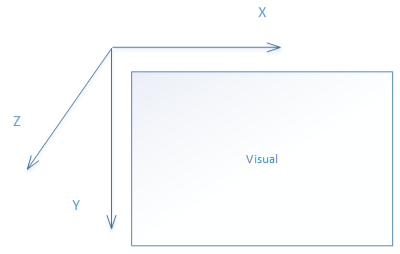

<!-- Property syntax
public Windows.UI.Composition.Visual CoordinateSpace { get;  set; }
-->

# Windows.UI.Composition.DistantLight.CoordinateSpace

## -description
The Visual used to determine the light’s direction. The light's 
    **Direction**
   property is relative to this Visual’s coordinate space.

    **CoordinateSpace**
   is a required property. If 
    **CoordinateSpace**
   is not set, the [DistantLight](distantlight.md) will not render.

## -property-value
The Visual used to determine the light’s direction. The light's 
    **Direction**
   property is relative to this Visual’s coordinate space.

## -remarks
DistantLight.Direction is relative to DistantLight.CoordinateSpace. Every Visual has an implicit 3D coordinate space, defined in this way:

X direction is from left to right. Y direction is from top to bottom. Z direction is point out of the plane. The original point of this coordinate is the upper-left corner of the visual, and the unit is DIP. A light’s offset and direction are defined in this coordinate space.

## -examples

## -see-also
[Direction](distantlight_direction.md)
