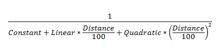

<!-- Property syntax
public float LinearAttenuation { get;  set; }
-->

# Windows.UI.Composition.PointLight.LinearAttenuation

## -description
The linear coefficient in the light's attenuation equation that determines how the light falls-off with distance.


## -property-value
The linear coefficient in the light's attenuation equation that determines how the light falls-off with distance. Range is from 0 to infinity.

## -remarks
The PointLight.LinearAttenuation property is part of the attenuation equation which also contains PointLight.ConstantAttenuation and PointLight.QuadraticAttenuation:



## -examples
```csharp

_pointLight.LinearAttenuation = .14F; 
        
```


## -see-also
[ConstantAttenuation](pointlight_constantattenuation.md), [QuadraticAttenuation](pointlight_quadraticattenuation.md)
