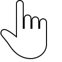
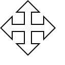
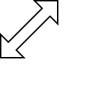
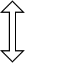
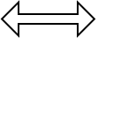

<!-- Enumeration syntax
public enum Windows.UI.Core.CoreCursorType : int
-->

# CoreCursorType

## -description

Specifies the set of cursor types.

## -enum-fields

### -field Arrow:0

The left-upward (northwest) arrow Windows cursor.

### -field Cross:1

The "cross" Windows cursor.

### -field Custom:2

A custom cursor.

### -field Hand:3

The "hand" Windows cursor.

### -field Help:4

The left-upward (northwest) arrow Windows cursor with a question mark.

### -field IBeam:5

The "I"-shaped Windows cursor used for text selection.

### -field SizeAll:6

The "cross arrow" Windows cursor used for user interface (UI) element sizing.

### -field SizeNortheastSouthwest:7

The "right-upward, left-downward" dual arrow Windows cursor often used for element sizing.

### -field SizeNorthSouth:8

The up-down dual arrow Windows cursor often used for vertical (height) sizing.

### -field SizeNorthwestSoutheast:9

The "left-upward, right-downward" dual arrow Windows cursor often used for element sizing.

### -field SizeWestEast:10

The left-right dual arrow Windows cursor often used for horizontal (width) sizing.

### -field UniversalNo:11

The red "circle slash" Windows cursor often used to indicate that a UI behavor cannot be performed.

### -field UpArrow:12

The up arrow Windows cursor.

### -field Wait:13

The cycling Windows "wait" cursor often used to indicate that an element or behavior is in a wait state and cannot respond at the time.

### -field Person:15

The "hand" Windows cursor with a person symbol.

### -field Pin:14

The "hand" Windows cursor with a pin symbol.

## -remarks

### Version history

| Windows version | SDK version | Value added |
| -- | -- | -- |
| 1709 | 16299 | Person |
| 1709 | 16299 | Pin |

## -examples

## -see-also

