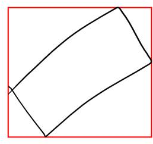
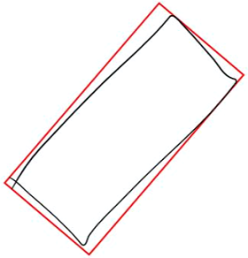

<!-- Property syntax.
public Rect BoundingRect { get; }
-->

# Windows.UI.Input.Inking.Analysis.InkAnalysisListItem.BoundingRect

## -description
Gets the bounding rectangle of the InkAnalysisListItem object.

| Bounding rectangle | Rotated bounding rectangle |
| --- | --- |
|  |  |

## -property-value
The X, Y coordinates (top left) and dimensions (length and width) of the bounding box for the InkAnalysisListItem object, in device-independent pixels (DIPs) relative to the upper left-hand corner of the inking area. 

## -remarks

## -see-also
[InkAnalysisListItem.RotatedBoundingRect](inkanalysislistitem_rotatedboundingrect.md)

## -examples
