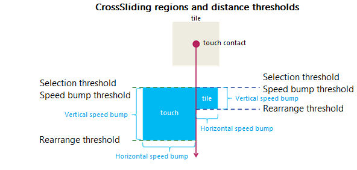

<!-- Structure syntax.
public struct CrossSlideThresholds 
-->

# CrossSlideThresholds

## -description

Contains the distance thresholds for a [CrossSliding](gesturerecognizer_crosssliding.md) interaction.

## -struct-fields

### -field SelectionStart

The distance, in device-independent pixel (DIP), from the initial point of contact until the selection action is initiated.

### -field SpeedBumpStart

The distance, in device-independent pixel (DIP), from the initial point of contact until the speed bump is initiated.

### -field SpeedBumpEnd

The distance, in device-independent pixel (DIP), from the initial point of contact until the end of the speed bump.

### -field RearrangeStart

The distance, in device-independent pixel (DIP), from the initial point of contact until the rearrange action is initiated.

## -remarks

A speed bump is a [CrossSliding](gesturerecognizer_crosssliding.md) region in which the user experiences a slight drag (or friction) during the [swipe](/windows/uwp/input-and-devices/guidelines-for-cross-slide) or [slide](/windows/uwp/input-and-devices/guidelines-for-cross-slide) gesture.

The following diagram shows the [CrossSliding](gesturerecognizer_crosssliding.md) regions and thresholds. The areas highlighted in blue are the selection/speed bump regions. (The region on the left shows the distance the tile must travel while the region on the right shows the equivalent distance that the touch contact must travel due to the speed bump behavior).

To disable a threshold, set its value to 0.0.

## -examples

## -see-also

[CrossSlideThresholds](gesturerecognizer_crossslidethresholds.md)
