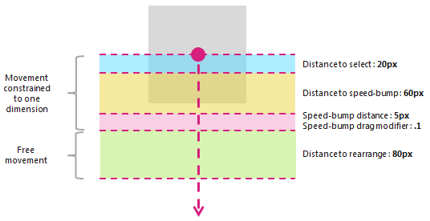

<!-- Class syntax.
public class GestureRecognizer : Windows.UI.Input.IGestureRecognizer
-->

# Windows.UI.Input.GestureRecognizer

## -description

Provides gesture and manipulation recognition, event listeners, and settings.

## -remarks

You can create a gesture object for each appropriate element when your app starts. However, this approach might not scale well depending on the number of gesture objects you need to create (for example, a jigsaw puzzle with hundreds of pieces).

In this case, you can create gesture objects dynamically on a [pointerdown](/previous-versions/windows/internet-explorer/ie-developer/platform-apis/jj191898(v=vs.85)) event and destroy them on an [MSGestureEnd](/previous-versions/windows/internet-explorer/ie-developer/platform-apis/jj191886(v=vs.85)) event. This approach scales well, but does incur some overhead due to creating and releasing these objects.

Alternatively, you can statically allocate and dynamically manage a pool of reusable gesture objects.

<!-- confirmed -->
> [!NOTE]
> This class is not agile, which means that you need to consider its threading model and marshaling behavior. For more info, see [Threading and Marshaling (C++/CX)](/cpp/cppcx/threading-and-marshaling-c-cx) and [Using Windows Runtime objects in a multithreaded environment (.NET)](/windows/uwp/threading-async/using-windows-runtime-objects-in-a-multithreaded-environment).

For more detail on how to use cross-slide functionality, see [Guidelines for cross-slide](/windows/uwp/input-and-devices/guidelines-for-cross-slide). The threshold distances used by the cross-slide interaction are shown in the following diagram.



The [PivotRadius](gesturerecognizer_pivotradius.md) and [PivotCenter](gesturerecognizer_pivotcenter.md) properties are used only when single pointer input is detected. They have no effect on multiple pointer input. The value for these properties should be updated regularly during the interaction.

Rotation is supported by a GestureRecognizer only when [manipulationRotate](gesturesettings.md) is set through the [GestureSettings](gesturerecognizer_gesturesettings.md) property.

Rotation is not supported for single pointer input if the value of [PivotRadius](gesturerecognizer_pivotradius.md) is set to 0.

### Version history

| Windows version | SDK version | Value added |
| -- | -- | -- |
| 2004 | 19041 | HoldMaxContactCount |
| 2004 | 19041 | HoldMinContactCount |
| 2004 | 19041 | HoldRadius |
| 2004 | 19041 | HoldStartDelay |
| 2004 | 19041 | TapMaxContactCount |
| 2004 | 19041 | TapMinContactCount |
| 2004 | 19041 | TranslationMaxContactCount |
| 2004 | 19041 | TranslationMinContactCount |

## -examples

Here we set up a GestureRecognizer object with a collection of input event handlers for processing both pointer and gesture input. For more information on how to listen to and handle Windows Runtime events, see [Events and routed events overview](/windows/uwp/xaml-platform/events-and-routed-events-overview). See the [Basic input sample](https://github.com/Microsoft/Windows-universal-samples/tree/master/Samples/BasicInput) for the full implementation.

```csharp
class ManipulationInputProcessor
{
    GestureRecognizer recognizer;
    UIElement element;
    UIElement reference;
    TransformGroup cumulativeTransform;
    MatrixTransform previousTransform;
    CompositeTransform deltaTransform;
    
    public ManipulationInputProcessor(GestureRecognizer gestureRecognizer, UIElement target, UIElement referenceFrame)
    {
        recognizer = gestureRecognizer;
        element = target;
        reference = referenceFrame;
        // Initialize the transforms that will be used to manipulate the shape
        InitializeTransforms();
        // The GestureSettings property dictates what manipulation events the
        // Gesture Recognizer will listen to.  This will set it to a limited
        // subset of these events.
        recognizer.GestureSettings = GenerateDefaultSettings();
        // Set up pointer event handlers. These receive input events that are used by the gesture recognizer.
        element.PointerPressed += OnPointerPressed;
        element.PointerMoved += OnPointerMoved;
        element.PointerReleased += OnPointerReleased;
        element.PointerCanceled += OnPointerCanceled;
        // Set up event handlers to respond to gesture recognizer output
        recognizer.ManipulationStarted += OnManipulationStarted;
        recognizer.ManipulationUpdated += OnManipulationUpdated;
        recognizer.ManipulationCompleted += OnManipulationCompleted;
        recognizer.ManipulationInertiaStarting += OnManipulationInertiaStarting;
    }
    
    public void InitializeTransforms()
    {
        cumulativeTransform = new TransformGroup();
        deltaTransform = new CompositeTransform();
        previousTransform = new MatrixTransform() { Matrix = Matrix.Identity };
        cumulativeTransform.Children.Add(previousTransform);
        cumulativeTransform.Children.Add(deltaTransform);
        element.RenderTransform = cumulativeTransform;
    }
    
    // Return the default GestureSettings for this sample
    GestureSettings GenerateDefaultSettings()
    {
        return GestureSettings.ManipulationTranslateX |
            GestureSettings.ManipulationTranslateY |
            GestureSettings.ManipulationRotate |
            GestureSettings.ManipulationTranslateInertia |
            GestureSettings.ManipulationRotateInertia;
    }
    
    // Route the pointer pressed event to the gesture recognizer.
    // The points are in the reference frame of the canvas that contains the rectangle element.
    void OnPointerPressed(object sender, PointerRoutedEventArgs args)
    {
        // Set the pointer capture to the element being interacted with so that only it
        // will fire pointer-related events
        element.CapturePointer(args.Pointer);
        // Feed the current point into the gesture recognizer as a down event
        recognizer.ProcessDownEvent(args.GetCurrentPoint(reference));
    }
    
    // Route the pointer moved event to the gesture recognizer.
    // The points are in the reference frame of the canvas that contains the rectangle element.
    void OnPointerMoved(object sender, PointerRoutedEventArgs args)
    {
        // Feed the set of points into the gesture recognizer as a move event
        recognizer.ProcessMoveEvents(args.GetIntermediatePoints(reference));
    }
    
    // Route the pointer released event to the gesture recognizer.
    // The points are in the reference frame of the canvas that contains the rectangle element.
    void OnPointerReleased(object sender, PointerRoutedEventArgs args)
    {
        // Feed the current point into the gesture recognizer as an up event
        recognizer.ProcessUpEvent(args.GetCurrentPoint(reference));
        // Release the pointer
        element.ReleasePointerCapture(args.Pointer);
    }
    
    // Route the pointer canceled event to the gesture recognizer.
    // The points are in the reference frame of the canvas that contains the rectangle element.
    void OnPointerCanceled(object sender, PointerRoutedEventArgs args)
    {
        recognizer.CompleteGesture();
        element.ReleasePointerCapture(args.Pointer);
    }
    
    // When a manipulation begins, change the color of the object to reflect
    // that a manipulation is in progress
    void OnManipulationStarted(object sender, ManipulationStartedEventArgs e)
    {
        Border b = element as Border;
        b.Background = new SolidColorBrush(Windows.UI.Colors.DeepSkyBlue);
    }
    
    // Process the change resulting from a manipulation
    void OnManipulationUpdated(object sender, ManipulationUpdatedEventArgs e)
    {
        previousTransform.Matrix = cumulativeTransform.Value;
        // Get the center point of the manipulation for rotation
        Point center = new Point(e.Position.X, e.Position.Y);
        deltaTransform.CenterX = center.X;
        deltaTransform.CenterY = center.Y;
        // Look at the Delta property of the ManipulationDeltaRoutedEventArgs to retrieve
        // the rotation, X, and Y changes
        deltaTransform.Rotation = e.Delta.Rotation;
        deltaTransform.TranslateX = e.Delta.Translation.X;
        deltaTransform.TranslateY = e.Delta.Translation.Y;
    }
    
    // When a manipulation that's a result of inertia begins, change the color of the
    // the object to reflect that inertia has taken over
    void OnManipulationInertiaStarting(object sender, ManipulationInertiaStartingEventArgs e)
    {
        Border b = element as Border;
        b.Background = new SolidColorBrush(Windows.UI.Colors.RoyalBlue);
    }
    
    // When a manipulation has finished, reset the color of the object
    void OnManipulationCompleted(object sender, ManipulationCompletedEventArgs e)
    {
        Border b = element as Border;
        b.Background = new SolidColorBrush(Windows.UI.Colors.LightGray);
    }
    
    // Modify the GestureSettings property to only allow movement on the X axis
    public void LockToXAxis()
    {
        recognizer.CompleteGesture();
        recognizer.GestureSettings |= GestureSettings.ManipulationTranslateY | GestureSettings.ManipulationTranslateX;
        recognizer.GestureSettings ^= GestureSettings.ManipulationTranslateY;
    }
    
    // Modify the GestureSettings property to only allow movement on the Y axis
    public void LockToYAxis()
    {
        recognizer.CompleteGesture();
        recognizer.GestureSettings |= GestureSettings.ManipulationTranslateY | GestureSettings.ManipulationTranslateX;
        recognizer.GestureSettings ^= GestureSettings.ManipulationTranslateX;
    }
    
    // Modify the GestureSettings property to allow movement on both the X and Y axes
    public void MoveOnXAndYAxes()
    {
        recognizer.CompleteGesture();
        recognizer.GestureSettings |= GestureSettings.ManipulationTranslateX | GestureSettings.ManipulationTranslateY;
    }
    
    // Modify the GestureSettings property to enable or disable inertia based on the passed-in value
    public void UseInertia(bool inertia)
    {
        if (!inertia)
        {
            recognizer.CompleteGesture();
            recognizer.GestureSettings ^= GestureSettings.ManipulationTranslateInertia | GestureSettings.ManipulationRotateInertia;
        }
        else
        {
            recognizer.GestureSettings |= GestureSettings.ManipulationTranslateInertia | GestureSettings.ManipulationRotateInertia;
        }
    }
    
    public void Reset()
    {
        element.RenderTransform = null;
        recognizer.CompleteGesture();
        InitializeTransforms();
        recognizer.GestureSettings = GenerateDefaultSettings();
    }
}
```

### Samples

- [User interaction mode sample](https://github.com/Microsoft/Windows-universal-samples/tree/master/Samples/UserInteractionMode)
- [Focus visuals sample](https://github.com/Microsoft/Windows-universal-samples/tree/master/Samples/XamlFocusVisuals)
- [Basic input sample](https://github.com/Microsoft/Windows-universal-samples/tree/master/Samples/BasicInput)
- [Direct3D game sample](https://github.com/Microsoft/Windows-universal-samples/tree/master/Samples/Simple3DGameDX)
- [DirectX and XAML game sample](https://github.com/Microsoft/Windows-universal-samples/tree/master/Samples/Simple3DGameXaml)

### Archived samples

- [Input: Manipulations and gestures sample](https://github.com/microsoftarchive/msdn-code-gallery-microsoft/tree/411c271e537727d737a53fa2cbe99eaecac00cc0/Official%20Windows%20Platform%20Sample/Input%20Gestures%20and%20manipulations%20with%20GestureRecognizer)
- [Input: XAML user input events sample](https://github.com/microsoftarchive/msdn-code-gallery-microsoft/tree/411c271e537727d737a53fa2cbe99eaecac00cc0/Official%20Windows%20Platform%20Sample/Input%20XAML%20user%20input%20events%20sample)
- [XAML scrolling, panning, and zooming sample](https://github.com/microsoftarchive/msdn-code-gallery-microsoft/tree/411c271e537727d737a53fa2cbe99eaecac00cc0/Official%20Windows%20Platform%20Sample/Universal%20Windows%20app%20samples/111487-Universal%20Windows%20app%20samples/XAML%20scrolling%2C%20panning%2C%20and%20zooming%20sample)
- [DirectX touch input sample](/en-us/samples/microsoft/windows-universal-samples/simple3dgamedx/)

## -see-also

[Windows.UI.Input Classes](windows_ui_input_classes.md), [Windows.Devices.Input](../windows.devices.input/windows_devices_input.md), [Windows.UI.Core](../windows.ui.core/windows_ui_core.md), [Windows.UI.Input](windows_ui_input.md), [Windows.UI.Input.Inking](../windows.ui.input.inking/windows_ui_input_inking.md), [Windows.UI.Xaml.Input](../windows.ui.xaml.input/windows_ui_xaml_input.md), [Custom user interactions](/windows/uwp/design/layout/index), [UX guidelines for custom user interactions](/windows/uwp/design/layout/index), [Touch design guidelines](/windows/uwp/input-and-devices/guidelines-for-user-interaction)