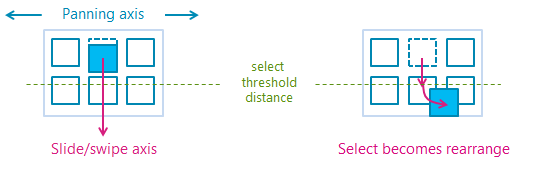

<!-- Event syntax
public event Windows.Foundation.TypedEventHandler CrossSliding<Windows.UI.Input.GestureRecognizer,  Windows.UI.Input.CrossSlidingEventArgs>
-->

# Windows.UI.Input.GestureRecognizer.CrossSliding

## -description
Occurs when a user performs a [slide](/windows/uwp/input-and-devices/guidelines-for-cross-slide) or [swipe](/windows/uwp/input-and-devices/guidelines-for-cross-slide) gesture (through a single touch contact) within a content area that supports panning along a single axis only. The gesture must occur in a direction that is perpendicular to this panning axis.

> [!NOTE]
> A swipe is a short sliding gesture that results in a selection action while the longer slide gesture crosses a distance threshold and results in a rearrange action. The swipe and slide gestures are demonstrated in the following diagram.

<!--kbridge: Font details: Segoe UI Symbol 11pt RGB: 214/31/126-->

## -remarks
[CrossSlide](gesturesettings.md) must be set in the [GestureSettings](gesturerecognizer_gesturesettings.md) property to support CrossSliding.

CrossSliding distance thresholds are disabled by default. Use [CrossSlideThresholds](gesturerecognizer_crossslidethresholds.md) to set these values.

## -examples

## -see-also
[TypedEventHandler](../windows.foundation/typedeventhandler_2.md), [CrossSlidingEventArgs](crossslidingeventargs.md), [Input and interactions](/windows/uwp/design/input/), [User interaction mode sample](https://github.com/Microsoft/Windows-universal-samples/tree/master/Samples/UserInteractionMode), [Focus visuals sample](https://go.microsoft.com/fwlink/p/?LinkID=619895), [Input: Device capabilities sample](https://github.com/microsoftarchive/msdn-code-gallery-microsoft/tree/411c271e537727d737a53fa2cbe99eaecac00cc0/Official%20Windows%20Platform%20Sample/Input%20Device%20capabilities%20sample), [Input: Simplified ink  sample](https://github.com/microsoftarchive/msdn-code-gallery-microsoft/tree/21cb9b6bc0da3b234c5854ecac449cb3bd261f29/Official%20Windows%20Platform%20Sample/Input%20Simplified%20ink%20sample), [Input: Windows 8 gestures sample](https://github.com/microsoftarchive/msdn-code-gallery-microsoft/tree/21cb9b6bc0da3b234c5854ecac449cb3bd261f29/Official%20Windows%20Platform%20Sample/Windows%208%20app%20samples/%5BC%23%5D-Windows%208%20app%20samples/C%23/Windows%208%20app%20samples/Input%20Windows%208%20gestures%20sample%20(Windows%208)/C%23), [Input: XAML user input events sample](https://github.com/microsoftarchive/msdn-code-gallery-microsoft/tree/21cb9b6bc0da3b234c5854ecac449cb3bd261f29/Official%20Windows%20Platform%20Sample/Input%20XAML%20user%20input%20events%20sample), [XAML scrolling, panning, and zooming sample](https://github.com/microsoftarchive/msdn-code-gallery-microsoft/tree/21cb9b6bc0da3b234c5854ecac449cb3bd261f29/Official%20Windows%20Platform%20Sample/XAML%20scrolling%2C%20panning%2C%20and%20zooming%20sample), [DirectX touch input sample](https://github.com/microsoftarchive/msdn-code-gallery-microsoft/tree/21cb9b6bc0da3b234c5854ecac449cb3bd261f29/Official%20Windows%20Platform%20Sample/Windows%208%20app%20samples/%5BC%2B%2B%5D-Windows%208%20app%20samples/C%2B%2B/Windows%208%20app%20samples/DirectX%20touch%20input%20sample%20(Windows%208)/C%2B%2B), [Input: Manipulations and gestures (C++) sample](https://github.com/microsoftarchive/msdn-code-gallery-microsoft/tree/21cb9b6bc0da3b234c5854ecac449cb3bd261f29/Official%20Windows%20Platform%20Sample/Windows%208%20app%20samples/%5BC%2B%2B%5D-Windows%208%20app%20samples/C%2B%2B/Windows%208%20app%20samples/Input%20Manipulations%20and%20gestures%20(C%2B%2B)%20sample%20(Windows%208)/C%2B%2B), [Input: Touch hit testing sample](https://github.com/microsoftarchive/msdn-code-gallery-microsoft/tree/21cb9b6bc0da3b234c5854ecac449cb3bd261f29/Official%20Windows%20Platform%20Sample/Windows%208%20app%20samples/%5BC%2B%2B%5D-Windows%208%20app%20samples/C%2B%2B/Windows%208%20app%20samples/Input%20Touch%20hit%20testing%20sample%20(Windows%208)/C%2B%2B), [Input source identification sample](https://github.com/microsoftarchive/msdn-code-gallery-microsoft/tree/21cb9b6bc0da3b234c5854ecac449cb3bd261f29/Official%20Windows%20Platform%20Sample/Windows%208%20desktop%20samples/%5BC%2B%2B%5D-Windows%208%20desktop%20samples/C%2B%2B/Windows%208%20desktop%20samples/Input%20Source%20identification%20sample/C%2B%2B), [Touch injection sample](https://github.com/microsoftarchive/msdn-code-gallery-microsoft/tree/21cb9b6bc0da3b234c5854ecac449cb3bd261f29/Official%20Windows%20Platform%20Sample/Input%20Touch%20injection%20sample), [Win32 touch hit-testing sample](https://github.com/microsoftarchive/msdn-code-gallery-microsoft/tree/21cb9b6bc0da3b234c5854ecac449cb3bd261f29/Official%20Windows%20Platform%20Sample/Windows%208%20app%20samples/%5BC%2B%2B%5D-Windows%208%20app%20samples/C%2B%2B/Windows%208%20app%20samples/Input%20Touch%20hit%20testing%20sample%20(Windows%208)/C%2B%2B)