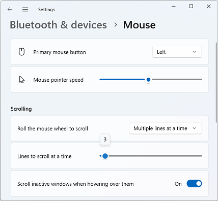

<!-- Property syntax
public Windows.Foundation.Point CharTranslation { get;  set; }
-->

# Windows.UI.Input.MouseWheelParameters.CharTranslation

## -description

Gets or sets the conversion factors for both character width and line height units, in device-independent pixel (DIP).

## -property-value

The conversion factors for the character width (x) and line height (y).

## -remarks

The following image shows the default control panel settings for the button wheel. These settings map a single detent to a specific unit of distance in the UI (character width and line height). CharTranslation provides the means to redefine these distances and specify them in terms of device-independent pixel (DIP).

*Mouse properties dialog with wheel settings displayed*

If the wheel button is set to scroll three lines at a time for each detent and the value of CharTranslation is set to (8,16), vertical scrolling is applied at 3 x 16 = 48 device-independent pixel (DIP) per detent. Horizontal scrolling through the mouse tilt wheel is applied at 3 x 8 = 24 device-independent pixel (DIP) per detent.

> [!NOTE]
> If **ManipulationTranslateY**/**ManipulationTranslateRailsY** is disabled and **ManipulationTranslateX**/**ManipulationTranslateRailsX** is enabled through [GestureSettings](gesturerecognizer_gesturesettings.md) then scrolling is applied only along the horizontal axis when the button wheel is rotated or tilted. Similarly, if **ManipulationTranslateY**/**ManipulationTranslateRailsY** is enabled and **ManipulationTranslateX**/**ManipulationTranslateRailsX** is disabled through [GestureSettings](gesturerecognizer_gesturesettings.md) then scrolling is applied only along the vertical axis when the button wheel is rotated or tilted.

## -examples

## -see-also
