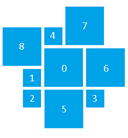
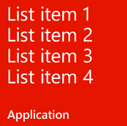
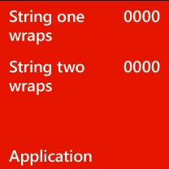
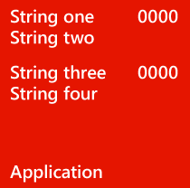
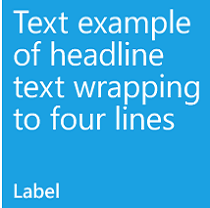
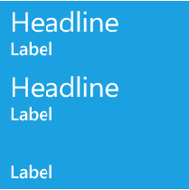

<!-- Enumeration syntax
public enum Windows.UI.Notifications.TileFlyoutTemplateType : int
-->

# TileFlyoutTemplateType

## -description
Specifies the layout template to use in a tile flyout (mix view) update. At present, only one template is defined.

## -enum-fields
### -field TileFlyoutTemplate01:0
Eight sub-tiles that surround a central medium (150x150) tile. Each sub-tile supports a combination of text and images.

+ Sub-tiles 1-4 support an image optionally overlaid with a single text string normally used as a label. If the user hovers over one of these sub-tiles, the text scrolls.
+ Sub-tiles 5-8 support an image optionally overlaid with one or more strings from a set of 11 possible strings, each of which provides its own placement and font size on the sub-tile.

## -remarks
### Sub-tile configurations

### How to specify a configuration
Each of sub-tiles 5-8 can be given one of eight configurations. The configuration is determined by which text elements you include in that sub-tile, with an order of precedence to those elements. 
1. If Text10 or Text11 are set    + If Text08 or Text09 are set       + Configuration 3

   + Else       + Configuration 2

1. Else if Text02 is set    + If Text06 or Text07 are set       + Configuration 9

   + Else if Text03 is set       + Configuration 1

   + Else       + Configuration 5

1. Else if Text06    + If Text01       + Configuration 6

   + Else       + Configuration 7

1. Else if Text01    + Configuration 8

1. Else configuration 4

### Configuration examples

The layout of each configuration is shown here. Note that any text element included but not recognized by a configuration is ignored.

<table>
   <tr><td>**Configuration 1**

Supported text elements: 
<ul><li>1 ("Application")</li><li>2 ("List item 1")</li><li>3 ("List item 2")</li><li>4 ("List item 3")</li><li>5 ("List item 4")</li></ul></td><td></td></tr>
   <tr><td>**Configuration 2**

Supported text elements: 
<ul><li>1 ("Application")</li><li>6 ("String one wraps")</li><li>7 ("String two wraps")</li><li>10 ("0000" - upper)</li><li>11 ("0000" - lower)</li></ul></td><td></td></tr>
   <tr><td>**Configuration 3**

Valid text elements: 
<ul><li>1 ("Application")</li><li>6 ("String one")</li><li>7 ("String two")</li><li>8 ("String three")</li><li>9 ("String four")</li><li>10 ("0000" - upper)</li><li>11 ("0000" - lower)</li></ul></td><td></td></tr>
   <tr><td>**Configuration 4**

Valid text elements: none (image only)</td><td></td></tr>
   <tr><td>**Configuration 5**

Valid text elements: 
<ul><li>1 ("Label")</li><li>2 ("Text example of text wrapping to four lines")</li></ul></td><td></td></tr>
   <tr><td>**Configuration 6**

Valid text elements: 
<ul><li>1 ("Label")</li><li>6 ("Text example of headline")</li></ul></td><td></td></tr>
   <tr><td>**Configuration 7**

Valid text elements: 
<ul><li>6 ("Text example of headine text on photo")</li></ul></td><td></td></tr>
   <tr><td>**Configuration 8**

Valid text elements: 1 
<ul><li>1 ("Label")</li></ul></td><td></td></tr>
   <tr><td>**Configuration 9**

Valid text elements: 
<ul><li>1 ("Label" - bottom)</li><li>2 ("Headline" - upper)</li><li>3 ("Headline" - lower)</li><li>6 ("Label" - upper)</li><li>7 ("Label" - lower)</li></ul></td><td></td></tr>
</table>

## -examples

## -see-also