<!-- Enumeration syntax
public enum Windows.UI.Notifications.TileTemplateType : int
-->

# TileTemplateType

## -description
Specifies the content template to use in a tile update. For a more detailed discussion of each tile, including an example of its XML coding, specifics on each template's image sizes, and use with different versions of the tile XML schema, see [The tile template catalog](/previous-versions/windows/apps/hh761491(v=win.10)).

When displayed on a device set to a right-to-left (RTL) language, some templates are flipped from their left and right descriptions here.

In many of the templates, the last line of text will not display if your tile includes a logo or display name. This does not apply to the large (310 x 310) tiles. For more information on the logo/short name, see [Quickstart: Creating a default tile using the  manifest editor](/previous-versions/windows/apps/hh465437(v=win.10)).

> [!IMPORTANT]
> Windows 8.1 added new templates for large, square tiles. To distinguish large tiles from medium tiles (known as square tiles in Windows 8), all of the older templates were renamed. To account for this, notification payloads can be declared with a specific version. For compatibility across systems, a fallback attribute has been added so that both the old name and the new name are present. You must understand the distinctions between versions to ensure that your notifications are displayed. For more information, see [Versioned templates](/previous-versions/windows/apps/hh761491(v=win.10)).

> When displayed on Windows Phone 8.1, some templates do not appear quite the same as they do when displayed on Windows. For instance, peek templates on the phone flip from front to back rather than scrolling up and down. The number of lines of displayed text might be different, sometimes less on the phone, but usually more. Wide tile images on the phone fill the tile with the text overlaid on them rather than having a solid colored text area. Image collection tiles are animated and appear very differently. Differences that you need to be aware of are called out for each value.

## -enum-fields
### -field TileSquareImage:0
One image that fills the entire tile; no text. 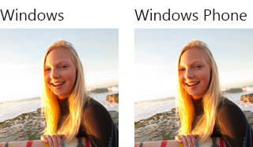

### -field TileSquareBlock:1
****: One string of large block text (generally numerical) over a single, short line of regular text.

****: One short string of large block text (generally numerical) in the lower right corner, to the left of a single, very short line of regular text.

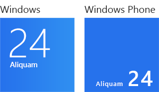

### -field TileSquareText01:2
One header string in larger text on the first line; three strings of regular text on each of the next three lines. Text does not wrap. 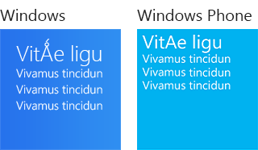

### -field TileSquareText02:3
One header string in larger text on the first line, over one string of regular text wrapped over a maximum of three lines. 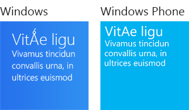

### -field TileSquareText03:4
Four strings of regular text on four lines. Text does not wrap. 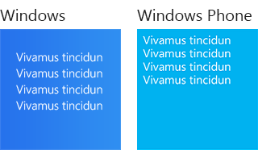

### -field TileSquareText04:5
One string of regular text wrapped over a maximum of four lines. 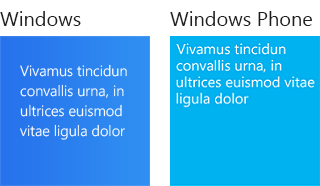

### -field TileSquarePeekImageAndText01:6
Top/Front: One square image, no text. Bottom/Back: One header string in larger text on the first line, three strings of regular text on each of the next three lines. Text does not wrap. 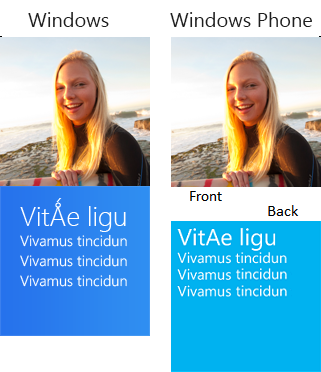

### -field TileSquarePeekImageAndText02:7
Top/Front: Square image, no text. Bottom/Back: One header string in larger text on the first line, over one string of regular text wrapped over a maximum of three lines. 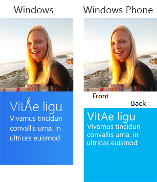

### -field TileSquarePeekImageAndText03:8
Top/Front: Square image, no text. Bottom/Back: Four strings of regular text on four lines. Text does not wrap. 

### -field TileSquarePeekImageAndText04:9
Top/Front: Square image, no text. Bottom/Back: One string of regular text wrapped over a maximum of four lines. 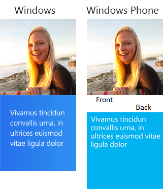

### -field TileWideImage:10
One wide image that fills the entire tile, no text. 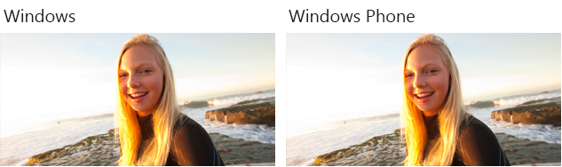

### -field TileWideImageCollection:11
****: One large square image with four smaller square images to its right, no text.

****: The images appear in a 6x3 set of tessellated, flipping blocks. An image might take up one block or four. Images are shown randomly, moving among blocks of various solid colors.

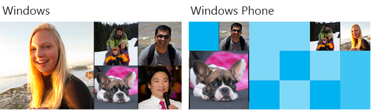

### -field TileWideImageAndText01:12
One wide image over one string of regular text wrapped over a maximum of two lines (one line on Windows Phone 8.1). The width of the text area depends on whether a logo is displayed. 

> [!NOTE]
> This template allows [branding](/uwp/schemas/tiles/tilesschema/element-binding) only as "logo" or "none", but not "name". If you set the branding attribute to "name", it will automatically revert to "logo" on Windows or "none" on Windows Phone 8.1.

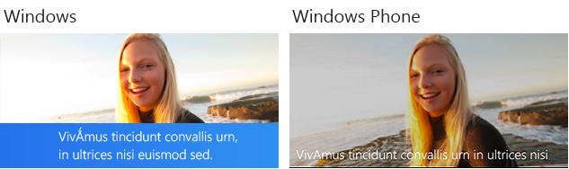

### -field TileWideImageAndText02:13
****: One wide image over two strings of regular text on two lines. Text does not wrap. The width of the text area depends on whether a logo is displayed.

****: One wide image over one string of regular text on one line. Text does not wrap. The second string is ignored. The width of the text area depends on whether a logo is displayed.

> [!NOTE]
> This template allows [branding](/uwp/schemas/tiles/tilesschema/element-binding) only as "logo" or "none", but not "name". If you set the branding attribute to "name", it will automatically revert to "logo" on Windows or "none" on Windows Phone 8.1..

### -field TileWideBlockAndText01:14
Four strings of regular, unwrapped text on the left; large block text (this should be numerical) over a single, short string of regular text on the right. 

> [!IMPORTANT]
> The last of the four strings on the left is ignored in Windows Phone 8.1.

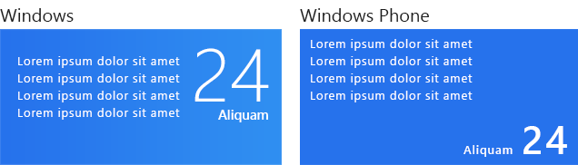

### -field TileWideBlockAndText02:15
One string of regular text wrapped over a maximum of four lines on the left; large block text (this should be numerical) over a single, short string of regular text on the right. 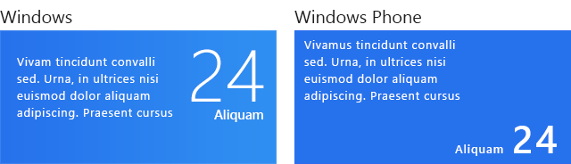

### -field TileWidePeekImageCollection01:16
****: Top: One large square image with four smaller square images to its right, no text.

****: Front: The images appear in a 6x3 set of tessellated, flipping blocks. An image might take up one block or four. Images are shown randomly, moving among blocks of various solid colors.

Bottom/Back: One header string in larger text over one string of regular text wrapped over a maximum of four lines.

### -field TileWidePeekImageCollection02:17
****: Top: One large square image with four smaller square images to its right, no text.

****: Front: The images appear in a 6x3 set of tessellated, flipping blocks. An image might take up one block or four. Images are shown randomly, moving among blocks of various solid colors.

Bottom/Back: One header string in larger text on the first line, four strings of regular text on the next four lines. Text does not wrap.

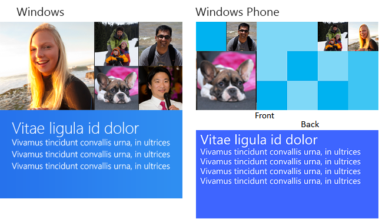

### -field TileWidePeekImageCollection03:18
****: Top: One large square image with four smaller square images to its right, no text.

****: Front: The images appear in a 6x3 set of tessellated, flipping blocks. An image might take up one block or four. Images are shown randomly, moving among blocks of various solid colors.

Bottom/Back: One string of large text wrapped over a maximum of three lines.

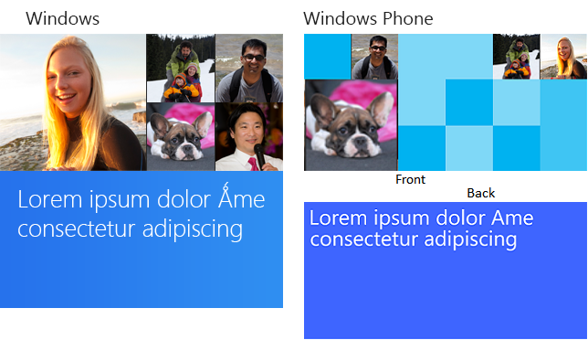

### -field TileWidePeekImageCollection04:19
****: Top: One large square image with four smaller square images to its right, no text.

****: Front: The images appear in a 6x3 set of tessellated, flipping blocks. An image might take up one block or four. Images are shown randomly, moving among blocks of various solid colors.

Bottom/Back: One string of regular text wrapped over a maximum of five lines.

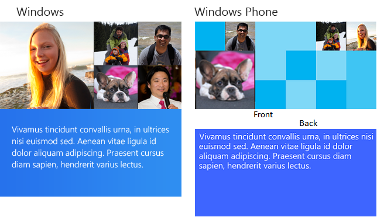

### -field TileWidePeekImageCollection05:20
****: Top: One large square image with four smaller square images to its right, no text.

****: Front: The images appear in a 6x3 set of tessellated, flipping blocks. An image might take up one block or four. Images are shown randomly, moving among blocks of various solid colors.

Bottom/Back: On the left, one small image; on the right, one header string of larger text on the first line over one string of regular text wrapped over a maximum of four lines.

> [!IMPORTANT]
> On Windows Phone 8.1, the small image that accompanies the text is not shown.

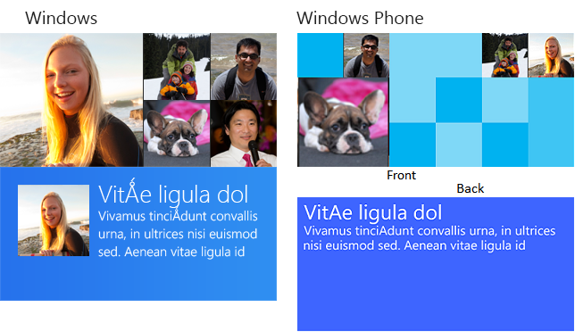

### -field TileWidePeekImageCollection06:21
****: Top: One large square image with four smaller square images to its right, no text.

****: Front: The images appear in a 6x3 set of tessellated, flipping blocks. An image might take up one block or four. Images are shown randomly, moving among blocks of various solid colors.

Bottom/Back: On the left, one small image; on the right, one string of large text wrapped over a maximum of three lines.

> [!IMPORTANT]
> On Windows Phone 8.1, the small image that accompanies the text is not shown.

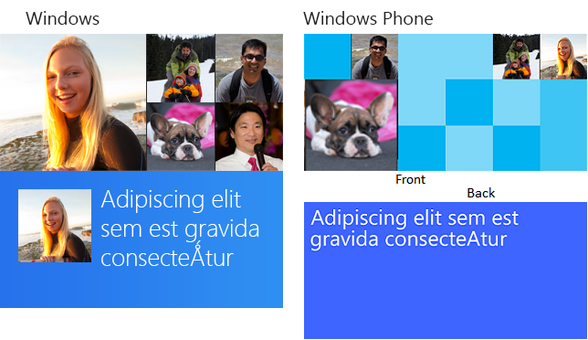

### -field TileWidePeekImageAndText01:22
****: Top: One wide image, with a shorter height than a full-bleed wide image.

****: Front: One wide image that fills the entire tile.

Bottom/Back: One string of regular text wrapped over a maximum of five lines.

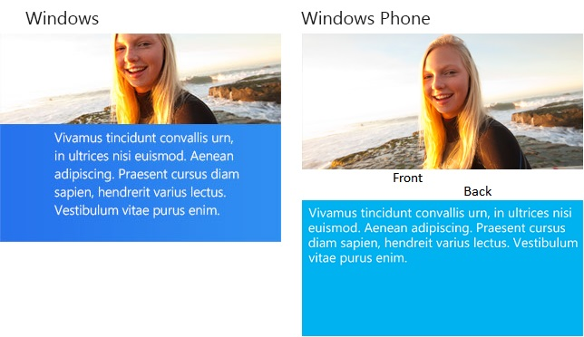

### -field TileWidePeekImageAndText02:23
Top/Front: One wide image, with a shorter height than a full-bleed wide image. Bottom/Back: Five strings of regular text on five lines. Text does not wrap. 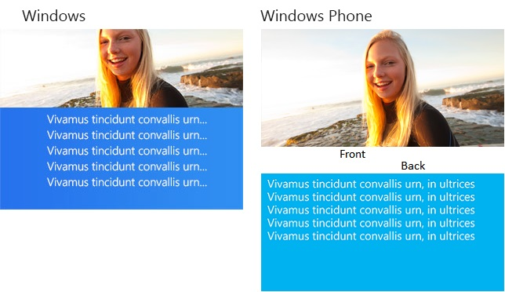

### -field TileWidePeekImage01:24
Top/Front: One wide image. Bottom/Back: One header string in larger text over one string of regular text that wraps over a maximum of four lines. 

### -field TileWidePeekImage02:25
Top/Front: One wide image. Bottom/Back: One header string in larger text on the first line, four strings of regular text on the next four lines. Text does not wrap. 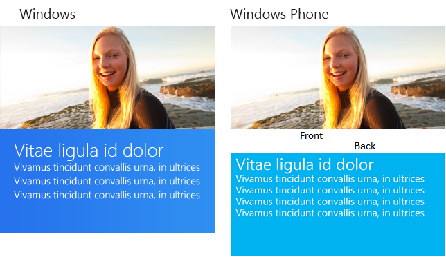

### -field TileWidePeekImage03:26
Top/Front: One wide image. Bottom/Back: One string of large text wrapped over a maximum of three lines. 

### -field TileWidePeekImage04:27
Top/Front: One wide image. Bottom/Back: One string of regular text wrapped over a maximum of five lines. 

### -field TileWidePeekImage05:28
Top/Front: One wide image.

****: Bottom: On the left, one small image; on the right, one header string of larger text on the first line over one string of regular text wrapped over a maximum of four lines.

****: Back: One header string of larger text on the first line over one string of regular text wrapped over a maximum of four lines.

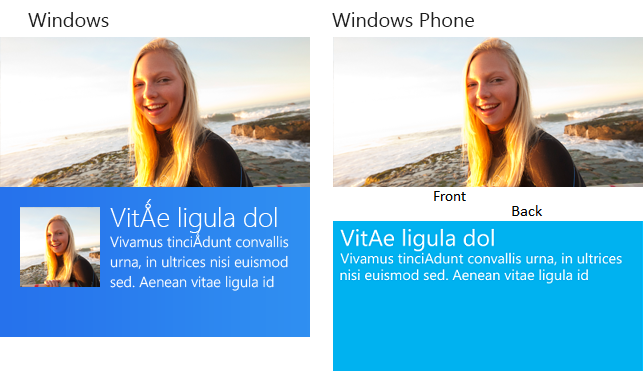

### -field TileWidePeekImage06:29
Top/Front: One wide image.

****: Bottom: On the left, one small image; on the right, one string of large text wrapped over a maximum of three lines.

****: Back: One string of large text wrapped over a maximum of three lines.

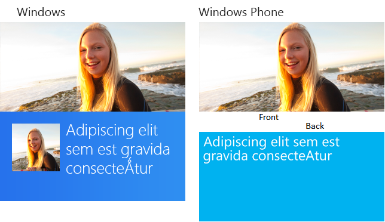

### -field TileWideSmallImageAndText01:30
On the left, one small image; on the right, one string of large text wrapped over a maximum of three lines. 

> [!IMPORTANT]
> On Windows Phone 8.1, the image is not shown.

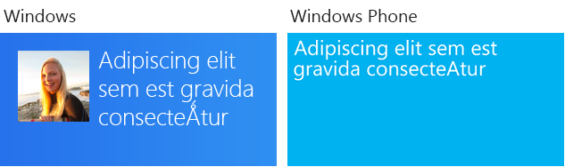

### -field TileWideSmallImageAndText02:31
On the left, one small image; on the right, one header string in larger text on the first line, four strings of regular text on the next four lines. Text does not wrap. 

> [!IMPORTANT]
> On Windows Phone 8.1, the image is not shown.

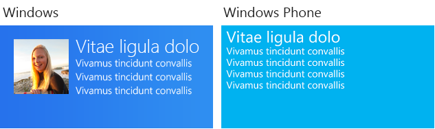

### -field TileWideSmallImageAndText03:32
On the left, one small image; on the right, one string of regular text wrapped over a maximum of five lines. 

> [!IMPORTANT]
> On Windows Phone 8.1, the image is not shown.

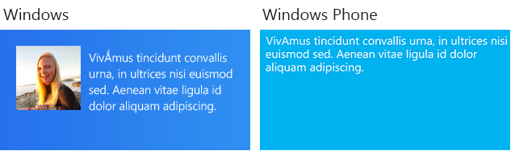

### -field TileWideSmallImageAndText04:33
On the left, one small image; on the right, one header string of larger text on the first line over one string of regular text wrapped over a maximum of four lines. 

> [!IMPORTANT]
> On Windows Phone 8.1, the image is not shown.

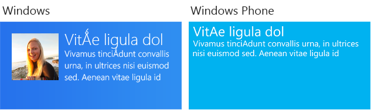

### -field TileWideSmallImageAndText05:34
On the left, one header string in larger text over one string of regular text wrapped over a maximum of four lines; on the right, one small image with 3:4 dimensions. 

> [!IMPORTANT]
> On Windows Phone 8.1, the image is not shown.

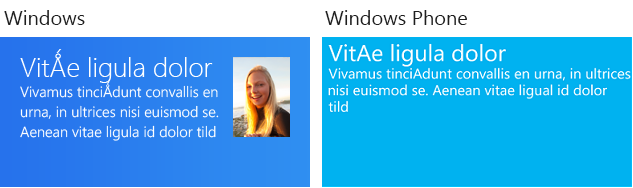

### -field TileWideText01:35
One header string in larger text on the first line, four strings of regular text on the next four lines. Text does not wrap. 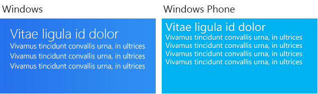

### -field TileWideText02:36
One header string in larger text over eight short strings arranged in two columns of four lines each. Columns are of equal width. This template is similar to TileWideText07 and TileWideText10, but those templates use columns of unequal width. 

### -field TileWideText03:37
One string of large text wrapped over a maximum of three lines. 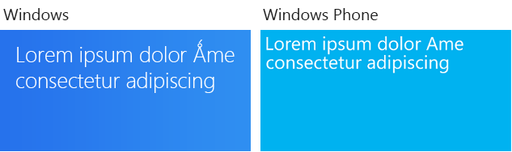

### -field TileWideText04:38
One string of regular text wrapped over a maximum of five lines. 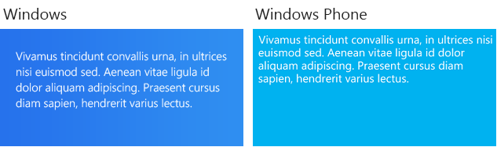

### -field TileWideText05:39
Five strings of regular text on five lines. Text does not wrap. 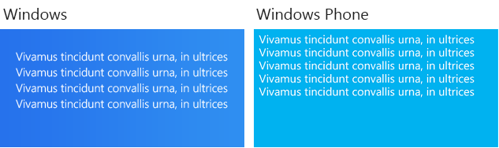

### -field TileWideText06:40
Ten short strings of regular text, arranged in two columns of five lines each. Columns are of equal width. This template is similar to TileWideText08 and TileWideText11, but those templates use columns of unequal width. 

### -field TileWideText07:41
One header string in larger text over eight short strings of regular text arranged in two columns of four lines each. The column widths are such that the first column acts as a label and the second column as the content. This template is similar to TileWideText10, which has an even narrower first column, and TileWideText02, which has columns of equal width. 

### -field TileWideText08:42
Ten short strings of regular text arranged in two columns of five lines each. The column widths are such that the first column acts as a label and the second column as the content. This template is similar to TileWideText11, which has an even narrower first column, and TileWideText06, which has columns of equal width. 

### -field TileWideText09:43
One header string in larger text over one string of regular text wrapped over a maximum of four lines. 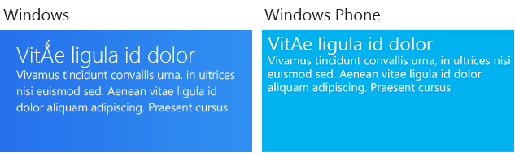

### -field TileWideText10:44
One header string in larger text over eight short strings of regular text arranged in two columns of four lines each. The column widths are such that the first column acts as a label and the second column as the content. This template is similar to TileWideText07, which has a wider first column, and TileWideText02, which has columns of equal width. 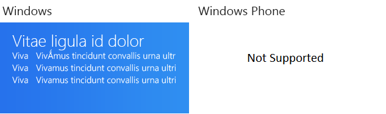

### -field TileWideText11:45
Ten short strings of regular text arranged in two columns of five lines each. The column widths are such that the first column acts as a label and the second column as the content. This template is similar to TileWideText08, which has a wider first column, and TileWideText06, which has columns of equal width. 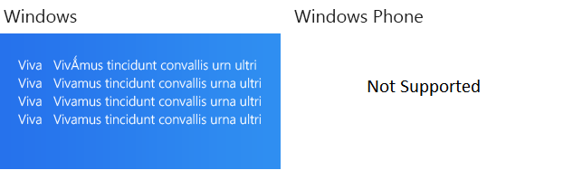

### -field TileSquare150x150Image:0
> [!NOTE]
> This value requires the version attribute of the template's [visual](/uwp/schemas/tiles/tilesschema/element-visual)element to be set to at least "2".

 Windows 8 (Version 1) name/Windows 8.1  [fallback](/uwp/schemas/tiles/tilesschema/element-binding)attribute value: **TileSquareImage**

One square image that fills the entire tile, no text.

### -field TileSquare150x150Block:1
> [!NOTE]
> This value requires the version attribute of the template's [visual](/uwp/schemas/tiles/tilesschema/element-visual)element to be set to at least "2".

 Windows 8 (Version 1) name/Windows 8.1  [fallback](/uwp/schemas/tiles/tilesschema/element-binding)attribute value: **TileSquareBlock**

One string of large block text (this should be numerical) over a single, short line of regular text.

### -field TileSquare150x150Text01:2
> [!NOTE]
> This value requires the version attribute of the template's [visual](/uwp/schemas/tiles/tilesschema/element-visual)element to be set to at least "2".

 Windows 8 (Version 1) name/Windows 8.1  [fallback](/uwp/schemas/tiles/tilesschema/element-binding)attribute value: **TileSquareText01**

One header string in larger text on the first line; three strings of regular text on each of the next three lines. Text does not wrap.

### -field TileSquare150x150Text02:3
> [!NOTE]
> This value requires the version attribute of the template's [visual](/uwp/schemas/tiles/tilesschema/element-visual)element to be set to at least "2".

 Windows 8 (Version 1) name/Windows 8.1  [fallback](/uwp/schemas/tiles/tilesschema/element-binding)attribute value: **TileSquareText02**

One header string in larger text on the first line, over one string of regular text wrapped over a maximum of three lines.

### -field TileSquare150x150Text03:4
> [!NOTE]
> This value requires the version attribute of the template's [visual](/uwp/schemas/tiles/tilesschema/element-visual)element to be set to at least "2".

 Windows 8 (Version 1) name/Windows 8.1  [fallback](/uwp/schemas/tiles/tilesschema/element-binding)attribute value: **TileSquareText03**

Four strings of regular text on four lines. Text does not wrap.

### -field TileSquare150x150Text04:5
> [!NOTE]
> This value requires the version attribute of the template's [visual](/uwp/schemas/tiles/tilesschema/element-visual)element to be set to at least "2".

 Windows 8 (Version 1) name/Windows 8.1  [fallback](/uwp/schemas/tiles/tilesschema/element-binding)attribute value: **TileSquareText04**

One string of regular text wrapped over a maximum of four lines.

### -field TileSquare150x150PeekImageAndText01:6
> [!NOTE]
> This value requires the version attribute of the template's [visual](/uwp/schemas/tiles/tilesschema/element-visual)element to be set to at least "2".

 Windows 8 (Version 1) name/Windows 8.1  [fallback](/uwp/schemas/tiles/tilesschema/element-binding)attribute value: **TileSquarePeekImageAndText01**

Top/Front: One square image, no text. Bottom/Back: One header string in larger text on the first line, three strings of regular text on each of the next three lines. Text does not wrap.

### -field TileSquare150x150PeekImageAndText02:7
> [!NOTE]
> This value requires the version attribute of the template's [visual](/uwp/schemas/tiles/tilesschema/element-visual)element to be set to at least "2".

 Windows 8 (Version 1) name/Windows 8.1  [fallback](/uwp/schemas/tiles/tilesschema/element-binding)attribute value: **TileSquarePeekImageAndText02**

Top/Front: Square image, no text. Bottom/Back: One header string in larger text on the first line, over one string of regular text wrapped over a maximum of three lines.

### -field TileSquare150x150PeekImageAndText03:8
> [!NOTE]
> This value requires the version attribute of the template's [visual](/uwp/schemas/tiles/tilesschema/element-visual)element to be set to at least "2".

 Windows 8 (Version 1) name/Windows 8.1  [fallback](/uwp/schemas/tiles/tilesschema/element-binding)attribute value: **TileSquarePeekImageAndText03**

Top/Front: Square image, no text. Bottom/Back: Four strings of regular text on four lines. Text does not wrap.

### -field TileSquare150x150PeekImageAndText04:9
> [!NOTE]
> This value requires the version attribute of the template's [visual](/uwp/schemas/tiles/tilesschema/element-visual)element to be set to at least "2".

 Windows 8 (Version 1) name/Windows 8.1  [fallback](/uwp/schemas/tiles/tilesschema/element-binding)attribute value: **TileSquarePeekImageAndText04**

Top/Front: Square image, no text. Bottom/Back: One string of regular text wrapped over a maximum of four lines.

### -field TileWide310x150Image:10
> [!NOTE]
> This value requires the version attribute of the template's [visual](/uwp/schemas/tiles/tilesschema/element-visual)element to be set to at least "2".

 Windows 8 (Version 1) name/Windows 8.1  [fallback](/uwp/schemas/tiles/tilesschema/element-binding)attribute value: **TileWideImage**

One wide image that fills the entire tile, no text.

### -field TileWide310x150ImageCollection:11
> [!NOTE]
> This value requires the version attribute of the template's [visual](/uwp/schemas/tiles/tilesschema/element-visual)element to be set to at least "2".

 Windows 8 (Version 1) name/Windows 8.1  [fallback](/uwp/schemas/tiles/tilesschema/element-binding)attribute value: **TileWideImageCollection**

****: One large square image with four smaller square images to its right, no text.

****: The images appear in a 6x3 set of tessellated, flipping blocks. An image might take up one block or four. Images are shown randomly, moving among blocks of various solid colors.

### -field TileWide310x150ImageAndText01:12
> [!NOTE]
> This value requires the version attribute of the template's [visual](/uwp/schemas/tiles/tilesschema/element-visual)element to be set to at least "2".

 Windows 8 (Version 1) name/Windows 8.1  [fallback](/uwp/schemas/tiles/tilesschema/element-binding)attribute value: **TileWideImageAndText01**

One wide image over one string of regular text wrapped over a maximum of two lines (one line on Windows Phone 8.1). The width of the text area depends on whether a logo is displayed.

> [!NOTE]
> This template allows [branding](/uwp/schemas/tiles/tilesschema/element-binding) only as "logo" or "none", but not "name". If you set the branding attribute to "name", it will automatically revert to "logo" on Windows or "none" on Windows Phone 8.1.

### -field TileWide310x150ImageAndText02:13
> [!NOTE]
> This value requires the version attribute of the template's [visual](/uwp/schemas/tiles/tilesschema/element-visual)element to be set to at least "2".

 Windows 8 (Version 1) name/Windows 8.1  [fallback](/uwp/schemas/tiles/tilesschema/element-binding)attribute value: **TileWideImageAndText02**

****: One wide image over two strings of regular text on two lines. Text does not wrap. The width of the text area depends on whether a logo is displayed.

****: One wide image over one string of regular text on one line. Text does not wrap. The second string is ignored. The width of the text area depends on whether a logo is displayed.

> [!NOTE]
> This template allows [branding](/uwp/schemas/tiles/tilesschema/element-binding) only as "logo" or "none", but not "name". If you set the branding attribute to "name", it will automatically revert to "logo" on Windows or "none" on Windows Phone 8.1.

### -field TileWide310x150BlockAndText01:14
> [!NOTE]
> This value requires the version attribute of the template's [visual](/uwp/schemas/tiles/tilesschema/element-visual)element to be set to at least "2".

 Windows 8 (Version 1) name/Windows 8.1  [fallback](/uwp/schemas/tiles/tilesschema/element-binding)attribute value: **TileWideBlockAndText01**

Four strings of regular, unwrapped text on the left; large block text (this should be numerical) over a single, short string of regular text on the right.

> [!IMPORTANT]
> The last of the four strings on the left is ignored in Windows Phone 8.1.

### -field TileWide310x150BlockAndText02:15
> [!NOTE]
> This value requires the version attribute of the template's [visual](/uwp/schemas/tiles/tilesschema/element-visual)element to be set to at least "2".

 Windows 8 (Version 1) name/Windows 8.1  [fallback](/uwp/schemas/tiles/tilesschema/element-binding)attribute value: **TileWideBlockAndText02**

One string of regular text wrapped over a maximum of four lines on the left; large block text (this should be numerical) over a single, short string of regular text on the right.

### -field TileWide310x150PeekImageCollection01:16
> [!NOTE]
> This value requires the version attribute of the template's [visual](/uwp/schemas/tiles/tilesschema/element-visual)element to be set to at least "2".

 Windows 8 (Version 1) name/Windows 8.1  [fallback](/uwp/schemas/tiles/tilesschema/element-binding)attribute value: **TileWidePeekImageCollection01**

****: Top: One large square image with four smaller square images to its right, no text. Note that the large image is not quite square; it is slightly wider than it is tall. If you supply a square image, the image will be scaled for width and slightly cropped on the top and bottom.

****: Front: The images appear in a 6x3 set of tessellated, flipping blocks. An image might take up one block or four. Images are shown randomly, moving among blocks of various solid colors.

Bottom/Back: One header string in larger text over one string of regular text wrapped over a maximum of four lines.

### -field TileWide310x150PeekImageCollection02:17
> [!NOTE]
> This value requires the version attribute of the template's [visual](/uwp/schemas/tiles/tilesschema/element-visual)element to be set to at least "2".

 Windows 8 (Version 1) name/Windows 8.1  [fallback](/uwp/schemas/tiles/tilesschema/element-binding)attribute value: **TileWidePeekImageCollection02**

****: Top: One large square image with four smaller square images to its right, no text. Note that the large image is not quite square; it is slightly wider than it is tall. If you supply a square image, the image will be scaled for width and slightly cropped on the top and bottom.

****: Front: The images appear in a 6x3 set of tessellated, flipping blocks. An image might take up one block or four. Images are shown randomly, moving among blocks of various solid colors.

Bottom/Back: One header string in larger text on the first line, four strings of regular text on the next four lines. Text does not wrap.

### -field TileWide310x150PeekImageCollection03:18
> [!NOTE]
> This value requires the version attribute of the template's [visual](/uwp/schemas/tiles/tilesschema/element-visual)element to be set to at least "2".

 Windows 8 (Version 1) name/Windows 8.1  [fallback](/uwp/schemas/tiles/tilesschema/element-binding)attribute value: **TileWidePeekImageCollection03**

****: Top: One large square image with four smaller square images to its right, no text. Note that the large image is not quite square; it is slightly wider than it is tall. If you supply a square image, the image will be scaled for width and slightly cropped on the top and bottom.

****: Front: The images appear in a 6x3 set of tessellated, flipping blocks. An image might take up one block or four. Images are shown randomly, moving among blocks of various solid colors.

Bottom/Back: One string of large text wrapped over a maximum of three lines.

### -field TileWide310x150PeekImageCollection04:19
> [!NOTE]
> This value requires the version attribute of the template's [visual](/uwp/schemas/tiles/tilesschema/element-visual)element to be set to at least "2".

 Windows 8 (Version 1) name/Windows 8.1  [fallback](/uwp/schemas/tiles/tilesschema/element-binding)attribute value: **TileWidePeekImageCollection04**

****: Top: One large square image with four smaller square images to its right, no text. Note that the large image is not quite square; it is slightly wider than it is tall. If you supply a square image, the image will be scaled for width and slightly cropped on the top and bottom.

****: Front: The images appear in a 6x3 set of tessellated, flipping blocks. An image might take up one block or four. Images are shown randomly, moving among blocks of various solid colors.

Bottom/Back: One string of regular text wrapped over a maximum of five lines.

### -field TileWide310x150PeekImageCollection05:20
> [!NOTE]
> This value requires the version attribute of the template's [visual](/uwp/schemas/tiles/tilesschema/element-visual)element to be set to at least "2".

 Windows 8 (Version 1) name/Windows 8.1  [fallback](/uwp/schemas/tiles/tilesschema/element-binding)attribute value: **TileWidePeekImageCollection05**

****
+ Top: One large square image with four smaller square images to its right, no text. Note that the large image is not quite square; it is slightly wider than it is tall. If you supply a square image, the image will be scaled for width and slightly cropped on the top and bottom.
+ Bottom: On the left, one small image; on the right, one header string of larger text on the first line over one string of regular text wrapped over a maximum of four lines.

****
+ Front: The images appear in a 6x3 set of tessellated, flipping blocks. An image might take up one block or four. Images are shown randomly, moving among blocks of various solid colors.
+ Back: One header string of larger text on the first line over one string of regular text wrapped over a maximum of four lines.

### -field TileWide310x150PeekImageCollection06:21
> [!NOTE]
> This value requires the version attribute of the template's [visual](/uwp/schemas/tiles/tilesschema/element-visual)element to be set to at least "2".

 Windows 8 (Version 1) name/Windows 8.1  [fallback](/uwp/schemas/tiles/tilesschema/element-binding)attribute value: **TileWidePeekImageCollection06**

****
+ Top: One large square image with four smaller square images to its right, no text. Note that the large image is not quite square; it is slightly wider than it is tall. If you supply a square image, the image will be scaled for width and slightly cropped on the top and bottom.
+ Bottom: On the left, one small image; on the right, one string of large text wrapped over a maximum of three lines.

****
+ Front: The images appear in a 6x3 set of tessellated, flipping blocks. An image might take up one block or four. Images are shown randomly, moving among blocks of various solid colors.
+ Back: One string of large text wrapped over a maximum of three lines.

### -field TileWide310x150PeekImageAndText01:22
> [!NOTE]
> This value requires the version attribute of the template's [visual](/uwp/schemas/tiles/tilesschema/element-visual)element to be set to at least "2".

 Windows 8 (Version 1) name/Windows 8.1  [fallback](/uwp/schemas/tiles/tilesschema/element-binding)attribute value: **TileWidePeekImageAndText01**

****: Top: One wide image, with a shorter height than a full-bleed wide image.

****: Front: One wide image that fills the entire tile.

Bottom/Back: One string of regular text wrapped over a maximum of five lines.

### -field TileWide310x150PeekImageAndText02:23
> [!NOTE]
> This value requires the version attribute of the template's [visual](/uwp/schemas/tiles/tilesschema/element-visual)element to be set to at least "2".

 Windows 8 (Version 1) name/Windows 8.1  [fallback](/uwp/schemas/tiles/tilesschema/element-binding)attribute value: **TileWidePeekImageAndText02**

Top/Front: One wide image, with a shorter height than a full-bleed wide image. Bottom/Back: Five strings of regular text on five lines. Text does not wrap.

### -field TileWide310x150PeekImage01:24
> [!NOTE]
> This value requires the version attribute of the template's [visual](/uwp/schemas/tiles/tilesschema/element-visual)element to be set to at least "2".

 Windows 8 (Version 1) name/Windows 8.1  [fallback](/uwp/schemas/tiles/tilesschema/element-binding)attribute value: **TileWidePeekImage01**

Top/Front: One wide image. Bottom/Back: One header string in larger text over one string of regular text that wraps over a maximum of four lines.

### -field TileWide310x150PeekImage02:25
> [!NOTE]
> This value requires the version attribute of the template's [visual](/uwp/schemas/tiles/tilesschema/element-visual)element to be set to at least "2".

 Windows 8 (Version 1) name/Windows 8.1  [fallback](/uwp/schemas/tiles/tilesschema/element-binding)attribute value: **TileWidePeekImage02**

Top/Front: One wide image. Bottom/Back: One header string in larger text on the first line, four strings of regular text on the next four lines. Text does not wrap.

### -field TileWide310x150PeekImage03:26
> [!NOTE]
> This value requires the version attribute of the template's [visual](/uwp/schemas/tiles/tilesschema/element-visual)element to be set to at least "2".

 Windows 8 (Version 1) name/Windows 8.1  [fallback](/uwp/schemas/tiles/tilesschema/element-binding)attribute value: **TileWidePeekImage03**

Top/Front: One wide image. Bottom/Back: One string of large text wrapped over a maximum of three lines.

### -field TileWide310x150PeekImage04:27
> [!NOTE]
> This value requires the version attribute of the template's [visual](/uwp/schemas/tiles/tilesschema/element-visual)element to be set to at least "2".

 Windows 8 (Version 1) name/Windows 8.1  [fallback](/uwp/schemas/tiles/tilesschema/element-binding)attribute value: **TileWidePeekImage04**

Top/Front: One wide image. Bottom/Back: One string of regular text wrapped over a maximum of five lines.

### -field TileWide310x150PeekImage05:28
> [!NOTE]
> This value requires the version attribute of the template's [visual](/uwp/schemas/tiles/tilesschema/element-visual)element to be set to at least "2".

 Windows 8 (Version 1) name/Windows 8.1  [fallback](/uwp/schemas/tiles/tilesschema/element-binding)attribute value: **TileWidePeekImage05**

Top/Front: One wide image.

****: Bottom: On the left, one small image; on the right, one header string of larger text on the first line over one string of regular text wrapped over a maximum of four lines.

****: Back: One header string of larger text on the first line over one string of regular text wrapped over a maximum of four lines.

### -field TileWide310x150PeekImage06:29
> [!NOTE]
> This value requires the version attribute of the template's [visual](/uwp/schemas/tiles/tilesschema/element-visual)element to be set to at least "2".

 Windows 8 (Version 1) name/Windows 8.1  [fallback](/uwp/schemas/tiles/tilesschema/element-binding)attribute value: **TileWidePeekImage06**

Top/Front: One wide image.

****: Bottom: On the left, one small image; on the right, one string of large text wrapped over a maximum of three lines.

****: Back: One string of large text wrapped over a maximum of three lines.

### -field TileWide310x150SmallImageAndText01:30
> [!NOTE]
> This value requires the version attribute of the template's [visual](/uwp/schemas/tiles/tilesschema/element-visual)element to be set to at least "2".

 Windows 8 (Version 1) name/Windows 8.1  [fallback](/uwp/schemas/tiles/tilesschema/element-binding)attribute value: **TileWideSmallImageAndText01**

On the left, one small image; on the right, one string of large text wrapped over a maximum of three lines.

> [!IMPORTANT]
> On Windows Phone 8.1, the image is not shown.

### -field TileWide310x150SmallImageAndText02:31
> [!NOTE]
> This value requires the version attribute of the template's [visual](/uwp/schemas/tiles/tilesschema/element-visual)element to be set to at least "2".

 Windows 8 (Version 1) name/Windows 8.1  [fallback](/uwp/schemas/tiles/tilesschema/element-binding)attribute value: **TileWideSmallImageAndText02**

On the left, one small image; on the right, one header string in larger text on the first line, four strings of regular text on the next four lines. Text does not wrap.

> [!IMPORTANT]
> On Windows Phone 8.1, the image is not shown.

### -field TileWide310x150SmallImageAndText03:32
> [!NOTE]
> This value requires the version attribute of the template's [visual](/uwp/schemas/tiles/tilesschema/element-visual)element to be set to at least "2".

 Windows 8 (Version 1) name/Windows 8.1  [fallback](/uwp/schemas/tiles/tilesschema/element-binding)attribute value: **TileWideSmallImageAndText03**

On the left, one small image; on the right, one string of regular text wrapped over a maximum of five lines.

> [!IMPORTANT]
> On Windows Phone 8.1, the image is not shown.

### -field TileWide310x150SmallImageAndText04:33
> [!NOTE]
> This value requires the version attribute of the template's [visual](/uwp/schemas/tiles/tilesschema/element-visual)element to be set to at least "2".

 Windows 8 (Version 1) name/Windows 8.1  [fallback](/uwp/schemas/tiles/tilesschema/element-binding)attribute value: **TileWideSmallImageAndText04**

On the left, one small image; on the right, one header string of larger text on the first line over one string of regular text wrapped over a maximum of four lines.

> [!IMPORTANT]
> On Windows Phone 8.1, the image is not shown.

### -field TileWide310x150SmallImageAndText05:34
> [!NOTE]
> This value requires the version attribute of the template's [visual](/uwp/schemas/tiles/tilesschema/element-visual)element to be set to at least "2".

 Windows 8 (Version 1) name/Windows 8.1  [fallback](/uwp/schemas/tiles/tilesschema/element-binding)attribute value: **TileWideSmallImageAndText05**

On the left, one header string in larger text over one string of regular text wrapped over a maximum of four lines; on the right, one small image with 3:4 dimensions.

> [!IMPORTANT]
> On Windows Phone 8.1, the image is not shown.

### -field TileWide310x150Text01:35
> [!NOTE]
> This value requires the version attribute of the template's [visual](/uwp/schemas/tiles/tilesschema/element-visual)element to be set to at least "2".

 Windows 8 (Version 1) name/Windows 8.1  [fallback](/uwp/schemas/tiles/tilesschema/element-binding)attribute value: **TileWideText01**

One header string in larger text on the first line, four strings of regular text on the next four lines. Text does not wrap.

### -field TileWide310x150Text02:36
**Windows only; not supported on **

> [!NOTE]
> This value requires the version attribute of the template's [visual](/uwp/schemas/tiles/tilesschema/element-visual)element to be set to at least "2".

 Windows 8 (Version 1) name/Windows 8.1  [fallback](/uwp/schemas/tiles/tilesschema/element-binding)attribute value: **TileWideText02**

One header string in larger text over eight short strings arranged in two columns of four lines each. Columns are of equal width.

### -field TileWide310x150Text03:37
> [!NOTE]
> This value requires the version attribute of the template's [visual](/uwp/schemas/tiles/tilesschema/element-visual)element to be set to at least "2".

 Windows 8 (Version 1) name/Windows 8.1  [fallback](/uwp/schemas/tiles/tilesschema/element-binding)attribute value: **TileWideText03**

One string of large text wrapped over a maximum of three lines.

### -field TileWide310x150Text04:38
> [!NOTE]
> This value requires the version attribute of the template's [visual](/uwp/schemas/tiles/tilesschema/element-visual)element to be set to at least "2".

 Windows 8 (Version 1) name/Windows 8.1  [fallback](/uwp/schemas/tiles/tilesschema/element-binding)attribute value: **TileWideText04**

One string of regular text wrapped over a maximum of five lines.

### -field TileWide310x150Text05:39
> [!NOTE]
> This value requires the version attribute of the template's [visual](/uwp/schemas/tiles/tilesschema/element-visual)element to be set to at least "2".

 Windows 8 (Version 1) name/Windows 8.1  [fallback](/uwp/schemas/tiles/tilesschema/element-binding)attribute value: **TileWideText05**

Five strings of regular text on five lines. Text does not wrap.

### -field TileWide310x150Text06:40
**Windows only; not supported on **

> [!NOTE]
> This value requires the version attribute of the template's [visual](/uwp/schemas/tiles/tilesschema/element-visual)element to be set to at least "2".

 Windows 8 (Version 1) name/Windows 8.1  [fallback](/uwp/schemas/tiles/tilesschema/element-binding)attribute value: **TileWideText06**

Ten short strings of regular text, arranged in two columns of five lines each. Columns are of equal width.

### -field TileWide310x150Text07:41
**Windows only; not supported on **

> [!NOTE]
> This value requires the version attribute of the template's [visual](/uwp/schemas/tiles/tilesschema/element-visual)element to be set to at least "2".

 Windows 8 (Version 1) name/Windows 8.1  [fallback](/uwp/schemas/tiles/tilesschema/element-binding)attribute value: **TileWideText07**

One header string in larger text over eight short strings of regular text arranged in two columns of four lines each. The column widths are such that the first column acts as a label and the second column as the content. This template is similar to TileWideText10, but in that template the first column is narrower.

### -field TileWide310x150Text08:42
**Windows only; not supported on **

> [!NOTE]
> This value requires the version attribute of the template's [visual](/uwp/schemas/tiles/tilesschema/element-visual)element to be set to at least "2".

 Windows 8 (Version 1) name/Windows 8.1  [fallback](/uwp/schemas/tiles/tilesschema/element-binding)attribute value: **TileWideText08**

Ten short strings of regular text arranged in two columns of five lines each. The column widths are such that the first column acts as a label and the second column as the content. This template is similar to TileWideText11, but in that template the first column is narrower.

### -field TileWide310x150Text09:43
> [!NOTE]
> This value requires the version attribute of the template's [visual](/uwp/schemas/tiles/tilesschema/element-visual)element to be set to at least "2".

 Windows 8 (Version 1) name/Windows 8.1  [fallback](/uwp/schemas/tiles/tilesschema/element-binding)attribute value: **TileWideText09**

One header string in larger text over one string of regular text wrapped over a maximum of four lines.

### -field TileWide310x150Text10:44
**Windows only; not supported on **

> [!NOTE]
> This value requires the version attribute of the template's [visual](/uwp/schemas/tiles/tilesschema/element-visual)element to be set to at least "2".

 Windows 8 (Version 1) name/Windows 8.1  [fallback](/uwp/schemas/tiles/tilesschema/element-binding)attribute value: **TileWideText10**

One header string in larger text over eight short strings of regular text arranged in two columns of four lines each. The column widths are such that the first column acts as a label and the second column as the content. This template is similar to TileWideText07, but in that template the first column is wider.

### -field TileWide310x150Text11:45
**Windows only; not supported on **

> [!NOTE]
> This value requires the version attribute of the template's [visual](/uwp/schemas/tiles/tilesschema/element-visual)element to be set to at least "2".

 Windows 8 (Version 1) name/Windows 8.1  [fallback](/uwp/schemas/tiles/tilesschema/element-binding)attribute value: **TileWideText11**

Ten short strings of regular text arranged in two columns of five lines each. The column widths are such that the first column acts as a label and the second column as the content. This template is similar to TileWideText08, but in that template the first column is wider.

### -field TileSquare310x310BlockAndText01:46
**Windows only; not supported on **

> [!NOTE]
> This value requires the version attribute of the template's [visual](/uwp/schemas/tiles/tilesschema/element-visual)element to be set to at least "2".

Two main text groups separated by a blank area: 
+ One string of large text, which can wrap over up to two lines, sitting over two strings of unwrapped regular text on two lines.
+ Four strings on four lines, separated slightly into two sets. To the side is one string of large block text (this should be numerical) over a single, short line of regular text.

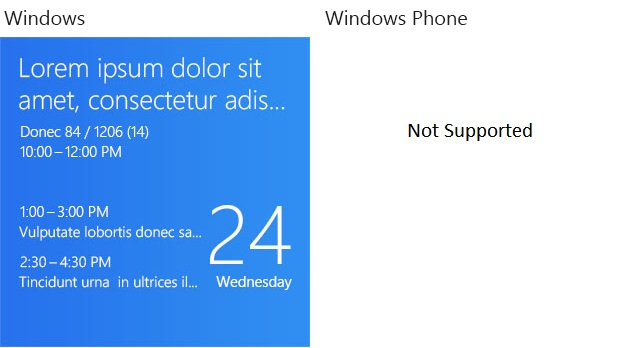

### -field TileSquare310x310BlockAndText02:47
**Windows only; not supported on **

> [!NOTE]
> This value requires the version attribute of the template's [visual](/uwp/schemas/tiles/tilesschema/element-visual)element to be set to at least "2".

One string of large block text (this should be numerical); two lines of large header text (no wrap); two sets of two strings in two lines (no wrap). Image in the background. If the text color is light, the image is darkened a bit to improve the text visibility.

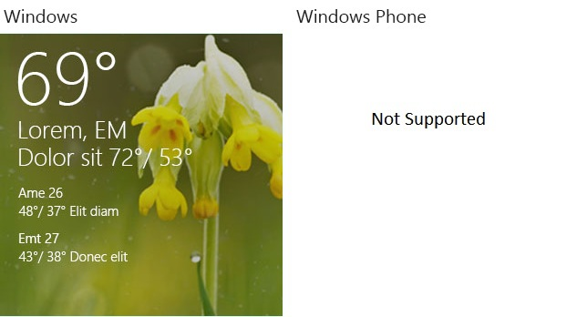

### -field TileSquare310x310Image:48
**Windows only; not supported on **

> [!NOTE]
> This value requires the version attribute of the template's [visual](/uwp/schemas/tiles/tilesschema/element-visual)element to be set to at least "2".

One image that fills the entire tile; no text.

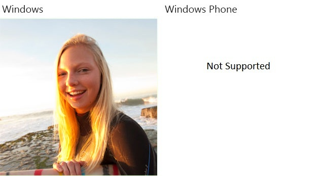

### -field TileSquare310x310ImageAndText01:49
**Windows only; not supported on **

> [!NOTE]
> This value requires the version attribute of the template's [visual](/uwp/schemas/tiles/tilesschema/element-visual)element to be set to at least "2".

One image above one string of regular text wrapped over a maximum of two lines.

> [!NOTE]
> This template allows [branding](/uwp/schemas/tiles/tilesschema/element-binding) only as "logo" or "none", but not "name". If you set the branding attribute to "name", it will automatically revert to "logo" on Windows or "none" on Windows Phone 8.1.

### -field TileSquare310x310ImageAndText02:50
**Windows only; not supported on **

> [!NOTE]
> This value requires the version attribute of the template's [visual](/uwp/schemas/tiles/tilesschema/element-visual)element to be set to at least "2".

One image above two strings of regular text on two lines. Text does not wrap.

> [!NOTE]
> This template allows [branding](/uwp/schemas/tiles/tilesschema/element-binding) only as "logo" or "none", but not "name". If you set the branding attribute to "name", it will automatically revert to "logo" on Windows or "none" on Windows Phone 8.1.

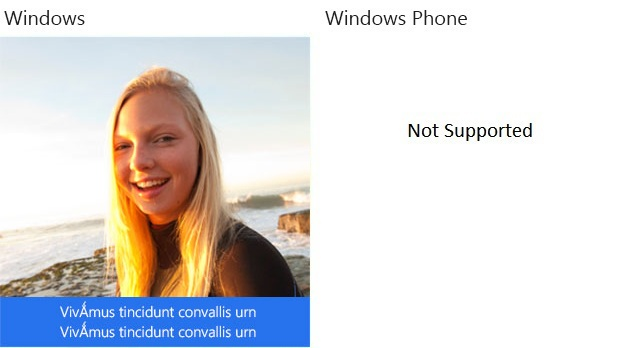

### -field TileSquare310x310ImageAndTextOverlay01:51
**Windows only; not supported on **

> [!NOTE]
> This value requires the version attribute of the template's [visual](/uwp/schemas/tiles/tilesschema/element-visual)element to be set to at least "2".

Background: a single image that fills the entire tile. Foreground: One string of text wrapped over a maximum of three lines. If the text color is light, the image is darkened a bit to improve the text visibility.

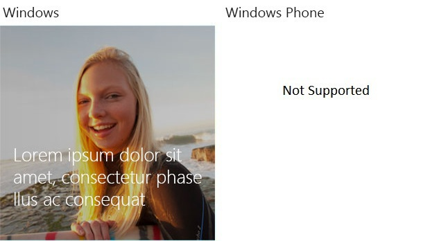

### -field TileSquare310x310ImageAndTextOverlay02:52
**Windows only; not supported on **

> [!NOTE]
> This value requires the version attribute of the template's [visual](/uwp/schemas/tiles/tilesschema/element-visual)element to be set to at least "2".

Background: a single image that fills the entire tile. Foreground: At the top, one string of large text wrapped over a maximum of two lines; at the bottom, one string of regular text wrapped over a maximum of three lines. If the text color is light, the image is darkened a bit to improve the text visibility.

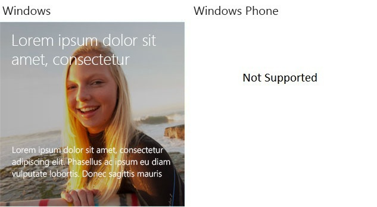

### -field TileSquare310x310ImageAndTextOverlay03:53
**Windows only; not supported on **

> [!NOTE]
> This value requires the version attribute of the template's [visual](/uwp/schemas/tiles/tilesschema/element-visual)element to be set to at least "2".

Background: a single image that fills the entire tile. Foreground: At the top, one string of large text wrapped over a maximum of two lines; at the bottom, three strings of regular text on three lines that do not wrap. If the text color is light, the image is darkened a bit to improve the text visibility.

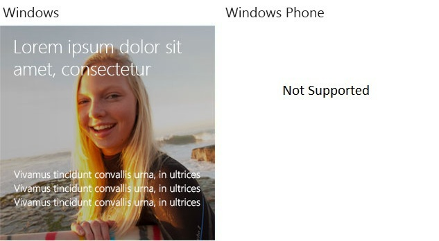

### -field TileSquare310x310ImageCollectionAndText01:54
**Windows only; not supported on **

> [!NOTE]
> This value requires the version attribute of the template's [visual](/uwp/schemas/tiles/tilesschema/element-visual)element to be set to at least "2".

**TileSquare310x310ImageCollection** with the addition of a text ribbon across the bottom of the tile. The text area contains one string of regular text wrapped over a maximum of two lines. Note that the small images cut off the top of the large image while the text area cuts off the bottom of the image.

> [!NOTE]
> This template allows [branding](/uwp/schemas/tiles/tilesschema/element-binding) only as "logo" or "none", but not "name". If you set the branding attribute to "name", it will automatically revert to "logo" on Windows or "none" on Windows Phone 8.1.

### -field TileSquare310x310ImageCollectionAndText02:55
**Windows only; not supported on **

> [!NOTE]
> This value requires the version attribute of the template's [visual](/uwp/schemas/tiles/tilesschema/element-visual)element to be set to at least "2".

**TileSquare310x310ImageCollection** with the addition of a text ribbon across the bottom of the tile. The text area contains two strings of regular text on two lines. Text does not wrap. Note that the small images cut off the top of the large image while the text area cuts off the bottom of the image.

> [!NOTE]
> This template allows [branding](/uwp/schemas/tiles/tilesschema/element-binding) only as "logo" or "none", but not "name". If you set the branding attribute to "name", it will automatically revert to "logo" on Windows or "none" on Windows Phone 8.1.

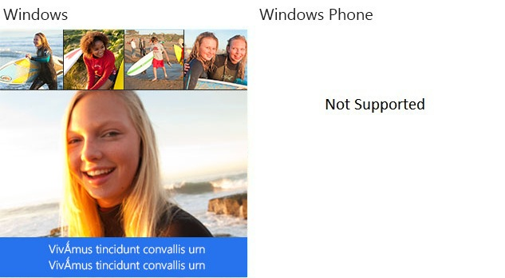

### -field TileSquare310x310ImageCollection:56
**Windows only; not supported on **

> [!NOTE]
> This value requires the version attribute of the template's [visual](/uwp/schemas/tiles/tilesschema/element-visual)element to be set to at least "2".

Four small square images overlaid across the top one large, full-tile, square image. Note that the small images cut off the top of the large image.

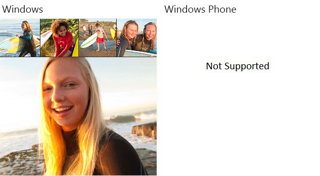

### -field TileSquare310x310SmallImagesAndTextList01:57
**Windows only; not supported on **

> [!NOTE]
> This value requires the version attribute of the template's [visual](/uwp/schemas/tiles/tilesschema/element-visual)element to be set to at least "2".

Three sets of information, each of which consists of one small square image to the left of one header string in larger text over two strings of regular text on the next two lines. Text does not wrap.

### -field TileSquare310x310SmallImagesAndTextList02:58
**Windows only; not supported on **

> [!NOTE]
> This value requires the version attribute of the template's [visual](/uwp/schemas/tiles/tilesschema/element-visual)element to be set to at least "2".

Up to three sets of information, each of which consists of one small square image to the left of one string of regular text wrapped over a maximum of three lines.

### -field TileSquare310x310SmallImagesAndTextList03:59
**Windows only; not supported on **

> [!NOTE]
> This value requires the version attribute of the template's [visual](/uwp/schemas/tiles/tilesschema/element-visual)element to be set to at least "2".

Up to three sets of information, each of which consists of one small square image to the left of one string of large text over one string of regular text wrapped over a maximum of two lines.

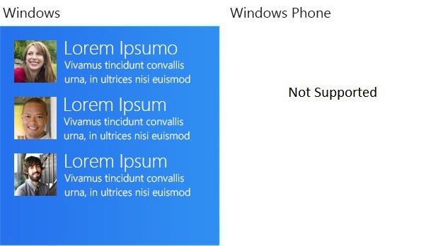

### -field TileSquare310x310SmallImagesAndTextList04:60
**Windows only; not supported on **

> [!NOTE]
> This value requires the version attribute of the template's [visual](/uwp/schemas/tiles/tilesschema/element-visual)element to be set to at least "2".

Up to three sets of information, each of which consists of one small rectangular image to the right of one string of large text over one string of regular text wrapped over a maximum of two lines.

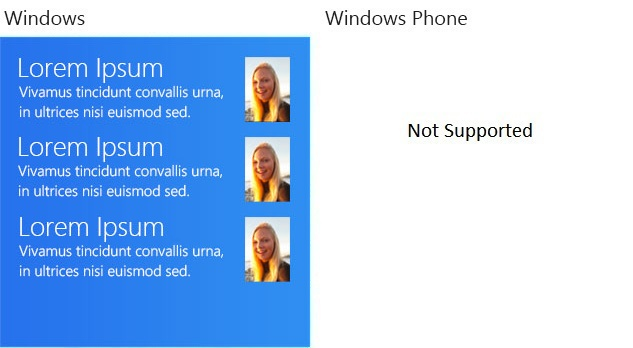

### -field TileSquare310x310SmallImagesAndTextList05:73
**Windows only; not supported on **

> [!NOTE]
> This value requires the version attribute of the template's [visual](/uwp/schemas/tiles/tilesschema/element-visual)element to be set to at least "2".

One line of header text across the top, over three sets of information, each of which consists of one small square image to the left of one header string in larger text over two strings of regular text on the next two lines. Text does not wrap.

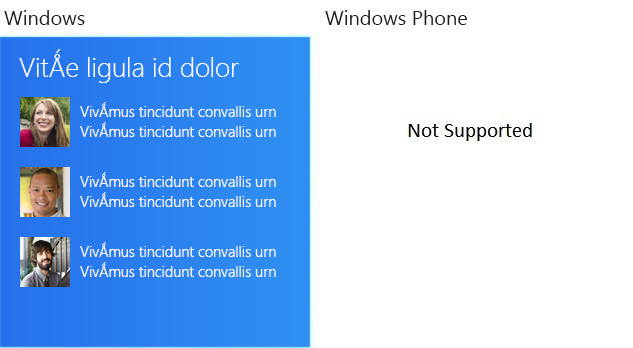

### -field TileSquare310x310SmallImageAndText01:72
**Windows only; not supported on **

> [!NOTE]
> This value requires the version attribute of the template's [visual](/uwp/schemas/tiles/tilesschema/element-visual)element to be set to at least "2".

One medium-sized image in the upper left corner (upper right on right-to-left systems) over a single, unwrapped header string. Beneath this are two sets of regular text: the first wrapped over a maximum of two lines, the second a single line only.

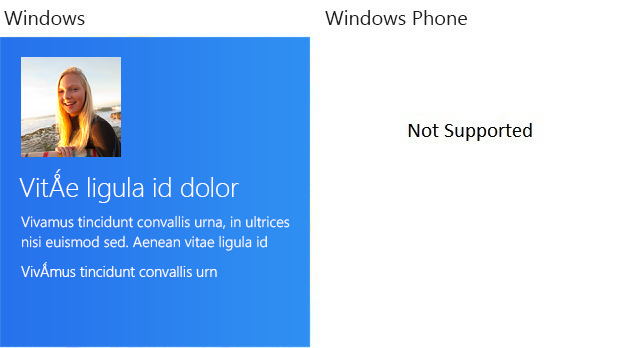

### -field TileSquare310x310Text01:61
**Windows only; not supported on **

> [!NOTE]
> This value requires the version attribute of the template's [visual](/uwp/schemas/tiles/tilesschema/element-visual)element to be set to at least "2".

One header string in larger text on the first line, nine strings of regular text on the next nine lines. Text does not wrap.

### -field TileSquare310x310Text02:62
**Windows only; not supported on **

> [!NOTE]
> This value requires the version attribute of the template's [visual](/uwp/schemas/tiles/tilesschema/element-visual)element to be set to at least "2".

One header string in larger text over eighteen short strings arranged in two columns of nine lines each. Columns are of equal width.

### -field TileSquare310x310Text03:63
**Windows only; not supported on **

> [!NOTE]
> This value requires the version attribute of the template's [visual](/uwp/schemas/tiles/tilesschema/element-visual)element to be set to at least "2".

Eleven strings of regular text on eleven lines. Text does not wrap.

### -field TileSquare310x310Text04:64
**Windows only; not supported on **

> [!NOTE]
> This value requires the version attribute of the template's [visual](/uwp/schemas/tiles/tilesschema/element-visual)element to be set to at least "2".

Twenty-two short strings of regular text, arranged in two columns of eleven lines each. Columns are of equal width. This template is similar to TileSquare310x310Text06 and TileSquare310x310Text08, but those templates have columns of unequal width.

### -field TileSquare310x310Text05:65
**Windows only; not supported on **

> [!NOTE]
> This value requires the version attribute of the template's [visual](/uwp/schemas/tiles/tilesschema/element-visual)element to be set to at least "2".

One header string in larger text over eighteen short strings of regular text arranged in two columns of nine lines each. The column widths are such that the first column acts as a label and the second column as the content. This template is similar to TileSquare310x310Text07, which has an even narrower first column, and TileSquare310x310Text02, which has columns of equal width.

### -field TileSquare310x310Text06:66
**Windows only; not supported on **

> [!NOTE]
> This value requires the version attribute of the template's [visual](/uwp/schemas/tiles/tilesschema/element-visual)element to be set to at least "2".

Twenty-two short strings of regular text arranged in two columns of eleven lines each. The column widths are such that the first column acts as a label and the second column as the content. This template is similar to TileSquare310x310Text08, which has an even narrower first column, and TileSquare310x310Text04, which has columns of equal width.

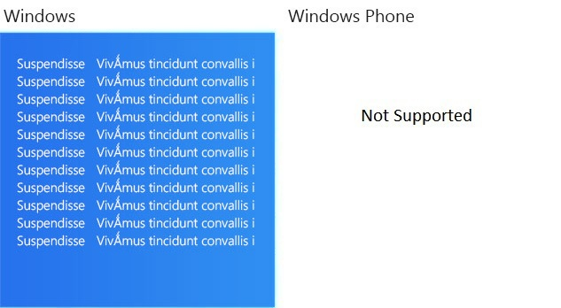

### -field TileSquare310x310Text07:67
**Windows only; not supported on **

> [!NOTE]
> This value requires the version attribute of the template's [visual](/uwp/schemas/tiles/tilesschema/element-visual)element to be set to at least "2".

One header string in larger text over eighteen short strings of regular text arranged in two columns of nine lines each. The column widths are such that the first column acts as a label and the second column as the content. This template is similar to TileSquare310x310Text05, which has a wider first column, and TileSquare310x310Text02, which has columns of equal width.

### -field TileSquare310x310Text08:68
**Windows only; not supported on **

> [!NOTE]
> This value requires the version attribute of the template's [visual](/uwp/schemas/tiles/tilesschema/element-visual)element to be set to at least "2".

Twenty-two short strings of regular text arranged in two columns of eleven lines each. The column widths are such that the first column acts as a label and the second column as the content. This template is similar to TileSquare310x310Text06, which has a wider first column, and TileSquare310x310Text04, which has columns of equal width.

### -field TileSquare310x310Text09:74
**Windows only; not supported on **

> [!NOTE]
> This value requires the version attribute of the template's [visual](/uwp/schemas/tiles/tilesschema/element-visual)element to be set to at least "2".

One line of header text wrapped over a maximum of two lines. Beneath are two more, slightly separated lines of header text, each one line only. At the bottom are two lines of regular text, each of one line only.

### -field TileSquare310x310TextList01:69
**Windows only; not supported on **

> [!NOTE]
> This value requires the version attribute of the template's [visual](/uwp/schemas/tiles/tilesschema/element-visual)element to be set to at least "2".

Three stacked notices, each containing one header string in larger text on the first line, two strings of regular text on the next two lines. Text does not wrap.

### -field TileSquare310x310TextList02:70
**Windows only; not supported on **

> [!NOTE]
> This value requires the version attribute of the template's [visual](/uwp/schemas/tiles/tilesschema/element-visual)element to be set to at least "2".

Three stacked notices, each containing one string of regular text wrapped over a maximum of three lines.

### -field TileSquare310x310TextList03:71
**Windows only; not supported on **

> [!NOTE]
> This value requires the version attribute of the template's [visual](/uwp/schemas/tiles/tilesschema/element-visual)element to be set to at least "2".

Three stacked notices, each containing one header string in larger text over one string of regular text wrapped over a maximum of two lines.

### -field TileSquare71x71IconWithBadge:75
** only**.

> [!NOTE]
> This value requires the version attribute of the template's [visual](/uwp/schemas/tiles/tilesschema/element-visual)element to be set to "3".

A single icon image. The icon image's background should be transparent to allow the tile color to show through. A badge, sent through a separate notification, is shown to the right of the image. Unlike other example images on this page, the badge (in this case, the number 13) is included here. This template, being the small tile size, cannot display the app name or logo declared in your manifest.

### -field TileSquare150x150IconWithBadge:76
** only**

> [!NOTE]
> This value requires the version attribute of the template's [visual](/uwp/schemas/tiles/tilesschema/element-visual)element to be set to "3".

A single icon image. The icon image's background should be transparent to allow the tile color to show through. A badge, sent through a separate notification, is shown to the right of the image. Unlike other example images on this page, the badge (in this case, the number 13) is included here.

### -field TileWide310x150IconWithBadgeAndText:77
** only**

> [!NOTE]
> This value requires the version attribute of the template's [visual](/uwp/schemas/tiles/tilesschema/element-visual)element to be set to "3".

In the lower right corner, a single icon image. Treat this image as a logo image. The icon image's background should be transparent to allow the tile color to show through. A badge, sent through a separate notification, is shown to the right of the image. Unlike other example images on this page, the badge (in this case, the number 13) is included here.

In the upper right corner, one header string in larger text on the first line, two strings of regular text on the next two lines. Text does not wrap.

> [!NOTE]
> If no text elements are specified in this template, the icon image and badge are centered in the tile.

### -field TileSquare71x71Image:78
** only**

> [!NOTE]
> This value requires the version attribute of the template's [visual](/uwp/schemas/tiles/tilesschema/element-visual)element to be set to "3".

One square image that fills the entire tile, no text.

### -field TileTall150x310Image:79
One rectangular image that fills the entire tile, no text.

## -remarks

## -examples

## -see-also
[App tiles and badges sample](https://github.com/microsoftarchive/msdn-code-gallery-microsoft/tree/master/Official%20Windows%20Platform%20Sample/Windows%208.1%20Store%20app%20samples/99866-Windows%208.1%20Store%20app%20samples/App%20tiles%20and%20badges%20sample), [The tile template catalog](/previous-versions/windows/apps/hh761491(v=win.10)), [Tiles XML schema](/uwp/schemas/tiles/tilesschema/schema-root), [Tile and tile notification overview](/previous-versions/windows/apps/hh779724(v=win.10)), [Tile and toast image sizes](/previous-versions/windows/apps/hh781198(v=win.10))
