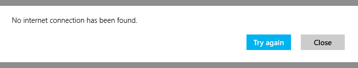

<!-- Class syntax.
public class MessageDialog : Windows.UI.Popups.IMessageDialog
-->

# Windows.UI.Popups.MessageDialog

## -description

Represents a dialog for showing messages to the user.

In a desktop app, before using an instance of this class in a way that displays UI, you'll need to associate the object with its owner's window handle. For more info, and code examples, see [Display WinRT UI objects that depend on CoreWindow](/windows/apps/develop/ui-input/display-ui-objects#winui-3-with-c).

> [!IMPORTANT]
> You should use MessageDialog only when you are upgrading a Universal Windows 8.x app that uses MessageDialog, and need to minimize changes or if your app isn't XAML. For new XAML apps in Windows 10+, we recommend using the [ContentDialog](./../windows.ui.xaml.controls/contentdialog.md) control instead.

## -remarks

> [!NOTE]
> This class is not agile, which means that you need to consider its threading model and marshaling behavior. For more info, see [Threading and Marshaling (C++/CX)](/cpp/cppcx/threading-and-marshaling-c-cx) and [Using Windows Runtime objects in a multithreaded environment (.NET)](/windows/uwp/threading-async/using-windows-runtime-objects-in-a-multithreaded-environment).

The dialog has a command bar that can support up to three commands in desktop apps, or two commands in mobile apps. If you don't specify any commands, then a default command is added to close the dialog. The dialog dims the screen behind it, and blocks touch events from passing to the app's canvas until the user responds.

Message dialogs should be used sparingly, and only for critical messages or simple questions that must block the user's flow. Here's an example of a dialog created by the code in the **Examples** section.



## -examples

The following example shows how to add commands to a message dialog and display it. For the full code example, see [Message dialog sample](https://github.com/microsoftarchive/msdn-code-gallery-microsoft/tree/master/Official%20Windows%20Platform%20Sample/Windows%208.1%20Store%20app%20samples/99866-Windows%208.1%20Store%20app%20samples/Message%20dialog%20sample).

```csharp
using Windows.UI.Popups;
using Windows.UI.Xaml;
using Windows.UI.Xaml.Controls;
using Windows.UI.Xaml.Navigation;
using SDKTemplate;
using System;

private async void CancelCommandButton_Click(object sender, RoutedEventArgs e)
{
    // Create the message dialog and set its content
    var messageDialog = new MessageDialog("No internet connection has been found.");

    // Add commands and set their callbacks; both buttons use the same callback function instead of inline event handlers
    messageDialog.Commands.Add(new UICommand(
        "Try again", 
        new UICommandInvokedHandler(this.CommandInvokedHandler)));
    messageDialog.Commands.Add(new UICommand(
        "Close", 
        new UICommandInvokedHandler(this.CommandInvokedHandler)));

    // Set the command that will be invoked by default
    messageDialog.DefaultCommandIndex = 0;

    // Set the command to be invoked when escape is pressed
    messageDialog.CancelCommandIndex = 1;

    // Show the message dialog
    await messageDialog.ShowAsync();
}

private void CommandInvokedHandler(IUICommand command)
{
    // Display message showing the label of the command that was invoked
    rootPage.NotifyUser("The '" + command.Label + "' command has been selected.", 
        NotifyType.StatusMessage);
}
```

```cppwinrt
// MainPage.cpp
#include "pch.h"
#include "MainPage.h"

#include <winrt/Windows.UI.Popups.h>

#include "winrt/Windows.System.h"
#include "winrt/Windows.UI.Xaml.Controls.h"
#include "winrt/Windows.UI.Xaml.Input.h"
#include "winrt/Windows.UI.Xaml.Navigation.h"
#include <sstream>

using namespace winrt;
using namespace Windows::Foundation;
using namespace Windows::UI::Xaml;
...
void MainPage::CancelCommandButton_Click(IInspectable const&, RoutedEventArgs const&)
{
    // Create the message dialog and set its content
    Windows::UI::Popups::MessageDialog msg{ L"No internet connection has been found." };

    // Add commands and set their callbacks.
    // Both commands use the same callback function instead of inline event handlers.
    Windows::UI::Popups::UICommand continueCommand{
        L"Try again",
        { this, &MainPage::CommandInvokedHandler} };
    Windows::UI::Popups::UICommand upgradeCommand{
        L"Close",
        { this, &MainPage::CommandInvokedHandler } };

    // Add the commands to the dialog.
    msg.Commands().Append(continueCommand);
    msg.Commands().Append(upgradeCommand);

    // Set the command that will be invoked by default.
    msg.DefaultCommandIndex(0);

    // Set the command to be invoked when escape is pressed.
    msg.CancelCommandIndex(1);

    // Show the message dialog.
    msg.ShowAsync();
}

void MainPage::CommandInvokedHandler(Windows::UI::Popups::IUICommand const& command)
{
    // Display message.
    std::wstringstream stringstream;
    stringstream << L"The '" << command.Label().c_str() << L"' command has been selected.";
    rootPage.NotifyUser(stringstream.str().c_str(), NotifyType::StatusMessage);
}
```

```cppcx
#include "pch.h"
#include "CancelCommand.xaml.h"

using namespace MessageDialogSample;

using namespace Windows::UI::Popups;
using namespace Windows::UI::Xaml;
using namespace Windows::UI::Xaml::Controls;
using namespace Windows::UI::Xaml::Navigation;

void MessageDialogSample::CancelCommand::CancelCommandButton_Click(Platform::Object^ sender,
    Windows::UI::Xaml::RoutedEventArgs^ e)
{
    // Create the message dialog and set its content
    MessageDialog^ msg = ref new MessageDialog("No internet connection has been found.");

    // Add commands and set their callbacks.
    // Both commands use the same callback function instead of inline event handlers.
    UICommand^ continueCommand = ref new UICommand(
        "Try again", 
        ref new UICommandInvokedHandler(this, &CancelCommand::CommandInvokedHandler));
    UICommand^ upgradeCommand = ref new UICommand(
        "Close", 
        ref new UICommandInvokedHandler(this, &CancelCommand::CommandInvokedHandler));

    // Add the commands to the dialog
    msg->Commands->Append(continueCommand);
    msg->Commands->Append(upgradeCommand);

    // Set the command that will be invoked by default
    msg->DefaultCommandIndex = 0;

    // Set the command to be invoked when escape is pressed
    msg->CancelCommandIndex = 1;

    // Show the message dialog
    msg->ShowAsync();
}

void CancelCommand::CommandInvokedHandler(Windows::UI::Popups::IUICommand^ command)
{
    // Display message
    rootPage->NotifyUser("The '" + command->Label + "' command has been selected.", 
        NotifyType::StatusMessage);
}
```

```vb
Imports Windows.UI.Popups
Imports Windows.UI.Xaml
Imports Windows.UI.Xaml.Controls
Imports Windows.UI.Xaml.Navigation
Imports SDKTemplate

Partial Public NotInheritable Class CloseCommand
    Inherits SDKTemplate.Common.LayoutAwarePage

    ' A pointer back to the main page.  This is needed if you want to call methods in MainPage such
    ' as NotifyUser()
    Private rootPage As MainPage = MainPage.Current

    Public Sub New()
        Me.InitializeComponent()
    End Sub

    Private Async Sub CloseCommandLaunch_Click(sender As Object, e As RoutedEventArgs)
        ' Create the message dialog and set its content and title
        Dim messageDialog = New MessageDialog("No internet connection has been found.")

        ' Add buttons and set their callbacks
        messageDialog.Commands.Add(New UICommand("Try again", Sub(command)
            rootPage.NotifyUser("The '" & command.Label & "' button has been selected.", _ 
                NotifyType.StatusMessage)
                                                              End Sub))

        messageDialog.Commands.Add(New UICommand("Close", Sub(command) 
            rootPage.NotifyUser("The '" & command.Label & "' button has been selected.", _
                NotifyType.StatusMessage)
                                                          End Sub))

        ' Set the command that will be invoked by default
        messageDialog.DefaultCommandIndex = 0

        ' Set the command to be invoked when escape is pressed
        messageDialog.CancelCommandIndex = 1

        ' Show the message dialog
        Await messageDialog.ShowAsync
    End Sub
End Class
```

## -see-also

[Message dialog sample](https://github.com/microsoftarchive/msdn-code-gallery-microsoft/tree/master/Official%20Windows%20Platform%20Sample/Windows%208.1%20Store%20app%20samples/99866-Windows%208.1%20Store%20app%20samples/Message%20dialog%20sample), [Message dialog sample (Windows 10)](https://go.microsoft.com/fwlink/p/?LinkId=620570), [Display WinRT UI objects that depend on CoreWindow](/windows/apps/develop/ui-input/display-ui-objects)
