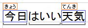

<!-- Class syntax.
public class CoreTextCompositionSegment : Windows.UI.Text.Core.ICoreTextCompositionSegment
-->

# Windows.UI.Text.Core.CoreTextCompositionSegment

## -description
Represents a segment in a composition string. See Remarks for an illustration.

## -remarks
An object of this type can be obtained from the [CoreTextCompositionCompletedEventArgs.CompositionSegments](coretextcompositioncompletedeventargs_compositionsegments.md) property inside a handler for the [CoreTextEditContext.CompositionCompleted](coretexteditcontext_compositioncompleted.md) event handler.

The following illustration shows the different parts of a composition:

The entire string is the composition. The sections marked by the gray brackets are segments, or composition segments. The words inside the blue boxes are converted strings (in this case, Kanji). And the words inside red boxes are pre-conversion strings (in this case, the Hiragana that generated the corresponding Kanji).

## -examples

## -see-also
