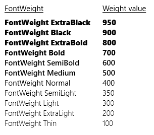

<!-- Class syntax.
public class FontWeights : Windows.UI.Text.IFontWeights
-->

# Windows.UI.Text.FontWeights

## -description

Provides a set of predefined font weights as static property values.


## -xaml-syntax

```xaml
See XAML Syntax for FontWeight
```

## -remarks

In standard typography API, the weight of a font is expressed by using constant names, for example "Bold". Using constant names for setting a font weight property is supported through type converter behaviors and also by the FontWeights support class. For code access, the relevant information is expressed as the **Weight** factor of a [FontWeight](fontweight.md) value.

This image shows the various font weight values applied to text.



## -examples

This example shows how to set the FontWeight property on a XAML [TextBlock](../windows.ui.xaml.controls/textblock.md).

```xaml
<TextBlock Text="FontWeight ExtraBlack" FontWeight="ExtraBlack"/>
```

```csharp
TextBlock textBlock1 = new TextBlock();
textBlock1.Text = "FontWeight ExtraBlack";
textBlock1.FontWeight = Windows.UI.Text.FontWeights.ExtraBlack;
```

## -see-also
