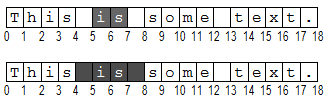

<!-- Method syntax
public int Move(Windows.UI.Text.TextRangeUnit unit, System.Int32 count)
-->

# Windows.UI.Text.ITextRange.Move

## -description
Moves the insertion point forward or backward by the specified number of *units*. If the text range is nondegenerate, it is collapsed to an insertion point at the start or end position of the text range, depending on *count*, and then is moved.

## -parameters
### -param unit
The units to move the insertion point. The default value is **Character**.

### -param count
The number of *units* to move the insertion point. The default value is 1. If *count* is greater than zero, the insertion point moves forward, toward the end of the story. If *count* is less than zero, the insertion point moves backward, toward the beginning of the story. If *count* is zero, the range is unchanged.

## -returns
The actual number of *units* the insertion point moves. For more information, see the Remarks section.

## -remarks
If the range is degenerate (an insertion point), this method tries to move the insertion point the number of units specified by *count*.

If the range is nondegenerate and *count* is greater than zero, this method collapses the range to an insertion point at the end of the range, moves the resulting insertion point forward to a *unit* boundary (if it is not already at one), and then tries to move *count*  – 1 *unit*s forward. If the range is nondegenerate and *count* is less than zero, this method collapses the range to an insertion point at the start of the range, moves the resulting insertion point backward to a *unit* boundary (if it isn't already at one), and then tries to move *count*  – 1 *unit*s backward. Thus, in both cases, collapsing a nondegenerate range to an insertion point, whether moving to the start or end of the *unit* following the collapse, counts as a *unit*.

This method returns the number of *unit*s actually moved. This method never moves the insertion point beyond the story of this range. If *count*  *unit*s would move the insertion point before the beginning of the story, the insertion point is moved to the story beginning and the result is set accordingly. Similarly, if *count*  *unit*s would move the insertion point beyond the end of the story, it is moved to the story end.

*Count* corresponds to the number of times you press Ctrl+Right Arrow.

For example, if you press Ctrl+Right Arrow for the selections shown in both of the following figures, you end up with an insertion point at character position 8, because this command collapses the selections at their ends (7 and 8, respectively) and moves to the next **Word** boundary.

The first selection does not include the blank space at character position 7, so Ctrl+Right Arrow moves past the space to the **Word** boundary at character position 8. The end position of the range is already at a **Word** boundary for the second selection, so Ctrl+Right Arrow just collapses the selection at that boundary. Similarly, Ctrl+Left Arrow, which for this text acts like `Move(Word, -1)`. But Ctrl+Left Arrow collapses the second selection at character position 4 and then moves to zero, because that's the next **Word** boundary in the direction of motion.

The return argument is set equal to the number of *unit*s that the insertion point is moved, including one *unit* for collapsing a nondegenerate range and moving it to a *unit* boundary. So, if no motion and no collapse occur, as when the range is an insertion point at the end of the story, the result is set equal to zero. This approach is useful for controlling app loops that process a whole story.

In both of the cases mentioned previously, calling `Move(Word, 1)` sets the result equal to 1 because the ranges were collapsed. Similarly, calling `Move(Word, -1)` sets the result equal to – 1 for both cases. Collapsing, with or without moving part of a *unit* to a *unit* boundary, counts as a *unit* moved.

The direction of motion refers to the logical character ordering in the plain-text backing store. This approach avoids the problems of geometrical ordering, such as left versus right and up versus down, in international software. Such geometrical methods are still needed in the edit engine, of course, because keyboards have arrow keys to invoke geometrical movements.

The [ITextSelection](itextselection.md)  UI methods back up over a carriage return/line feed (CR/LF) as if it were a single character, but the ITextRange.Move methods count carriage return/line feed (CR/LF) as two characters. It's clearly better to use a single character as a paragraph separator, which is represented by CR, although the Unicode paragraph separator character, 0x2029, is accepted. In general, the rich edit control supports carriage return/line feed (CR/LF), CR, LF, VT (vertical tab), FF (form feed), and 0x2029. Microsoft Rich Edit 2.0 also supports CR/CR/LF for backward compatibility.

See also the [ITextRange.MoveStart](itextrange_movestart_65838126.md) and [ITextRange.MoveEnd](itextrange_moveend_1212634036.md) methods, which move the range start or end position *count*  *unit* s, respectively.

## -examples

## -see-also
[ITextRange.MoveEnd](itextrange_moveend_1212634036.md), [ITextRange.MoveStart](itextrange_movestart_65838126.md)
