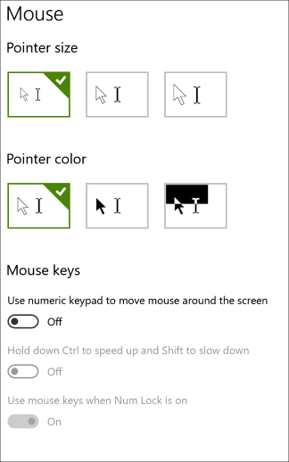

<!-- Method syntax.
public void AutomationProperties.SetHeadingLevel(DependencyObject element, AutomationHeadingLevel value)
-->

# Windows.UI.Xaml.Automation.AutomationProperties.SetHeadingLevel

## -description
Sets the value of the [AutomationProperties.HeadingLevel](automationproperties_headinglevelproperty.md) property for the specified [DependencyObject](../windows.ui.xaml/dependencyobject.md).

## -parameters
### -param element
The specified [DependencyObject](../windows.ui.xaml/dependencyobject.md).

### -param value
The value for the heading level.

## -remarks
Heading elements organize the user interface and make it easier to navigate. Some assistive technology (AT) allows users to quickly jump between headings. Headings have a level from 1 to 9.  

Examples of headings would be section titles within the Windows Settings app. For instance, under the **Ease of Access** -> **Mouse** page, **Pointer size**, **Pointer color**, and **Mouse keys** would be a heading of level 1.

## -see-also
[HeadingLevel](automationproperties_headinglevel.md), [GetHeadingLevel](automationproperties_getheadinglevel_655629781.md), [Landmarks and Headings](/windows/uwp/design/accessibility/landmarks-and-headings), [Attached properties overview](/windows/uwp/xaml-platform/attached-properties-overview)

## -examples
