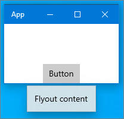
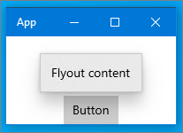

<!-- Property syntax.
public bool ShouldConstrainToRootBounds { get;  set; }
-->

# Windows.UI.Xaml.Controls.Primitives.FlyoutBase.ShouldConstrainToRootBounds

## -description

Gets or sets a value that indicates whether the flyout should be shown within the bounds of the XAML root.

## -property-value

**true** if the flyout should be shown within the bounds of the XAML root; otherwise, **false**.

## -remarks

The default value depends on the derived type. For [Flyout](../windows.ui.xaml.controls/flyout.md), the default is `true`. For [MenuFlyout](../windows.ui.xaml.controls/menuflyout.md) and [CommandBarFlyout](../windows.ui.xaml.controls/commandbarflyout.md), the default is `false`.

This property is applicable only to apps running on the desktop. To check if the flyout is actually constrained to the root bounds, check the [IsConstrainedToRootBounds](flyoutbase_isconstrainedtorootbounds.md) property.

In an app running on the desktop, when this property is **true**, the flyout is shown within the main XAML window handle (HWND). When this property is **false**, the flyout is shown in its own top level HWND. In this case, the flyout might be positioned to extend beyond the main app window.

When a flyout with `ShouldConstrainToRootBounds = false` is first shown, it's placed in its own window and shown in that context. After it has been shown, `ShouldConstrainToRootBounds` cannot be set back to **true**.

The _XAML root_ might be a [CoreWindow](../windows.ui.core/corewindow.md), a [XAML island](/windows/uwp/xaml-platform/xaml-host-controls), or an [AppWindow](../windows.ui.windowmanagement/appwindow.md).

## -see-also

[IsConstrainedToRootBounds](flyoutbase_isconstrainedtorootbounds.md), [Popup ShouldConstrainToRootBounds](popup_shouldconstraintorootbounds.md)

## -examples

In this example, the flyout is not restricted to the root bounds by default. Therefore, the request to place the flyout below the button is honored as long as there is room for it on the display. The flyout is shown outside of the app window.

```xaml
<Button Content="Button"
        VerticalAlignment="Bottom" HorizontalAlignment="Center">
    <Button.Flyout>
        <Flyout Placement="Bottom">
            <TextBlock Text="Flyout content" />
        </Flyout>
    </Button.Flyout>
</Button>
```



In this example, **ShouldConstrainToRootBounds** is set to **true**, so the flyout is restricted to the root bounds. Therefore, the request to place the flyout below the button is not honored, and the flyout is shown inside the app window above the button.

```xaml
<Button Content="Button"
        VerticalAlignment="Bottom" HorizontalAlignment="Center">
    <Button.Flyout>
        <Flyout Placement="Bottom"
                ShouldConstrainToRootBounds="True">
            <TextBlock Text="Flyout content" />
        </Flyout>
    </Button.Flyout>
</Button>
```


