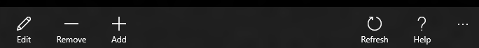

<!-- Class syntax.
public class AppBar : Windows.UI.Xaml.Controls.ContentControl, Windows.UI.Xaml.Controls.IAppBar, Windows.UI.Xaml.Controls.IAppBar2, Windows.UI.Xaml.Controls.IAppBar3, Windows.UI.Xaml.Controls.IAppBar4, Windows.UI.Xaml.Controls.IAppBarOverrides, Windows.UI.Xaml.Controls.IAppBarOverrides3
-->

# Windows.UI.Xaml.Controls.AppBar

## -description

Represents the container control that holds app UI components for commanding and experiences. For Windows 10, see Remarks.


## -xaml-syntax

```xaml
<AppBar .../>
-or-
<AppBar>
  content
</AppBar>
```

## -remarks

> [!IMPORTANT]
> You should use the AppBar only when you are upgrading a Universal Windows 8 app that uses the AppBar, and need to minimize changes. For new apps in Windows 10, we recommend using the [CommandBar](commandbar.md) control instead.

An app bar is a UI element that's typically used to present commands and tools to the user, but can also be used for navigation. An app bar can appear at the top of the page, at the bottom of the page, or both. By default, its shown in a minimal state. Its content is shown or hidden when the user presses the ellipsis [•••], or performs a right-click that is not otherwise handled by the app.

Here's an app bar in its minimal state.


Here's the app bar when it's open.



You can open and close the app bar programmatically by setting the [IsOpen](appbar_isopen.md) property. You can use the [Opening](appbar_opening.md), [Opened](appbar_opened.md), [Closing](appbar_closing.md), and [Closed](appbar_closed.md) events to respond to the app bar being opened or closed.

By default, the app bar is dismissed (closed) when the user interacts with the app anywhere outside of the app bar. Closing the app bar this way is called *light dismiss*. You can control how the app bar is dismissed by setting the [IsSticky](appbar_issticky.md) property. When the app bar is *sticky*, it's not closed by a *light dismiss* gesture. The app bar remains visible until the user right clicks or presses the ellipsis [•••].

To add an app bar in Extensible Application Markup Language (XAML), you assign an AppBar control to a [Page](page.md)'s [TopAppBar](page_topappbar.md) or [BottomAppBar](page_bottomappbar.md) property. A single app bar can be shared across multiple pages. You can add and remove commands programmatically based on the page context.

### Control style and template

You can modify the default [Style](../windows.ui.xaml/style.md) and [ControlTemplate](controltemplate.md) to give the control a unique appearance. For information about modifying a control's style and template, see [XAML styles](/windows/apps/design/style/xaml-styles). The default style, template, and resources that define the look of the control are included in the `generic.xaml` file. For design purposes, `generic.xaml` is available in the `\(Program Files)\Windows Kits\10\DesignTime\CommonConfiguration\Neutral\UAP\<SDK version>\Generic` folder from a Windows SDK installation. Styles and resources from different versions of the SDK might have different values.

XAML also includes resources that you can use to modify the colors of a control in different visual states without modifying the control template. Modifying these resources is preferred to setting properties such as [Background](control_background.md) and [Foreground](control_foreground.md). For more info, see the [Light-weight styling](/windows/apps/design/style/xaml-styles#lightweight-styling) section of the [XAML styles](/windows/apps/design/style/xaml-styles) article. Light-weight styling resources are available starting in Windows 10, version 1607 (SDK 14393).

### Version history

| Windows version | SDK version | Value added |
| -- | -- | -- |
| 1607 | 14393 | LightDismissOverlayMode |

## -examples

This example shows a top app bar with a group of navigation buttons and a search box.

```xaml
<Page.TopAppBar>
    <AppBar>
        <Grid>
            <Grid.ColumnDefinitions>
                <ColumnDefinition/>
                <ColumnDefinition/>
            </Grid.ColumnDefinitions>
            <StackPanel Orientation="Horizontal">
                <Button Content="Home" Width="140" Height="80" Click="AppBarButton_Click"/>
                <Button Content="Page 1" Width="140" Height="80" Click="AppBarButton_Click"/>
                <Button Content="Page 2" Width="140" Height="80" Click="AppBarButton_Click"/>
            </StackPanel>
            <AutoSuggestBox Grid.Column="1" Width="300" Height="50" HorizontalAlignment="Right"/>
        </Grid>
    </AppBar>
</Page.TopAppBar>
```

<!--<auto_snippet sample_id="BasicControlSnippets" snippet_id="BasicAppBarXAML"/>-->

## -see-also

[Guidelines for command and app bars](/windows/uwp/controls-and-patterns/app-bars), [AppBarButton](appbarbutton.md), [CommandBar](commandbar.md), [Commanding sample](https://github.com/Microsoft/Windows-universal-samples/tree/master/Samples/XamlCommanding)
