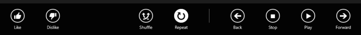
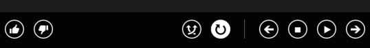
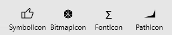

<!-- Class syntax.
public class AppBarButton : Windows.UI.Xaml.Controls.Button, Windows.UI.Xaml.Controls.IAppBarButton, Windows.UI.Xaml.Controls.IAppBarButton3, Windows.UI.Xaml.Controls.ICommandBarElement, Windows.UI.Xaml.Controls.ICommandBarElement2
-->

# Windows.UI.Xaml.Controls.AppBarButton

## -description

Represents a templated button control to be displayed in an [AppBar](appbar.md).

Equivalent WinUI class: [Microsoft.UI.Xaml.Controls.AppBarButton](/windows/winui/api/microsoft.ui.xaml.controls.appbarbutton).

## -xaml-syntax

```xaml
<AppBarButton .../>
```

## -remarks

App bar buttons differ from standard buttons in several ways:

+ The default appearance is a semi-transparent rectangle without a border.
+ You use the [Label](appbarbutton_label.md) and [Icon](appbarbutton_icon.md) properties to set the content instead of the [Content](contentcontrol_content.md) property. The [Content](contentcontrol_content.md) property is ignored if the [Icon](appbarbutton_icon.md) is set.
+ The button has the [IsCompact](appbarbutton_iscompact.md) property to control its size.

AppBarButton has two sizes; normal and compact. By default, it's shown with a text label and full padding. When the [IsCompact](appbarbutton_iscompact.md) property is set to **true**, the text label is hidden and the height of the button is reduced.

<p>Here are the same commands shown in their normal state,  and then in their compact state.</p>
<p>
    </img>
</p>
<p>
    </img>
</p>

When used in the [CommandBar](commandbar.md) control as part of the [PrimaryCommands](commandbar_primarycommands.md) collection, the [CommandBar](commandbar.md) sets the [IsCompact](appbarbutton_iscompact.md) property automatically as the control opens and closes. If you use an app bar button elsewhere, like in the [Content](contentcontrol_content.md) of a [CommandBar](commandbar.md), in an [AppBar](appbar.md), or the app canvas, you need to set the [IsCompact](appbarbutton_iscompact.md) property appropriately in your code. When used outside of an app bar, Windows guidelines indicate that the button should always be in its compact state. You should also include a [ToolTip](tooltip.md) to display the text label.

You use the [Label](appbarbutton_label.md) and [Icon](appbarbutton_icon.md) properties to define the content of the app bar buttons. Set the [Label](appbarbutton_label.md) property to a string to specify the text label. It’s shown by default, and is hidden when the button is in its compact state, so you also need to define a meaningful icon. To define the app bar button icon, set the [Icon](appbarbutton_icon.md) property to an element derived from the [IconElement](iconelement.md) class. There are four kinds of icon elements provided:

+ [FontIcon](fonticon.md) - the icon is based on a glyph from the specified font family.
+ [BitmapIcon](bitmapicon.md) - the icon is based on a bitmap image file with the specified **Uri**.
+ [PathIcon](pathicon.md) - the icon is based on [Path](../windows.ui.xaml.shapes/path.md) data.
+ [SymbolIcon](symbolicon.md) - the icon is based on a glyph from the Segoe MDL2 Assets font as listed in the [Symbol](symbol.md) enumeration.

AppBarButton icons have a default font size of 20px. 

### Control style and template

You can modify the default [Style](../windows.ui.xaml/style.md) and [ControlTemplate](controltemplate.md) to give the control a unique appearance. For information about modifying a control's style and template, see [Styling controls](/windows/uwp/controls-and-patterns/styling-controls). The default style, template, and resources that define the look of the control are included in the generic.xaml file. For design purposes, generic.xaml is available in the \(Program Files)\Windows Kits\10\DesignTime\CommonConfiguration\Neutral\UAP\ &lt;SDK version&gt;\Generic folder from a Windows Software Development Kit (SDK) installation. Styles and resources from different versions of the SDK might have different values.

Starting in Windows 10, version 1607 (SDK 14393), generic.xaml includes resources that you can use to modify the colors of a control in different visual states without modifying the control template. In apps that target this software development kit (SDK) or later, modifying these resources is preferred to setting properties such as [Background](control_background.md) and [Foreground](control_foreground.md). For more info, see the [Light-weight styling](/windows/uwp/controls-and-patterns/styling-controls) section of the [Styling controls](/windows/uwp/controls-and-patterns/styling-controls) article.

This table shows the resources used by the AppBarButton control.

<table>
   <tr><th>Resource key</th><th>Description</th></tr>
   <tr><td>AppBarButtonBackground</td><td>Background color at rest</td></tr>
   <tr><td>AppBarButtonBackgroundPointerOver</td><td>Background color on hover</td></tr>
   <tr><td>AppBarButtonBackgroundPressed</td><td>Background color when pressed</td></tr>
   <tr><td>AppBarButtonBackgroundDisabled</td><td>Background color when disabled</td></tr>
   <tr><td>AppBarButtonForeground</td><td>Foreground color at rest</td></tr>
   <tr><td>AppBarButtonForegroundPointerOver</td><td>Foreground color on hover</td></tr>
   <tr><td>AppBarButtonForegroundPressed</td><td>Foreground color when pressed</td></tr>
   <tr><td>AppBarButtonForegroundDisabled</td><td>Foreground color when disabled</td></tr>
   <tr><td>AppBarButtonBorderBrush</td><td>Border color at rest</td></tr>
   <tr><td>AppBarButtonBorderBrushPointerOver</td><td>Border color on hover</td></tr>
   <tr><td>AppBarButtonBorderBrushPressed</td><td>Border color when pressed</td></tr>
   <tr><td>AppBarButtonBorderBrushDisabled</td><td>Border color when disabled</td></tr>
</table>

### Version history

| Windows version | SDK version | Value added |
| -- | -- | -- |
| 1607 | 14393 | DynamicOverflowOrder |
| 1607 | 14393 | IsInOverflow |
| 1607 | 14393 | LabelPosition |
| 1803 | 17134 | KeyboardAcceleratorTextOverride |
| 1803 | 17134 | TemplateSettings |

## -examples

> [!TIP]
> For more info, design guidance, and code examples, see [Command bar](/windows/uwp/controls-and-patterns/app-bars).
>
> If you have the **XAML Controls Gallery** app installed, click here to [open the app and see the AppBarButton in action](xamlcontrolsgallery:/item/AppBarButton).
> + [Get the XAML Controls Gallery app (Microsoft Store)](https://www.microsoft.com/store/productId/9MSVH128X2ZT)
> + [Get the source code (GitHub)](https://github.com/Microsoft/Xaml-Controls-Gallery)

This example shows AppBarButton controls with each type of icon:



```xaml
<!-- App bar button with symbol icon. -->
<AppBarButton Icon="Like" Label="SymbolIcon" Click="AppBarButton_Click"/>         

<!-- App bar button with bitmap icon. -->
<AppBarButton Label="BitmapIcon" Click="AppBarButton_Click">
    <AppBarButton.Icon>
        <BitmapIcon UriSource="ms-appx:///Assets/Slices.png"/>
    </AppBarButton.Icon>
</AppBarButton>

<!-- App bar button with font icon. -->
<AppBarButton Label="FontIcon" Click="AppBarButton_Click">
    <AppBarButton.Icon>
        <FontIcon FontFamily="Candara" Glyph="&#x03A3;"/>
    </AppBarButton.Icon>
</AppBarButton>

<!-- App bar button with path icon. -->
<AppBarButton Label="PathIcon" Click="AppBarButton_Click">
    <AppBarButton.Icon>
        <PathIcon Data="F1 M 16,12 20,2L 20,16 1,16" HorizontalAlignment="Center"/>
    </AppBarButton.Icon>
</AppBarButton>
```

Here's how to create the same AppBarButton controls in code.

```csharp
void MainPage_Loaded(object sender, RoutedEventArgs e)
{
    CommandBar bottomAppBar = this.BottomAppBar as CommandBar;

    if (bottomAppBar != null)
    {
        // SymbolIcon
        AppBarButton button1 = new AppBarButton();
        button1.Icon = new SymbolIcon(Symbol.Like);
        button1.Label = "SymbolIcon";
        button1.Click += AppBarButton_Click;
        bottomAppBar.PrimaryCommands.Add(button1);

        // BitmapIcon
        BitmapIcon bi = new BitmapIcon();
        bi.UriSource = new Uri("ms-appx:///Assets/Slices.png");
        
        AppBarButton button2 = new AppBarButton();
        button2.Icon = bi;
        button2.Label = "BitmapIcon";
        button2.Click += AppBarButton_Click;
        bottomAppBar.PrimaryCommands.Add(button2);

        // FontIcon  
        FontIcon fi = new FontIcon();
        fi.FontFamily = new Windows.UI.Xaml.Media.FontFamily("Candara");
        fi.FontSize = 16;
        fi.Glyph = "\u2211";

        AppBarButton button3 = new AppBarButton();
        button3.Icon = fi;
        button3.Label = "FontIcon";
        button3.Click += AppBarButton_Click;
        bottomAppBar.PrimaryCommands.Add(button3);

        // PathIcon
        PathIcon pi = new PathIcon();

        PathGeometry pg = new PathGeometry();
        PathFigure pf = new PathFigure();
        pf.IsFilled = true;
        pf.IsClosed = true;
        pf.StartPoint = new Windows.Foundation.Point(16.0, 12.0);
        LineSegment s1 = new LineSegment();
        s1.Point = new Windows.Foundation.Point(20.0, 2.0);
        LineSegment s2 = new LineSegment();
        s2.Point = new Windows.Foundation.Point(20.0, 16.0);
        LineSegment s3 = new LineSegment();
        s3.Point = new Windows.Foundation.Point(1.0, 16.0);
        pf.Segments.Add(s1);
        pf.Segments.Add(s2);
        pf.Segments.Add(s3);
        pg.Figures.Add(pf);

        pi.Data = pg;
        pi.HorizontalAlignment = HorizontalAlignment.Center;

        AppBarButton button4 = new AppBarButton();
        button4.Icon = pi;
        button4.Label = "PathIcon";
        button4.Click += AppBarButton_Click;
        bottomAppBar.PrimaryCommands.Add(button4);
    }
}

void AppBarButton_Click(object sender, RoutedEventArgs e)
{
    // Handle button click.
}
```

This example shows how to change the [Icon](appbarbutton_icon.md) and [Label](appbarbutton_label.md) of an AppBarButton that's initially defined in Extensible Application Markup Language (XAML). This code toggles a button between `Play` and `Pause`.

```xaml
<Page.BottomAppBar>
    <CommandBar>
        <AppBarButton x:Name="PlayPauseButton" Tag="play" Icon="Play" Label="Play" Click="PlayPauseButton_Click"/>
        <AppBarButton Icon="Stop" Label="Stop" Click="StopButton_Click"/>
    </CommandBar>
</Page.BottomAppBar>
```

```csharp
private void PlayPauseButton_Click(object sender, RoutedEventArgs e)
{
    // Using the Tag property value lets you localize the Label value
    // without affecting the app code.
    if ((string)PlayPauseButton.Tag == "play")
    {
        PlayPauseButton.Icon = new SymbolIcon(Symbol.Pause);
        PlayPauseButton.Label = "Pause";
        PlayPauseButton.Tag = "pause";
    }
    else
    {
        PlayPauseButton.Icon = new SymbolIcon(Symbol.Play);
        PlayPauseButton.Label = "Play";
        PlayPauseButton.Tag = "play";
    }  
}
```

## -see-also

[AppBar](appbar.md), [CommandBar](commandbar.md), [Commanding sample (Windows 10)](https://github.com/Microsoft/Windows-universal-samples/tree/master/Samples/XamlCommanding), [AppBarButton styles and templates](/windows/uwp/design/controls-and-patterns/xaml-styles), [XAML AppBar control sample (Windows 8)](/samples/browse/)
