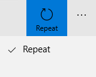

<!-- Class syntax.
public class AppBarToggleButton : Windows.UI.Xaml.Controls.Primitives.ToggleButton, Windows.UI.Xaml.Controls.IAppBarToggleButton, Windows.UI.Xaml.Controls.IAppBarToggleButton3, Windows.UI.Xaml.Controls.ICommandBarElement, Windows.UI.Xaml.Controls.ICommandBarElement2
-->

# Windows.UI.Xaml.Controls.AppBarToggleButton

## -description

Represents a button control that can switch states and be displayed in an [AppBar](appbar.md).


## -xaml-syntax

```xaml
<AppBarToggleButton .../>
```

## -remarks

An AppBarToggleButton is similar to an [AppBarButton](appbarbutton.md) with an additional toggle state. When used inside a [CommandBar](commandbar.md). the visual appearance changes based on whether the control appears in the primary commands or the overflow menu. Here is an example of a toggled button as both a primary command and secondary command.



### Control style and template

You can modify the default [Style](../windows.ui.xaml/style.md) and [ControlTemplate](controltemplate.md) to give the control a unique appearance. For information about modifying a control's style and template, see [Styling controls](/windows/uwp/controls-and-patterns/styling-controls). The default style, template, and resources that define the look of the control are included in the `generic.xaml` file. For design purposes, `generic.xaml` is available locally with the SDK or NuGet package installation.

- **[WinUI Styles (recommended)](/windows/apps/design/style/xaml-styles#winui-and-styles):** For updated styles from WinUI, see `\Users\<username>\.nuget\packages\microsoft.ui.xaml\<version>\lib\uap10.0\Microsoft.UI.Xaml\Themes\generic.xaml`.
- **Non-WinUI styles:** For built-in styles, see `%ProgramFiles(x86)%\Windows Kits\10\DesignTime\CommonConfiguration\Neutral\UAP\<SDK version>\Generic\generic.xaml`.

Locations might be different if you customized the installation. Styles and resources from different versions of the SDK might have different values.

XAML also includes resources that you can use to modify the colors of a control in different visual states without modifying the control template. Modifying these resources is preferred to setting properties such as [Background](control_background.md) and [Foreground](control_foreground.md). For more info, see the [Light-weight styling](/windows/apps/design/style/xaml-styles#lightweight-styling) section of the [XAML styles](/windows/apps/design/style/xaml-styles) article. Light-weight styling resources are available starting in Windows 10, version 1607 (SDK 14393).

### Version history

| Windows version | SDK version | Value added |
| -- | -- | -- |
| 1607 | 14393 | DynamicOverflowOrder |
| 1607 | 14393 | IsInOverflow |
| 1607 | 14393 | LabelPosition |
| 1803 | 17134 | KeyboardAcceleratorTextOverride |
| 1803 | 17134 | TemplateSettings |

## -examples

> [!TIP]
> For more info, design guidance, and code examples, see [Command bar](/windows/apps/design/controls/command-bar).

> [!div class="nextstepaction"]
> [Open the WinUI 2 Gallery app and see the AppBarToggleButton in action](winui2gallery:/item/AppBarToggleButton)

> The **WinUI 2 Gallery** app includes interactive examples of most WinUI 2 controls, features, and functionality. Get the app from the [Microsoft Store](https://www.microsoft.com/store/productId/9MSVH128X2ZT) or get the source code on [GitHub](https://github.com/Microsoft/WinUI-Gallery/tree/winui2).

## -see-also

[Control](control.md), [AppBar](appbar.md), [AppBarButton](appbarbutton.md), [AppBarSeparator](appbarseparator.md), [CommandBar](commandbar.md), [ToggleButton](../windows.ui.xaml.controls.primitives/togglebutton.md), [Controls list](/windows/uwp/design/controls-and-patterns/), [Controls by function](/windows/uwp/controls-and-patterns/controls-by-function), [Commanding sample (Windows 10)](https://github.com/Microsoft/Windows-universal-samples/tree/master/Samples/XamlCommanding)
