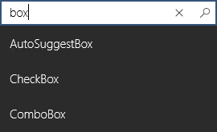

<!-- Class syntax.
public class AutoSuggestBox : Windows.UI.Xaml.Controls.ItemsControl, Windows.UI.Xaml.Controls.IAutoSuggestBox, Windows.UI.Xaml.Controls.IAutoSuggestBox2, Windows.UI.Xaml.Controls.IAutoSuggestBox3
-->

# Windows.UI.Xaml.Controls.AutoSuggestBox

## -description

Represents a text control that makes suggestions to users as they enter text using a keyboard or pen (using ink and handwriting recognition). The app is notified when text has been changed by the user and is responsible for providing relevant suggestions for this control to display.


## -xaml-syntax

```xaml
<AutoSuggestBox .../>
```

## -remarks

> [!TIP]
> For more info, design guidance, and code examples, see [Auto-suggest box](/windows/uwp/design/controls-and-patterns/auto-suggest-box).

Use an AutoSuggestBox to provide a list of suggestions for a user to select from as they type.

By default, the text entry box doesn’t have a query button shown. You can set the [QueryIcon](autosuggestbox_queryicon.md) property to add a button with the specified icon on the right side of the text box. For example, to make the AutoSuggestBox look like a typical search box, add a ‘find’ icon, like this.

```xaml
<AutoSuggestBox QueryIcon="Find"/>
```

Here's an AutoSuggestBox with a 'find' icon. The suggestion list shows suggested results based on the user's entry.


To use an AutoSuggestBox, you need to respond to 3 user actions.

+ Text changed - When the user enters text, update the suggestion list.
+ Suggestion chosen - When the user chooses a suggestion in the suggestion list, update the text box.
+ Query submitted - When the user submits a query, show the query results.

### Text changed

The [TextChanged](autosuggestbox_textchanged.md) event occurs whenever the content of the text box is updated. Use the event args [Reason](autosuggestboxtextchangedeventargs_reason.md) property to determine whether the change was due to user input. If the change reason is **UserInput**, filter your data based on the input. Then, set the filtered data as the [ItemsSource](itemscontrol_itemssource.md) of the AutoSuggestBox to update the suggestion list.

To control how items are displayed in the suggestion list, you can use [DisplayMemberPath](itemscontrol_displaymemberpath.md) or [ItemTemplate](itemscontrol_itemtemplate.md).

+ To display the text of a single property of your data item, set the [DisplayMemberPath](itemscontrol_displaymemberpath.md) property to choose which property from your object to display in the suggestion list.
+ To define a custom look for each item in the list, use the [ItemTemplate](itemscontrol_itemtemplate.md) property .

### Suggestion chosen

When a user navigates through the suggestion list using the keyboard, you need to update the text in the text box to match.

You can set the [TextMemberPath](autosuggestbox_textmemberpath.md) property to choose which property from your data object to display in the text box. If you specify a [TextMemberPath](autosuggestbox_textmemberpath.md), the text box is updated automatically. You should typically specify the same value for [DisplayMemberPath](itemscontrol_displaymemberpath.md) and [TextMemberPath](autosuggestbox_textmemberpath.md) so the text is the same in the suggestion list and the text box.

If you need to show more than a simple property, handle the [SuggestionChosen](autosuggestbox_suggestionchosen.md) event to populate the text box with custom text based on the selected item.

### Query submitted

Handle the [QuerySubmitted](autosuggestbox_querysubmitted.md) event to perform a query action appropriate to your app and show result to the user.

The [QuerySubmitted](autosuggestbox_querysubmitted.md) event occurs when a user commits a query string. The user can commit a query in one of these ways:
+ While focus is in the text box, press Enter or click the query icon. The event args [ChosenSuggestion](autosuggestboxquerysubmittedeventargs_chosensuggestion.md) property is **null**.
+ While focus is in the suggestion list, press Enter, click, or tap an item. The event args [ChosenSuggestion](autosuggestboxquerysubmittedeventargs_chosensuggestion.md) property contains the item that was selected from the list.
 In all cases, the event args [QueryText](autosuggestboxquerysubmittedeventargs_querytext.md) property contains the text from the text box.

### Accessibility

If you are using an assistive technology, such as [Narrator](https://support.microsoft.com/help/17173/windows-10-hear-text-read-aloud), to interact with the AutoSuggestBox the accessibility experience has already been hooked up for you. A user will:

+ Know the list is present and when the list closes
+ Know how many suggestions are available
+ Be able to move Narrator focus to the list
+ Be able to Navigate through a suggestion with all other reading modes
See [Auto-suggest accessibility](/windows/uwp/design/accessibility/accessible-text-requirements#auto-suggest-accessibility) for more information.

## Pen input

Starting with Windows 10, version 1803, XAML text input boxes feature embedded support for pen input using [Windows Ink](/windows/uwp/input-and-devices/pen-and-stylus-interactions). When a user taps into a text input box using a Windows pen, the text box transforms to let the user write directly into it with a pen, rather than opening a separate input panel.

You can configure the handwriting view of the AutoSuggestBox through its TextBox control, as we show here.

```xaml
<AutoSuggestBox Name="NoHandwritingAutoSuggestBox"
        BorderThickness="0"  Width="680"
        FontSize="24" VerticalAlignment="Top"
        HorizontalAlignment="Center"
        PlaceholderText="Handwriting view is not supported">
    <AutoSuggestBox.TextBoxStyle>
        <Style TargetType="TextBox">
            <Setter Property="IsHandwritingViewEnabled" Value="False"/>
        </Style>
    </AutoSuggestBox.TextBoxStyle>
</AutoSuggestBox>
```


For more info, see [Text input with the handwriting view](/windows/uwp/design/controls-and-patterns/text-handwriting-view).

### Control style and template

You can modify the default [Style](../windows.ui.xaml/style.md) and [ControlTemplate](controltemplate.md) to give the control a unique appearance. For information about modifying a control's style and template, see [Styling controls](/windows/uwp/controls-and-patterns/styling-controls). The default style, template, and resources that define the look of the control are included in the `generic.xaml` file. For design purposes, `generic.xaml` is available locally with the SDK or NuGet package installation.

- **[WinUI Styles (recommended)](/windows/apps/design/style/xaml-styles#winui-and-styles):** For updated styles from WinUI, see `\Users\<username>\.nuget\packages\microsoft.ui.xaml\<version>\lib\uap10.0\Microsoft.UI.Xaml\Themes\generic.xaml`.
- **Non-WinUI styles:** For built-in styles, see `%ProgramFiles(x86)%\Windows Kits\10\DesignTime\CommonConfiguration\Neutral\UAP\<SDK version>\Generic\generic.xaml`.

Locations might be different if you customized the installation. Styles and resources from different versions of the SDK might have different values.

XAML also includes resources that you can use to modify the colors of a control in different visual states without modifying the control template. Modifying these resources is preferred to setting properties such as [Background](control_background.md) and [Foreground](control_foreground.md). For more info, see the [Light-weight styling](/windows/apps/design/style/xaml-styles#lightweight-styling) section of the [XAML styles](/windows/apps/design/style/xaml-styles) article. Light-weight styling resources are available starting in Windows 10, version 1607 (SDK 14393).

Resources that start with `TextControl` are shared by [TextBox](textbox.md), [PasswordBox](passwordbox.md), [RichEditBox](richeditbox.md), and `AutoSuggestBox`. Changes to these resources will affect all four controls.

### Version history

| Windows version | SDK version | Value added |
| -- | -- | -- |
| 1607 | 14393 | LightDismissOverlayMode |
| 1809 | 17763 | Description |

## -examples

> [!TIP]
> For more info, design guidance, and code examples, see [Auto-suggest box](/windows/apps/design/controls/auto-suggest-box).

> [!div class="nextstepaction"]
> [Open the WinUI 2 Gallery app and see the AutoSuggestBox in action](winui2gallery:/item/AutoSuggestBox)

> The **WinUI 2 Gallery** app includes interactive examples of most WinUI 2 controls, features, and functionality. Get the app from the [Microsoft Store](https://www.microsoft.com/store/productId/9MSVH128X2ZT) or get the source code on [GitHub](https://github.com/Microsoft/WinUI-Gallery/tree/winui2).

Here is a simple AutoSuggestBox with the required event handlers.

```xaml
<AutoSuggestBox PlaceholderText="Search" QueryIcon="Find" Width="200"
                TextChanged="AutoSuggestBox_TextChanged"
                QuerySubmitted="AutoSuggestBox_QuerySubmitted"
                SuggestionChosen="AutoSuggestBox_SuggestionChosen"/>
```

```csharp
private void AutoSuggestBox_TextChanged(AutoSuggestBox sender, AutoSuggestBoxTextChangedEventArgs args)
{
    // Only get results when it was a user typing, 
    // otherwise assume the value got filled in by TextMemberPath 
    // or the handler for SuggestionChosen.
    if (args.Reason == AutoSuggestionBoxTextChangeReason.UserInput)
    {
        //Set the ItemsSource to be your filtered dataset
        //sender.ItemsSource = dataset;
    }
}


private void AutoSuggestBox_SuggestionChosen(AutoSuggestBox sender, AutoSuggestBoxSuggestionChosenEventArgs args)
{
    // Set sender.Text. You can use args.SelectedItem to build your text string.
}


private void AutoSuggestBox_QuerySubmitted(AutoSuggestBox sender, AutoSuggestBoxQuerySubmittedEventArgs args)
{
    if (args.ChosenSuggestion != null)
    {
        // User selected an item from the suggestion list, take an action on it here.
    }
    else
    {
        // Use args.QueryText to determine what to do.
    }
}
```


## -see-also
[ItemsControl](itemscontrol.md), [IItemContainerMapping](iitemcontainermapping.md), [AutoSuggestBox migration sample (Windows 10)](https://github.com/Microsoft/Windows-universal-samples/tree/master/Samples/XamlAutoSuggestBox), [Guidelines for auto-suggest boxes](/windows/uwp/design/controls-and-patterns/auto-suggest-box), [Search and find-in-page](/windows/uwp/design/controls-and-patterns/search)
