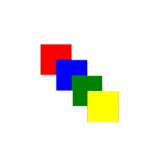

<!-- Class syntax.
public class Canvas : Windows.UI.Xaml.Controls.Panel, Windows.UI.Xaml.Controls.ICanvas
-->

# Windows.UI.Xaml.Controls.Canvas

## -description
Defines an area within which you can explicitly position child objects, using coordinates that are relative to the Canvas area.


## -xaml-syntax
```xaml
<Canvas ...>
  oneOrMoreUIElements
</Canvas>
-or-
<Canvas .../>
```


## -remarks

Canvas is a layout panel that supports absolute positioning of child elements relative to the top left corner of the canvas.



A Canvas is one of the [Panel](panel.md) elements that enable layout. Canvas uses absolute positioning as its layout technique for its contained child elements. Each child element is rendered within the Canvas area. You control the positioning of elements inside the Canvas by specifying x and y coordinates. These coordinates are in pixels. The x and y coordinates are often specified by using the [Canvas.Left](/uwp/api/windows.ui.xaml.controls.canvas.left) and [Canvas.Top](/uwp/api/windows.ui.xaml.controls.canvas.top) attached properties. [Canvas.Left](/uwp/api/windows.ui.xaml.controls.canvas.left) specifies the object's distance from the left side of the containing Canvas (the x-coordinate), and [Canvas.Top](/uwp/api/windows.ui.xaml.controls.canvas.top) specifies the object's distance from the top of the containing Canvas (the y-coordinate).

> [!NOTE]
> Because absolute positioning does not take into account the size of the app window, scaling, or other user-selected sizing, using a container element that adapts to different orientations and screen settings, such as [Grid](grid.md) or [StackPanel](stackpanel.md), is often a better choice than using Canvas. For more information, see [Define layouts with XAML](/windows/uwp/layout/layouts-with-xaml).

You can nest Canvas objects. When you nest objects, the coordinates used by each object are relative to its immediate containing Canvas.

Each child object of a Canvas must be a [UIElement](../windows.ui.xaml/uielement.md). In XAML, you declare child objects as content of a Canvas object element. In code, you can manipulate the collection of Canvas child objects by getting the collection that is accessed by the [Children](panel_children.md) property.

In many cases, a Canvas is used solely as a container for other objects and does not have any visible properties. A Canvas and its children (if any) are not visible if any of these conditions are true:

+ The [Visibility](../windows.ui.xaml/uielement_visibility.md) property is set to **Collapsed**.
+ The [Opacity](../windows.ui.xaml/uielement_opacity.md) property of the Canvas is 0.

The children of a Canvas (if any) are still visible even if the Canvas has any of these conditions:

+ The [Background](panel_background.md) property of the Canvas is **null**.
+ The [Height](../windows.ui.xaml/frameworkelement_height.md) or [Width](../windows.ui.xaml/frameworkelement_width.md) property of the Canvas is 0.

A Canvas with no children and with a default [Height](../windows.ui.xaml/frameworkelement_height.md) and [Width](../windows.ui.xaml/frameworkelement_width.md) of **Auto** doesn't have dimensions. This is also the case if the Canvas has children but all the children have [Visibility](../windows.ui.xaml/uielement_visibility.md) of **Collapsed**, or zero [Height](../windows.ui.xaml/frameworkelement_height.md) or [Width](../windows.ui.xaml/frameworkelement_width.md).

### XAML attached properties

Canvas is the host service class for several [XAML attached properties](/windows/uwp/xaml-platform/attached-properties-overview).

In order to support XAML processor access to the attached properties, and also to expose equivalent _get_ and _set_ operations to code, each XAML attached property has a pair of Get and Set accessor methods. Another way to get or set the value in code is to use the dependency property system, calling either [GetValue](../windows.ui.xaml/dependencyobject_getvalue_1188551207.md) or [SetValue](../windows.ui.xaml/dependencyobject_setvalue_52578133.md) and passing the identifier field as the dependency property identifier.

| Attached property | Description |
| - | - |
| [Left](canvas_left.md) | Gets or sets the distance between the left side of an object and the left side of its parent Canvas.<ul><li>Type: Double</li><li>Identifier field: <a href="/uwp/api/windows.ui.xaml.controls.canvas.leftproperty">LeftProperty</a></li><li>Accessor methods: <a href="/uwp/api/windows.ui.xaml.controls.canvas.getleft">GetLeft</a>, <a href="/uwp/api/windows.ui.xaml.controls.canvas.setleft">SetLeft</a></li></ul> The Left value is the horizontal offset between the left edge of the parent Canvas and where the target element should be placed. You typically specify positive integer numbers. Non-integer Double values are allowed but can potentially cause subpixel rendering issues; see UseLayoutRounding. |
| [Top](canvas_top.md) | Gets or sets the distance between the top of an element and the top of its parent Canvas.<ul><li>Type: Double</li><li>Identifier field: <a href="/uwp/api/windows.ui.xaml.controls.canvas.topproperty">TopProperty</a></li><li>Accessor methods: <a href="/uwp/api/windows.ui.xaml.controls.canvas.gettop">GetTop</a>, <a href="/uwp/api/windows.ui.xaml.controls.canvas.settop">SetTop</a></li></ul> The Top value is the vertical offset between the top edge of the parent Canvas and where the target element should be placed. You typically specify positive integer numbers. Non-integer Double values are allowed but can potentially cause subpixel rendering issues; see UseLayoutRounding.<br/>A Canvas.Top value is interpreted by the most immediate parent Canvas element from where the value is set. The value is used along with Canvas.Left to specify the layout characteristics of each child element of a Canvas. |
| [ZIndex](canvas_zindex.md)| Gets or sets the Z-order of an element when that element is presented in its parent Canvas layout container.<ul><li>Type: Int32</li><li>Identifier field: <a href="/uwp/api/windows.ui.xaml.controls.canvas.zindexproperty">ZIndexProperty</a></li><li>Accessor methods: <a href="/uwp/api/windows.ui.xaml.controls.canvas.getzindex">GetZIndex</a>, <a href="/uwp/api/windows.ui.xaml.controls.canvas.setzindex">SetZIndex</a></li></ul> Canvas.ZIndex declares the draw order for the child elements of a Canvas. This matters when there is overlap between any of the bounds of the child elements. A higher z-order value will draw on top of a lower z-order value. If no value is set, the default is 0. If there is a draw order issue where elements share one or more pixels of layout space in a Canvas and the z-index values are the same, then the last element declared in XAML (or the highest index element in the Children collection if using code) is the element that draws on top.<br/>You typically use values 0 and greater but negative values are permitted. A negative value, such as -99, places the object even farther from the foreground than any default value.<br/>A value is interpreted by the most immediate parent Canvas element from where the value is set. The value is used to explicitly define the draw order in cases where child elements overlap. |

## -examples

> [!TIP]
> For more info, design guidance, and code examples, see [Canvas](/windows/apps/design/layout/layout-panels#canvas).

> [!div class="nextstepaction"]
> [Open the WinUI 2 Gallery app and see the Canvas in action](winui2gallery:/item/Canvas)

> The **WinUI 2 Gallery** app includes interactive examples of most WinUI 2 controls, features, and functionality. Get the app from the [Microsoft Store](https://www.microsoft.com/store/productId/9MSVH128X2ZT) or get the source code on [GitHub](https://github.com/Microsoft/WinUI-Gallery/tree/winui2).

This example shows how to position a rectangle 30 pixels from the left and 30 pixels from the top of a Canvas.

[!code-xaml[LayoutOvwCanvas1](../windows.ui.xaml/code/layout_ovw_all/CSharp/MainPage.xaml#SnippetLayoutOvwCanvas1)]
<!--<desc><p xml:space="preserve">In the following example, the <xref targtype="class_winrt" rid="w_ui_xaml_ctrl.canvas">Canvas</xref> contains a red rectangle that has <xref targtype="property_winrt" rid="w_ui_xaml_ctrl.canvas_left">Canvas.Left</xref> and <xref targtype="property_winrt" rid="w_ui_xaml_ctrl.canvas_top">Canvas.Top</xref> values of 30.  </p></desc>
    <auto_snippet sample_id="layout_ovw_all" snippet_id="LayoutOvwCanvas2"/>-->

## -see-also
[Panel](panel.md), [Define layouts](/windows/uwp/layout/layouts-with-xaml), [Alignment, margin, and padding](/windows/uwp/layout/alignment-margin-padding), [Attached properties overview](/windows/uwp/xaml-platform/attached-properties-overview), [Grid](grid.md), [StackPanel](stackpanel.md), [VariableSizedWrapGrid](variablesizedwrapgrid.md), [Controls list](/windows/uwp/design/controls-and-patterns/), [Controls by function](/windows/uwp/controls-and-patterns/controls-by-function)
