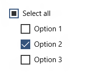

<!-- Class syntax.
public class CheckBox : Windows.UI.Xaml.Controls.Primitives.ToggleButton, Windows.UI.Xaml.Controls.ICheckBox
-->

# Windows.UI.Xaml.Controls.CheckBox

## -description
Represents a control that a user can select (check) or clear (uncheck). A CheckBox can also report its value as indeterminate.


## -xaml-syntax
```xaml
<CheckBox .../>
-or-
<CheckBox>
  singleObject
</CheckBox>
-or-
<CheckBox>stringContent</CheckBox>
```


## -remarks

> [!TIP]
> For more info, design guidance, and code examples, see [Check boxes](/windows/uwp/design/controls-and-patterns/checkbox).

CheckBox is a control that a user can select or clear.


Use the CheckBox control to provide a list of options that a user can select, such as a list of settings to apply to an application. Both CheckBox and [RadioButton](radiobutton.md) controls allow the user to select from a list of options. CheckBox controls allow the user to select a combination of options. In contrast, [RadioButton](radiobutton.md) controls allow the user to select from mutually exclusive options.

The CheckBox control inherits from [ToggleButton](../windows.ui.xaml.controls.primitives/togglebutton.md) and can have three states:

| State | Property | Value |
|---|---|---|
| checked | [IsChecked](../windows.ui.xaml.controls.primitives/togglebutton_ischecked.md) | **true** |
| unchecked | [IsChecked](../windows.ui.xaml.controls.primitives/togglebutton_ischecked.md) | **false** |
| indeterminate | [IsChecked](../windows.ui.xaml.controls.primitives/togglebutton_ischecked.md) | **null** |

 For the CheckBox to report the indeterminate state, you must set the [IsThreeState](../windows.ui.xaml.controls.primitives/togglebutton_isthreestate.md) property to **true**.

### Control style and template

You can modify the default [Style](../windows.ui.xaml/style.md) and [ControlTemplate](controltemplate.md) to give the control a unique appearance. For information about modifying a control's style and template, see [Styling controls](/windows/uwp/controls-and-patterns/styling-controls). The default style, template, and resources that define the look of the control are included in the `generic.xaml` file. For design purposes, `generic.xaml` is available locally with the SDK or NuGet package installation.

- **[WinUI Styles (recommended)](/windows/apps/design/style/xaml-styles#winui-and-styles):** For updated styles from WinUI, see `\Users\<username>\.nuget\packages\microsoft.ui.xaml\<version>\lib\uap10.0\Microsoft.UI.Xaml\Themes\generic.xaml`.
- **Non-WinUI styles:** For built-in styles, see `%ProgramFiles(x86)%\Windows Kits\10\DesignTime\CommonConfiguration\Neutral\UAP\<SDK version>\Generic\generic.xaml`.

Locations might be different if you customized the installation. Styles and resources from different versions of the SDK might have different values.

XAML also includes resources that you can use to modify the colors of a control in different visual states without modifying the control template. Modifying these resources is preferred to setting properties such as [Background](control_background.md) and [Foreground](control_foreground.md). For more info, see the [Light-weight styling](/windows/apps/design/style/xaml-styles#lightweight-styling) section of the [XAML styles](/windows/apps/design/style/xaml-styles) article. Light-weight styling resources are available starting in Windows 10, version 1607 (SDK 14393).

## -examples

> [!TIP]
> For more info, design guidance, and code examples, see [Checkbox](/windows/apps/design/controls/checkbox).

> [!div class="nextstepaction"]
> [Open the WinUI 2 Gallery app and see the CheckBox in action](winui2gallery:/item/CheckBox)

> The **WinUI 2 Gallery** app includes interactive examples of most WinUI 2 controls, features, and functionality. Get the app from the [Microsoft Store](https://www.microsoft.com/store/productId/9MSVH128X2ZT) or get the source code on [GitHub](https://github.com/Microsoft/WinUI-Gallery/tree/winui2).

The following example shows two check box controls. The first check box demonstrates the checked and unchecked states. The second check box demonstrates the checked, unchecked, and indeterminate states. You can select the controls to change their appearance and see which state they are in.

[!code-xaml[1](../windows.ui.xaml.data/code/System.Windows.Controls.CheckBoxEx/csharp/Page.xaml#Snippet1)]

[!code-csharp[11](../windows.ui.xaml.data/code/System.Windows.Controls.CheckBoxEx/csharp/Page.xaml.cs#Snippet11)]

[!code-vb[11](../windows.ui.xaml.data/code/System.Windows.Controls.CheckBoxEx/vbnet/Page.xaml.vb#Snippet11)]



```xaml
<StackPanel>
    <CheckBox x:Name="OptionsAllCheckBox" Content="Select all" IsThreeState="True" 
              Checked="SelectAll_Checked" Unchecked="SelectAll_Unchecked" Indeterminate="SelectAll_Indeterminate"/>
    <CheckBox x:Name="Option1CheckBox" Content="Option 1" Margin="24,0,0,0" 
              Checked="Option_Checked" Unchecked="Option_Unchecked"/>
    <CheckBox x:Name="Option2CheckBox" Content="Option 2" Margin="24,0,0,0" 
              Checked="Option_Checked" Unchecked="Option_Unchecked" IsChecked="True"/>
    <CheckBox x:Name="Option3CheckBox" Content="Option 3" Margin="24,0,0,0"
              Checked="Option_Checked" Unchecked="Option_Unchecked"/>
</StackPanel>
```

```csharp
private void SelectAll_Checked(object sender, RoutedEventArgs e)
{
    Option1CheckBox.IsChecked = Option2CheckBox.IsChecked = Option3CheckBox.IsChecked = true;
}

private void SelectAll_Unchecked(object sender, RoutedEventArgs e)
{
    Option1CheckBox.IsChecked = Option2CheckBox.IsChecked = Option3CheckBox.IsChecked = false;
}

private void SelectAll_Indeterminate(object sender, RoutedEventArgs e)
{
    // If the SelectAll box is checked (all options are selected), 
    // clicking the box will change it to its indeterminate state.
    // Instead, we want to uncheck all the boxes,
    // so we do this programatically. The indeterminate state should
    // only be set programatically, not by the user.

    if (Option1CheckBox.IsChecked == true &&
        Option2CheckBox.IsChecked == true &&
        Option3CheckBox.IsChecked == true)
    {
        // This will cause SelectAll_Unchecked to be executed, so
        // we don't need to uncheck the other boxes here.
        OptionsAllCheckBox.IsChecked = false;
    }
}

private void SetCheckedState()
{
    // Controls are null the first time this is called, so we just 
    // need to perform a null check on any one of the controls.
    if (Option1CheckBox != null)
    {
        if (Option1CheckBox.IsChecked == true &&
            Option2CheckBox.IsChecked == true &&
            Option3CheckBox.IsChecked == true)
        {
            OptionsAllCheckBox.IsChecked = true;
        }
        else if (Option1CheckBox.IsChecked == false &&
            Option2CheckBox.IsChecked == false &&
            Option3CheckBox.IsChecked == false)
        {
            OptionsAllCheckBox.IsChecked = false;
        }
        else
        {
            // Set third state (indeterminate) by setting IsChecked to null.
            OptionsAllCheckBox.IsChecked = null;
        }
    }
}

private void Option_Checked(object sender, RoutedEventArgs e)
{
    SetCheckedState();
}

private void Option_Unchecked(object sender, RoutedEventArgs e)
{
    SetCheckedState();
} 
```


## -see-also
[Check boxes overview](/windows/uwp/controls-and-patterns/checkbox), [RadioButton](radiobutton.md), [ToggleButton](../windows.ui.xaml.controls.primitives/togglebutton.md), [Controls list](/windows/uwp/design/controls-and-patterns/), [Controls by function](/windows/uwp/controls-and-patterns/controls-by-function)
