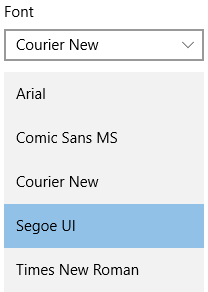

<!-- Class syntax.
public class ComboBox : Windows.UI.Xaml.Controls.Primitives.Selector, Windows.UI.Xaml.Controls.IComboBox, Windows.UI.Xaml.Controls.IComboBox2, Windows.UI.Xaml.Controls.IComboBox3, Windows.UI.Xaml.Controls.IComboBoxOverrides
-->

# Windows.UI.Xaml.Controls.ComboBox

## -description
Represents a selection control that combines a non-editable text box and a drop-down list box that allows users to select an item from a list.


## -xaml-syntax
```xaml
<ComboBox .../>
```


## -remarks

> [!TIP]
> For more info, design guidance, and code examples, see [Combo box](/windows/uwp/design/controls-and-patterns/combo-box).

ComboBox presents a drop-down list of items a user can select from.



Use a ComboBox to present a list of items that a user can select from. When the ComboBox is closed, it either displays the current selection or is empty if there is no selected item. When the ComboBox is open, it displays the list of selectable items. You can get or set the combo box's selected item by using the [SelectedItem](../windows.ui.xaml.controls.primitives/selector_selecteditem.md) property, and get or set the index of the selected item by using the [SelectedIndex](../windows.ui.xaml.controls.primitives/selector_selectedindex.md) property.

You populate the ComboBox by adding objects directly to the [Items](itemscontrol_items.md) collection or by binding the [ItemsSource](itemscontrol_itemssource.md) property to a data source. Items added to the ComboBox are wrapped in [ComboBoxItem](comboboxitem.md) containers.

> [!NOTE]
> ComboBox uses a [CarouselPanel](../windows.ui.xaml.controls.primitives/carouselpanel.md) as its [ItemsPanel](itemscontrol_itemspanel.md). Using a different panel as the [ItemsPanel](itemscontrol_itemspanel.md) is not supported and might result in undesired behavior.

If you need to handle pointer events for a [UIElement](../windows.ui.xaml/uielement.md) in a scrollable view (such as a ScrollViewer), you must explicitly disable support for manipulation events on the element in the view by calling [UIElement.CancelDirectmanipulation()](../windows.ui.xaml/uielement_canceldirectmanipulations_1164631120.md). To re-enable manipulation events in the view, call [UIElement.TryStartDirectManipulation()](../windows.ui.xaml/uielement_trystartdirectmanipulation_1983346775.md).

### Control style and template

You can modify the default [Style](../windows.ui.xaml/style.md) and [ControlTemplate](controltemplate.md) to give the control a unique appearance. For information about modifying a control's style and template, see [Styling controls](/windows/uwp/controls-and-patterns/styling-controls). The default style, template, and resources that define the look of the control are included in the `generic.xaml` file. For design purposes, `generic.xaml` is available locally with the SDK or NuGet package installation.

- **[WinUI Styles (recommended)](/windows/apps/design/style/xaml-styles#winui-and-styles):** For updated styles from WinUI, see `\Users\<username>\.nuget\packages\microsoft.ui.xaml\<version>\lib\uap10.0\Microsoft.UI.Xaml\Themes\generic.xaml`.
- **Non-WinUI styles:** For built-in styles, see `%ProgramFiles(x86)%\Windows Kits\10\DesignTime\CommonConfiguration\Neutral\UAP\<SDK version>\Generic\generic.xaml`.

Locations might be different if you customized the installation. Styles and resources from different versions of the SDK might have different values.

XAML also includes resources that you can use to modify the colors of a control in different visual states without modifying the control template. Modifying these resources is preferred to setting properties such as [Background](control_background.md) and [Foreground](control_foreground.md). For more info, see the [Light-weight styling](/windows/apps/design/style/xaml-styles#lightweight-styling) section of the [XAML styles](/windows/apps/design/style/xaml-styles) article. Light-weight styling resources are available starting in Windows 10, version 1607 (SDK 14393).

### Version history

| Windows version | SDK version | Value added |
| -- | -- | -- |
| 1607 | 14393 | IsTextSearchEnabled |
| 1607 | 14393 | LightDismissOverlayMode |
| 1703 | 15063 | SelectionChangedTrigger |
| 1709 | 16299 | PlaceholderForeground |
| 1809 | 17763 | Description |
| 1809 | 17763 | Text |
| 1809 | 17763 | TextBoxStyle |
| 1809 | 17763 | TextSubmitted |

## -examples

> [!TIP]
> For more info, design guidance, and code examples, see [Combo box](/windows/apps/design/controls/combo-box).

> [!div class="nextstepaction"]
> [Open the WinUI 2 Gallery app and see the ComboBox in action](winui2gallery:/item/ComboBox)

> The **WinUI 2 Gallery** app includes interactive examples of most WinUI 2 controls, features, and functionality. Get the app from the [Microsoft Store](https://www.microsoft.com/store/productId/9MSVH128X2ZT) or get the source code on [GitHub](https://github.com/Microsoft/WinUI-Gallery/tree/winui2).

The following example demonstrates binding a ComboBox to a collection of [FontFamily](../windows.ui.xaml.media/fontfamily.md) objects.

```xaml
<ComboBox x:Name="FontsCombo" Header="Fonts" Height="44" Width="296" 
          ItemsSource="{x:Bind fonts}" DisplayMemberPath="Source"/>
```


<!--<auto_snippet sample_id="ComboBoxBoundEx" snippet_id="1"/>-->
```csharp
ObservableCollection<FontFamily> fonts = new ObservableCollection<FontFamily>();

public MainPage()
{
    this.InitializeComponent();
    fonts.Add(new FontFamily("Arial"));
    fonts.Add(new FontFamily("Courier New"));
    fonts.Add(new FontFamily("Times New Roman"));
}

```


<!--<auto_snippet sample_id="ComboBoxBoundEx" snippet_id="2"/>-->

## -see-also
[Selector](../windows.ui.xaml.controls.primitives/selector.md), [ListBox](listbox.md), [Controls list](/windows/uwp/design/controls-and-patterns/), [Controls by function](/windows/uwp/controls-and-patterns/controls-by-function)
