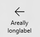

<!-- Class syntax.
public class CommandBar : Windows.UI.Xaml.Controls.AppBar, Windows.UI.Xaml.Controls.ICommandBar, Windows.UI.Xaml.Controls.ICommandBar2, Windows.UI.Xaml.Controls.ICommandBar3
-->

# Windows.UI.Xaml.Controls.CommandBar

## -description

Represents a specialized app bar that provides layout for [AppBarButton](appbarbutton.md) and related command elements.


## -xaml-syntax

```xaml
<CommandBar .../>
-or-
<CommandBar>
  commandBarElements
</CommandBar>
```

## -remarks

> [!TIP]
> For more info, design guidance, and code examples, see [Command bar](/windows/uwp/design/controls-and-patterns/app-bars).

Use a CommandBar to provide users with quick access to your app’s most common tasks. It's a general-purpose, flexible, light-weight control that can display both complex content, such as images, progress bars, or text blocks, as well as simple commands such as [AppBarButton](appbarbutton.md), [AppBarToggleButton](appbartogglebutton.md), and [AppBarSeparator](appbarseparator.md) controls.

### Anatomy

By default, the CommandBar shows a row of icon buttons and a "More" button, which is represented by an ellipsis [•••]. Here's the CommandBar created by the example code shown later. It's shown in its default closed state.


Here's the same CommandBar shown in its open state. The labels show the main parts of the control.


The CommandBar is divided into 4 main areas:

+ The content area is shown on the left.
+ The "More" button is shown on the right. Pressing the "More" button has 2 effects: it reveals the labels on the primary command buttons, and it opens the overflow menu if any secondary commands are present.
+ The primary commands are shown to the left of the "More" button.
+ The overflow menu is shown only when the CommandBar is open and contains secondary commands.

The layout is reversed when the [FlowDirection](../windows.ui.xaml/frameworkelement_flowdirection.md) is [RightToLeft](../windows.ui.xaml/flowdirection.md).

Assigning an access key to CommandBar will place the key tip over the "More" button without changing the scope of the access keys.

### Content and commands

CommandBar has 3 properties you can use to add content and commands: [Content](contentcontrol_content.md), [PrimaryCommands](commandbar_primarycommands.md), and [SecondaryCommands](commandbar_secondarycommands.md).

You can add any XAML elements to the content area by setting the [Content](contentcontrol_content.md) property.

Both the [PrimaryCommands](commandbar_primarycommands.md) and [SecondaryCommands](commandbar_secondarycommands.md) can be populated only with [AppBarButton](appbarbutton.md), [AppBarToggleButton](appbartogglebutton.md), and [AppBarSeparator](appbarseparator.md) command elements. By default, items you add to the CommandBar are added to the [PrimaryCommands](commandbar_primarycommands.md) collection. These commands are shown to the left of the "More" button. You can add commands to the [SecondaryCommands](commandbar_secondarycommands.md) collection, and these items are shown in the overflow menu. You can programmatically move commands between the [PrimaryCommands](commandbar_primarycommands.md) and [SecondaryCommands](commandbar_secondarycommands.md) as needed.

The app bar button controls are characterized by an icon and associated label. They have two sizes; normal and compact. By default, the text label is shown. When the [IsCompact](appbarbutton_iscompact.md) property is set to **true**, the text label is hidden. When used in a CommandBar control, the CommandBar sets the [IsCompact](appbarbutton_iscompact.md) property automatically as the control is opened and closed.

If the width of a button needs to be greater than the default when shown in the [PrimaryCommands](commandbar_primarycommands.md), use the [MinWidth](../windows.ui.xaml/frameworkelement_minwidth.md) property to achieve the desired size. Then, if you later move it to the [SecondaryCommands](commandbar_secondarycommands.md), it will still stretch to fill the width of the overflow menu.

If a text label for an app bar button is too long to fit on one line it will wrap to another line, increasing the overall height of the bar when it’s opened. You can include a soft-hyphen character (0x00AD) in the text for a label to hint at the character boundary where a word break should occur. In XAML, you express this using an escape sequence, like this:

```xaml
<AppBarButton Icon="Back" Label="Areally&#x00AD;longlabel"/>
```

When the label wraps at the hinted location, it looks like this.



### Open and closed states

The CommandBar can be open or closed. A user can switch between these states by pressing the "More" button. You can switch between them programmatically by setting the [IsOpen](appbar_isopen.md) property. You can use the [Opening](appbar_opening.md), [Opened](appbar_opened.md), [Closing](appbar_closing.md), and [Closed](appbar_closed.md) events to respond to the CommandBar being opened or closed.

When open, the primary command buttons are shown with text labels and the overflow menu is open if secondary commands are present. The default overflow menu is styled to be distinct from the bar. You can adjust the styling by setting the [CommandBarOverflowPresenterStyle](commandbar_commandbaroverflowpresenterstyle.md) property to a [Style](../windows.ui.xaml/style.md) that targets the [CommandBarOverflowPresenter](commandbaroverflowpresenter.md).

You can control how the CommandBar is shown in its closed state by setting the [ClosedDisplayMode](appbar_closeddisplaymode.md) property. By default, it’s shown in the **Compact** mode, with content, icons without labels, and the "More" button. You can set the mode to **Minimal** to show only a thin bar that acts as the "More" button. In **Minimal** mode, the user can press anywhere on the bar to open it. Here's how the CommandBar looks in **Minimal** mode.


Changing the [ClosedDisplayMode](appbar_closeddisplaymode.md) to provide more or less of a hint to the user affects the layout of surrounding elements. When the CommandBar transitions between closed and open, it does not affect the layout of other elements.

### IsSticky

After opening the CommandBar, if the user interacts with the app anywhere outside of the control then by default the overflow menu is dismissed and the labels are hidden. Closing it in this way is called *light dismiss*. You can control how the bar is dismissed by setting the [IsSticky](appbar_issticky.md) property. When the bar is sticky ([IsSticky](appbar_issticky.md) ="**true** "), it's not closed by a light dismiss gesture. The app bar remains visible until the user presses the "More" button or, if present, selects an item from the overflow menu.

### Placement

You can place a CommandBar inline with your app content, anywhere in your XAML. If the CommandBar must remain visible to a user when the touch keyboard, or Soft Input Panel (SIP), appears then you can assign it to the [BottomAppBar](page_bottomappbar.md) property of a [Page](page.md) and it will move to remain visible when the Soft Input Panel (SIP) is present. Otherwise, you should place it inline and positioned relative to your app content. Where you place the CommandBar will influence things like whether you make it sticky, or use the minimal mode when it's closed. For more info and guidance, see [Guidelines for command bars](/windows/uwp/controls-and-patterns/app-bars).

### Control style and template

You can modify the default [Style](../windows.ui.xaml/style.md) and [ControlTemplate](controltemplate.md) to give the control a unique appearance. For information about modifying a control's style and template, see [Styling controls](/windows/uwp/controls-and-patterns/styling-controls). The default style, template, and resources that define the look of the control are included in the `generic.xaml` file. For design purposes, `generic.xaml` is available locally with the SDK or NuGet package installation.

- **[WinUI Styles (recommended)](/windows/apps/design/style/xaml-styles#winui-and-styles):** For updated styles from WinUI, see `\Users\<username>\.nuget\packages\microsoft.ui.xaml\<version>\lib\uap10.0\Microsoft.UI.Xaml\Themes\generic.xaml`.
- **Non-WinUI styles:** For built-in styles, see `%ProgramFiles(x86)%\Windows Kits\10\DesignTime\CommonConfiguration\Neutral\UAP\<SDK version>\Generic\generic.xaml`.

Locations might be different if you customized the installation. Styles and resources from different versions of the SDK might have different values.

XAML also includes resources that you can use to modify the colors of a control in different visual states without modifying the control template. Modifying these resources is preferred to setting properties such as [Background](control_background.md) and [Foreground](control_foreground.md). For more info, see the [Light-weight styling](/windows/apps/design/style/xaml-styles#lightweight-styling) section of the [XAML styles](/windows/apps/design/style/xaml-styles) article. Light-weight styling resources are available starting in Windows 10, version 1607 (SDK 14393).

### Version history

| Windows version | SDK version | Value added |
| -- | -- | -- |
| 1607 | 14393 | DefaultLabelPosition |
| 1607 | 14393 | DynamicOverflowItemsChanging |
| 1607 | 14393 | IsDynamicOverflowEnabled |
| 1607 | 14393 | OverflowButtonVisibility |

## -examples

> [!TIP]
> For more info, design guidance, and code examples, see [Command bar](/windows/apps/design/controls/command-bar).

> [!div class="nextstepaction"]
> [Open the WinUI 2 Gallery app and see the CommandBar in action](winui2gallery:/item/CommandBar)

> The **WinUI 2 Gallery** app includes interactive examples of most WinUI 2 controls, features, and functionality. Get the app from the [Microsoft Store](https://www.microsoft.com/store/productId/9MSVH128X2ZT) or get the source code on [GitHub](https://github.com/Microsoft/WinUI-Gallery/tree/winui2).

This example creates the command bar shown in Remarks.

```xaml
<CommandBar>
    <AppBarToggleButton Icon="Shuffle" Label="Shuffle" Click="AppBarButton_Click"/>
    <AppBarToggleButton Icon="RepeatAll" Label="Repeat" Click="AppBarButton_Click"/>
    <AppBarSeparator/>
    <AppBarButton Icon="Back" Label="Back" Click="AppBarButton_Click"/>
    <AppBarButton Icon="Stop" Label="Stop" Click="AppBarButton_Click"/>
    <AppBarButton Icon="Play" Label="Play" Click="AppBarButton_Click"/>
    <AppBarButton Icon="Forward" Label="Forward" Click="AppBarButton_Click"/>

    <CommandBar.SecondaryCommands>
        <AppBarButton Icon="Like" Label="Like" Click="AppBarButton_Click"/>
        <AppBarButton Icon="Dislike" Label="Dislike" Click="AppBarButton_Click"/>
    </CommandBar.SecondaryCommands>

    <CommandBar.Content>
        <TextBlock Text="Now playing..." Margin="12,8"/>
    </CommandBar.Content>
</CommandBar>
```

## -see-also

[Guidelines for command bars](/windows/uwp/controls-and-patterns/app-bars), [Commanding sample (Windows 10)](https://github.com/Microsoft/Windows-universal-samples/tree/master/Samples/XamlCommanding)
