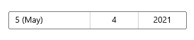

<!-- Property syntax
public string MonthFormat { get;  set; }
-->

# Windows.UI.Xaml.Controls.DatePicker.MonthFormat

## -description
Gets or sets the display format for the month value.


## -xaml-syntax
```xaml
<DatePicker MonthFormat="formatString"/>
```


## -xaml-values
<dl><dt>formatString</dt><dd>formatStringThe string format to use to display the month. See Remarks.</dd>
</dl>
## -property-value
The display format for the month value.

## -remarks
Change the format of the month picker by setting the `MonthFormat` property.

The string content of each [ComboBox](combobox.md) in the [DatePicker](datepicker.md) is created by a [DateTimeFormatter](../windows.globalization.datetimeformatting/datetimeformatter.md). You instruct the [DateTimeFormatter](../windows.globalization.datetimeformatting/datetimeformatter.md) how to format the month value by providing a string that is either a *format template* or a *format pattern*. Common templates and patterns for month values are listed in the following table.

<table>
   <tr><th>format pattern</th><th>format template</th></tr>
   <tr><td>`{month.integer} | {month.integer(n)} `</td><td>`month.numeric`</td></tr>
   <tr><td>`{month.full} | {month.abbreviated} | {month.abbreviated(n)}`</td><td>`month | month.full | month.abbreviated`</td></tr>
</table>

In some cases, using a format pattern gives you more precise control over the formatting. For example, you can use a format pattern to specify that the month picker always shows 2 digits, including a leading 0 when needed. You can also combine multiple format patterns. For example, you can combine the `{month.integer}` and `{month.abbreviated}` formats to make the month picker show the month number and name, like this: **12 Dec**. See the Examples section for more info.

For the complete list of format templates and format patterns, see the Remarks section of the [DateTimeFormatter](../windows.globalization.datetimeformatting/datetimeformatter.md) class documentation.

> [!NOTE]
> Some date formats should be avoided if the date picker might be displayed in a small area, such as adding the full string value of the day of week. These strings can be long and might be clipped if the DatePicker's width is forced to be small.

## -examples
Here's a [DatePicker](datepicker.md) formatted using format templates, and a [DatePicker](datepicker.md) formatted using format strings. Both [DatePicker](datepicker.md) controls look the same when the app is run because the formatting is equivalent.

```xaml
<!-- DatePicker formatted using format templates. -->
<DatePicker DayFormat="day" MonthFormat="month.numeric" YearFormat="year.abbreviated"/>

<!-- DatePicker formatted using format patterns. -->
<DatePicker DayFormat="{}{day.integer}" MonthFormat="{}{month.integer}" YearFormat="{}{year.abbreviated}"/>
```


Here's a [DatePicker](datepicker.md) that combines 2 format patterns to display both the month number and name in the month picker. You can add literal strings to the format pattern, such as the parentheses around the month abbreviation: `({month.abbreviated})`. There is no equivalent format template for this format.

```xaml
<DatePicker MonthFormat="{}{month.integer} ({month.abbreviated})"/>
```



## -see-also

[DateTimeFormatter](../windows.globalization.datetimeformatting/datetimeformatter.md), [DayFormat](datepicker_dayformat.md), [YearFormat](datepicker_yearformat.md), [MonthVisible](datepicker_monthvisible.md), [Date picker](/windows/uwp/design/controls-and-patterns/date-picker), [Use templates and patterns to format dates and times](/windows/uwp/design/globalizing/use-patterns-to-format-dates-and-times
