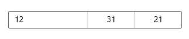

<!-- Property syntax
public string YearFormat { get;  set; }
-->

# Windows.UI.Xaml.Controls.DatePicker.YearFormat

## -description

Gets or sets the display format for the year value.


## -xaml-syntax

```xaml
<DatePicker YearFormat="formatString"/>
```

## -xaml-values

<dl><dt>formatString</dt><dd>formatStringThe string format to use to display the year. See Remarks.</dd>
</dl>
## -property-value
The display format for the year value.

## -remarks

Change the format of the year picker by setting the `YearFormat` property.

The string content of each [ComboBox](combobox.md) in the [DatePicker](datepicker.md) is created by a [DateTimeFormatter](../windows.globalization.datetimeformatting/datetimeformatter.md). You inform the [DateTimeFormatter](../windows.globalization.datetimeformatting/datetimeformatter.md) how to format the year value by providing a string that is either a *format template* or a *format pattern*. Common templates and patterns for year values are listed in the following table.

<table>
   <tr><th>format pattern</th><th>format template</th></tr>
   <tr><td>`{year.full} | {year.abbreviated} | {year.abbreviated(n)}`</td><td>`year | year.full | year.abbreviated`</td></tr>
   <tr><td>`{era.full} | {era.abbreviated} | {era.abbreviated(n)}`</td><td>n/a</td></tr>
</table>

> [!NOTE]
> "Era" only applies when the [CalendarIdentifier](datepicker_calendaridentifier.md) is set to the Japanese calendar. For the Japanese calendar, era is shown in the year picker.

For the complete list of format templates and format patterns, see the Remarks section of the [DateTimeFormatter](../windows.globalization.datetimeformatting/datetimeformatter.md) class documentation.

> [!NOTE]
> Some date formats should be avoided if the date picker might be displayed in a small area, such as adding the full string value of the day of week. These strings can be long and might be clipped if the DatePicker's width is forced to be small.

## -examples

Here's a [DatePicker](datepicker.md) formatted using format templates, and a [DatePicker](datepicker.md) formatted using format strings. Both [DatePicker](datepicker.md)s look the same when the app is run because the formatting is equivalent.

```xaml
<!-- DatePicker formatted using format templates. -->
<DatePicker DayFormat="day" MonthFormat="month.numeric" YearFormat="year.abbreviated"/>

<!-- DatePicker formatted using format patterns. -->
<DatePicker DayFormat="{}{day.integer}" MonthFormat="{}{month.integer}" YearFormat="{}{year.abbreviated}"/>
```



## -see-also

[DateTimeFormatter](../windows.globalization.datetimeformatting/datetimeformatter.md), [DayFormat](datepicker_dayformat.md), [MonthFormat](datepicker_monthformat.md), [YearVisible](datepicker_yearvisible.md), [Date picker](/windows/uwp/design/controls-and-patterns/date-picker), [Use templates and patterns to format dates and times](/windows/uwp/design/globalizing/use-patterns-to-format-dates-and-times
