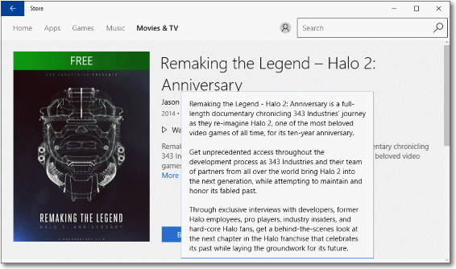

<!-- Class syntax.
public class Flyout : Windows.UI.Xaml.Controls.Primitives.FlyoutBase, Windows.UI.Xaml.Controls.IFlyout
-->

# Windows.UI.Xaml.Controls.Flyout

## -description

Represents a control that displays lightweight UI that is either information, or requires user interaction. Unlike a dialog, a Flyout can be light dismissed by clicking or tapping outside of it, pressing the device's back button, or pressing the 'Esc' key.


## -xaml-syntax

```xaml

<Flyout>
    singleUIElement
</Flyout>

```

## -remarks

A Flyout displays a message that requires user interaction.


Use a Flyout control for collecting information, for displaying more info, or for warnings and confirmations. Unlike a dialog, a Flyout does not create a separate window, and does not block other user interaction. To show a menu of items, use a [MenuFlyout](menuflyout.md) instead. For more info, including XAML and code examples, see [Quickstart: Adding a Flyout](/previous-versions/windows/apps/dn308515(v=win.10)).

A Flyout control (or [MenuFlyout](menuflyout.md)) is used as the value of the [Button.Flyout](button_flyout.md) property. This is usually set in XAML as part of a UI definition of the page. [Button](button.md) is the only control that has a dedicated **Flyout** property. To associate a Flyout with other controls, use the [FlyoutBase.AttachedFlyout](/uwp/api/windows.ui.xaml.controls.primitives.flyoutbase.attachedflyout) attached property. When set as [Button.Flyout](button_flyout.md), the Flyout displays when the button is tapped or otherwise invoked. When a Flyout is assigned to other UI elements using [FlyoutBase.AttachedFlyout](/uwp/api/windows.ui.xaml.controls.primitives.flyoutbase.attachedflyout), you must call either the [ShowAt](../windows.ui.xaml.controls.primitives/flyoutbase_showat_157739403.md) method or the static [ShowAttachedFlyout](../windows.ui.xaml.controls.primitives/flyoutbase_showattachedflyout_1146189011.md) method to display the flyout.

In addition to the members listed in this reference topic, there are other members of the base class [FlyoutBase](../windows.ui.xaml.controls.primitives/flyoutbase.md) that are often used in typical Flyout scenarios:

+ [FlyoutBase.AttachedFlyout](/uwp/api/windows.ui.xaml.controls.primitives.flyoutbase.attachedflyout): an attached property that associates a Flyout with a particular UI element (this can be any [FrameworkElement](../windows.ui.xaml/frameworkelement.md) derived class).
+ [ShowAttachedFlyout](../windows.ui.xaml.controls.primitives/flyoutbase_showattachedflyout_1146189011.md): a static method that can determine whether a flyout is already associated with a UI element through a [FlyoutBase.AttachedFlyout](/uwp/api/windows.ui.xaml.controls.primitives.flyoutbase.attachedflyout) assignment. If so, the method calls [ShowAt](../windows.ui.xaml.controls.primitives/flyoutbase_showat_157739403.md) internally, using the [FrameworkElement](../windows.ui.xaml/frameworkelement.md) that you specified.

### Accessibility

If you use a Flyout with no focusable content-for example, with only text, as shown here-you should take some additional steps to ensure that your content is accessible. Specifically, you need to ensure that Windows Narrator or other screen readers can read the flyout's content.



By default, there are properties set on the [FlyoutPresenter](flyoutpresenter.md) that prevent it from receiving focus. This is the desired behavior when content inside the Flyout can receive focus. However, if the content inside the Flyout can't receive focus, you should update to the [FlyoutPresenterStyle](flyout_flyoutpresenterstyle.md) to let the [FlyoutPresenter](flyoutpresenter.md) receive focus instead. To do this, set [IsTabStop](control_istabstop.md) to **true** and [TabNavigation](control_tabnavigation.md) to **Cycle** on the flyout presenter style.

This example shows how to let the [FlyoutPresenter](flyoutpresenter.md) receive focus so that the content is accessible.

```xaml
<Grid Background="{ThemeResource ApplicationPageBackgroundThemeBrush}">
    <Button VerticalAlignment="Center" HorizontalAlignment="Center"
            Content="Open flyout">
        <Button.Flyout>
            <Flyout>
                <Flyout.FlyoutPresenterStyle>
                    <Style TargetType="FlyoutPresenter">
                        <Setter Property="ScrollViewer.HorizontalScrollMode" Value="Disabled"/>
                        <Setter Property="ScrollViewer.HorizontalScrollBarVisibility" Value="Disabled"/>
                        <Setter Property="IsTabStop" Value="True"/>
                        <Setter Property="TabNavigation" Value="Cycle"/>
                    </Style>
                </Flyout.FlyoutPresenterStyle>
                <TextBlock TextWrapping="Wrap" Text="This is some text in a flyout."/>
            </Flyout>
        </Button.Flyout>
    </Button>
</Grid>

```

## -examples

> [!TIP]
> For more info, design guidance, and code examples, see [Flyouts](/windows/apps/design/controls/dialogs-and-flyouts/flyouts).

> [!div class="nextstepaction"]
> [Open the WinUI 2 Gallery app and see the Flyout in action](winui2gallery:/item/Flyout)

> The **WinUI 2 Gallery** app includes interactive examples of most WinUI 2 controls, features, and functionality. Get the app from the [Microsoft Store](https://www.microsoft.com/store/productId/9MSVH128X2ZT) or get the source code on [GitHub](https://github.com/Microsoft/WinUI-Gallery/tree/winui2).

## -see-also

[Flyouts](/windows/uwp/design/controls-and-patterns/dialogs-and-flyouts/flyouts), [FlyoutBase](../windows.ui.xaml.controls.primitives/flyoutbase.md), [FlyoutPresenter](flyoutpresenter.md), [Button.Flyout](button_flyout.md), [MenuFlyout](menuflyout.md), [Dialogs v. flyouts](/windows/uwp/controls-and-patterns/dialogs), [Attached properties overview](/windows/uwp/xaml-platform/attached-properties-overview), [Commanding sample (Windows 10)](https://github.com/Microsoft/Windows-universal-samples/tree/master/Samples/XamlCommanding), [XAML Flyout and MenuFlyout sample (Windows 8)](https://github.com/microsoftarchive/msdn-code-gallery-microsoft/tree/master/Official%20Windows%20Platform%20Sample/Windows%208.1%20Store%20app%20samples/99866-Windows%208.1%20Store%20app%20samples/XAML%20Flyout%20and%20MenuFlyout%20sample)
