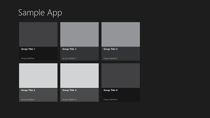

<!-- Class syntax.
public class GridView : Windows.UI.Xaml.Controls.ListViewBase, Windows.UI.Xaml.Controls.IGridView
-->

# Windows.UI.Xaml.Controls.GridView

## -description

Represents a control that displays data items in rows and columns.


## -xaml-syntax

```xaml
<GridView .../>
-or-
<GridView ...>
  oneOrMoreItems
</GridView>
```

## -remarks

> [!TIP]
> For more info, design guidance, and code examples, see [List view and grid view](/windows/uwp/design/controls-and-patterns/listview-and-gridview).

Use a **GridView** to display a collection of items in rows and columns that can scroll vertically. Data is stacked horizontally until it fills the columns, then continues with the next row. It's often used when you need to show a rich visualization of each item that takes more space, such as a photo gallery.



GridView is an [ItemsControl](itemscontrol.md), so it can contain a collection of items of any type. To populate the view, add items to the [Items](itemscontrol_items.md) collection, or set the [ItemsSource](itemscontrol_itemssource.md) property to a data source.

By default, a data item is displayed in the GridView as the string representation of the data object it's bound to. To specify exactly how items in the GridView are displayed, you create a [DataTemplate](../windows.ui.xaml/datatemplate.md) to define the layout of controls used to display an individual item. The controls in the layout can be bound to properties of a data object, or have content defined inline. You assign the [DataTemplate](../windows.ui.xaml/datatemplate.md) to the [ItemTemplate](itemscontrol_itemtemplate.md) property of the GridView. For common templates you can use in your app, see [Item templates for GridView](/windows/uwp/controls-and-patterns/item-templates-gridview).

If you populate the GridView by setting the [ItemsSource](itemscontrol_itemssource.md) property, the [ItemTemplate](itemscontrol_itemtemplate.md) is applied to every item. If you populate the [Items](itemscontrol_items.md) collection directly, the [ItemTemplate](itemscontrol_itemtemplate.md) is applied only if the item is not a [GridViewItem](gridviewitem.md). In this example, the template is applied to the first item, but not the second item.

```xaml
<GridView>
    <GridView.ItemTemplate>
        <DataTemplate>
            <Grid>
                <Border Background="LightGray" Height="200" Width="200">
                    <TextBlock Text="{Binding}" 
                               FontSize="48" Foreground="Green"/>
                </Border>
            </Grid>
        </DataTemplate>
    </GridView.ItemTemplate>
    <GridView.Items>
        <x:String>One</x:String>
        <GridViewItem>Two</GridViewItem>
    </GridView.Items>
</GridView>
```

If you use the GridView to display large sets of data, see [Optimize ListView and GridView](/windows/uwp/debug-test-perf/optimize-gridview-and-listview) for tips to maintain a smooth and responsive user experience.

> <div id="main">
> <strong>Windows 10, version 1709 (SDK 16299) - Behavior change</strong>
> </div>
> By default, instead of performing selection, an active pen now scrolls/pans a list in UWP apps (like touch, touchpad, and passive pen).
> If your app depends on the previous behavior, you can override pen scrolling and revert to the previous behavior. See [ScrollViewer](scrollviewer.md) for details.

By default, a user can select a single item in a GridView. You can set the [SelectionMode](listviewbase_selectionmode.md) property to a [ListViewSelectionMode](listviewselectionmode.md) enumeration value to allow multi-selection or to disable selection. You can also change the GridView interaction mode to make items respond to a user click like a button instead of being selected.

This table shows the ways a user can interact with a GridView, and how you can respond to the interaction.

| To enable this interaction: | Use these settings: | Handle this event: | Use this property to get the selected item: |
| - | - | - | - |
| No interaction | [SelectionMode](listviewbase_selectionmode.md) = [None](listviewselectionmode.md), [IsItemClickEnabled](listviewbase_isitemclickenabled.md) = **False** | N/A | N/A |
| Single selection | [SelectionMode](listviewbase_selectionmode.md) = [Single](listviewselectionmode.md), [IsItemClickEnabled](listviewbase_isitemclickenabled.md) = **False** | [SelectionChanged](../windows.ui.xaml.controls.primitives/selector_selectionchanged.md) | [SelectedItem](../windows.ui.xaml.controls.primitives/selector_selecteditem.md), [SelectedIndex](../windows.ui.xaml.controls.primitives/selector_selectedindex.md) |
| Contiguous multi-selection | [SelectionMode](listviewbase_selectionmode.md) = [Multiple](listviewselectionmode.md), [IsItemClickEnabled](listviewbase_isitemclickenabled.md) = **False** | [SelectionChanged](../windows.ui.xaml.controls.primitives/selector_selectionchanged.md) | [SelectedItems](listviewbase_selecteditems.md) |
| Non-contiguous multi-selection | [SelectionMode](listviewbase_selectionmode.md) = [Extended](listviewselectionmode.md), [IsItemClickEnabled](listviewbase_isitemclickenabled.md) = **False** | [SelectionChanged](../windows.ui.xaml.controls.primitives/selector_selectionchanged.md) | [SelectedItems](listviewbase_selecteditems.md) |
| Click | [SelectionMode](listviewbase_selectionmode.md) = [None](listviewselectionmode.md), [IsItemClickEnabled](listviewbase_isitemclickenabled.md) = **True** | [ItemClick](listviewbase_itemclick.md) | N/A |

> [!NOTE]
> The [PointerWheelChanged](../windows.ui.xaml/uielement_pointerwheelchanged.md) event does not bubble up from a GridView. This means that a control that has a GridView inside of it does not receive mouse wheel change messages if the pointer is over the GridView. For example, if you put a GridView inside of a [ScrollViewer](scrollviewer.md), you can't scroll the [ScrollViewer](scrollviewer.md) with the mouse wheel when the pointer is over the GridView.

> [!NOTE]
> When you set the [Padding](control_padding.md) property on a GridView control, the value for **right** padding is ignored; only the values for left, top, and bottom padding are applied.

GridView supports data virtualization to improve performance with large data sets. Random access virtualization is supported when the data source implements the appropriate interfaces, which vary depending on the programming language:

+ Visual C++ component extensions (C++/CX) apps should implement [IObservableVector](../windows.foundation.collections/iobservablevector_1.md).
+ C# or Visual Basic apps should implement [INotifyCollectionChanged](/dotnet/api/system.collections.specialized.inotifycollectionchanged?view=dotnet-uwp-10.0&preserve-view=true) and [System.Collections.IList](/dotnet/api/system.collections.ilist?view=dotnet-uwp-10.0&preserve-view=true) (not [IList&lt;T&gt;](/dotnet/api/system.collections.generic.ilist-1?view=dotnet-uwp-10.0&preserve-view=true). Virtualization requires both of these interfaces.
 Incremental loading virtualization is supported when the data source implements the [ISupportIncrementalLoading](../windows.ui.xaml.data/isupportincrementalloading.md) interface. When incremental loading is supported, you can use these members to control data loading: [DataFetchSize](listviewbase_datafetchsize.md), [IncrementalLoadingThreshold](listviewbase_incrementalloadingthreshold.md), [IncrementalLoadingTrigger](listviewbase_incrementalloadingtrigger.md), [LoadMoreItemsAsync](listviewbase_loadmoreitemsasync_1264491126.md).

> **Windows 8**
> In Windows 8, when the data item in a selected [GridViewItem](gridviewitem.md) is replaced, the [SelectedIndex](../windows.ui.xaml.controls.primitives/selector_selectedindex.md) value is not cleared. In Windows 8.1 or later, the [SelectedIndex](../windows.ui.xaml.controls.primitives/selector_selectedindex.md) value is cleared.

GridView implements the [ISemanticZoomInformation](isemanticzoominformation.md) interface, so it can be used as a view in a [SemanticZoom](semanticzoom.md) control. When it's used in a [SemanticZoom](semanticzoom.md) control, always set the [ScrollViewer.IsHorizontalScrollChainingEnabled](scrollviewer_ishorizontalscrollchainingenabled.md) attached property to **false** on the [ScrollViewer](scrollviewer.md) that's in the GridView's control template, like this: `<GridView ScrollViewer.IsHorizontalScrollChainingEnabled="False">`. These members have an effect only when the GridView is hosted in a [SemanticZoom](semanticzoom.md) control: [IsActiveView](listviewbase_isactiveview.md), [IsZoomedInView](listviewbase_iszoomedinview.md), [SemanticZoomOwner](listviewbase_semanticzoomowner.md), [CompleteViewChange](listviewbase_completeviewchange_1917507883.md), [CompleteViewChangeFrom](listviewbase_completeviewchangefrom_788425485.md), [CompleteViewChangeTo](listviewbase_completeviewchangeto_41306206.md), [InitializeViewChange](listviewbase_initializeviewchange_1165335344.md), [MakeVisible](listviewbase_makevisible_1148837317.md), [StartViewChangeFrom](listviewbase_startviewchangefrom_1386295791.md), [StartViewChangeTo](listviewbase_startviewchangeto_1504058226.md).

The default template for GridView includes existing transition animations. Specifically, the default [ItemContainerTransitions](itemscontrol_itemcontainertransitions.md) value already contains values for [AddDeleteThemeTransition](../windows.ui.xaml.media.animation/adddeletethemetransition.md), [ContentThemeTransition](../windows.ui.xaml.media.animation/contentthemetransition.md), [ReorderThemeTransition](../windows.ui.xaml.media.animation/reorderthemetransition.md) and [EntranceThemeTransition](../windows.ui.xaml.media.animation/entrancethemetransition.md) (with `IsStaggeringEnabled="False"`). If you are setting a new value for [ItemContainerTransitions](itemscontrol_itemcontainertransitions.md) on GridView, consider reproducing these same theme animations as a starting point. If you are setting the property yourself, those defaults get overwritten unless you include them again in your definition.

If you need to handle pointer events for a [UIElement](../windows.ui.xaml/uielement.md) in a scrollable view (such as a ScrollViewer), you must explicitly disable support for manipulation events on the element in the view by calling [UIElement.CancelDirectmanipulation()](../windows.ui.xaml/uielement_canceldirectmanipulations_1164631120.md). To re-enable manipulation events in the view, call [UIElement.TryStartDirectManipulation()](../windows.ui.xaml/uielement_trystartdirectmanipulation_1983346775.md).

### Selection behavior and CollectionViewSource

List controls that derive from [Selector](../windows.ui.xaml.controls.primitives/selector.md) have a default selection behavior that depends on what the items source is (the type that's used for [ItemsSource](itemscontrol_itemssource.md)). If the items source is a [CollectionViewSource](../windows.ui.xaml.data/collectionviewsource.md) instance, then the behavior in the selection control is that the selection will default to the current item. When the list is first displayed, the selection defaults to the first item as current item. If you don't want the first item to be selected in this case, set [IsSynchronizedWithCurrentItem](../windows.ui.xaml.controls.primitives/selector_issynchronizedwithcurrentitem.md) to **false** in the GridView.

### Visual updates in WinUI 2.6
In [WinUI 2.6](/windows/apps/winui/winui2/release-notes/), new APIs and styles were added to update the visuals and design of GridView. These updated visuals include rounded corners, improved borders, rounded checkboxes in multiple selection mode, and more. 

If you'd like to use these new styles, first ensure that you're using WinUI 2.6 in your app. To get set up with WinUI 2, see [Getting started with the Windows UI 2.x Library](/windows/apps/winui/winui2/getting-started). 

You can always modify the look of a GridView by specifying Xaml resources in your app. A new resource that is available in WinUI 2.6 is `GridViewItemCornerRadius`, which controls the level of rounding on GridViewItem corners. By default, this theme resource is set to 4px.

## -examples

> [!TIP]
> For more info, design guidance, and code examples, see [Grid view](/windows/apps/design/controls/listview-and-gridview).

> [!div class="nextstepaction"]
> [Open the WinUI 2 Gallery app and see the GridView in action](winui2gallery:/item/GridView)

> The **WinUI 2 Gallery** app includes interactive examples of most WinUI 2 controls, features, and functionality. Get the app from the [Microsoft Store](https://www.microsoft.com/store/productId/9MSVH128X2ZT) or get the source code on [GitHub](https://github.com/Microsoft/WinUI-Gallery/tree/winui2).

Here, a GridView is bound to a grouped [CollectionViewSource](../windows.ui.xaml.data/collectionviewsource.md) named `cvsProjects`. The appearance of individual items in each group is defined by the [ItemTemplate](itemscontrol_itemtemplate.md). The [ItemsPanel](itemscontrol_itemspanel.md) specifies how the groups are arranged in the GridView. The [GroupStyle.Panel](groupstyle_panel.md) specifies how individual items are arranged within each group. The [GroupStyle.ContainerStyle](groupstyle_containerstyle.md) is used to add a border around each group, and set its minimum size and margins. The [HidesIfEmpty](groupstyle_hidesifempty.md) property is set to **true** to hide any empty groups.

```xaml
<Page
    x:Class="GroupedGridViewApp.MainPage"
    xmlns="http://schemas.microsoft.com/winfx/2006/xaml/presentation"
    xmlns:x="http://schemas.microsoft.com/winfx/2006/xaml"
    xmlns:local="using:GroupedGridViewApp"
    xmlns:d="http://schemas.microsoft.com/expression/blend/2008"
    xmlns:mc="http://schemas.openxmlformats.org/markup-compatibility/2006"
    mc:Ignorable="d"
    Background="{ThemeResource ApplicationPageBackgroundThemeBrush}">
    <Page.Resources>
        <CollectionViewSource x:Name="cvsProjects" IsSourceGrouped="True" 
                              ItemsPath="Activities"/>
    </Page.Resources>

    <Grid Background="{ThemeResource ApplicationPageBackgroundThemeBrush}">
        <GridView ItemsSource="{Binding Source={StaticResource cvsProjects}}" MaxHeight="500">
            <GridView.ItemTemplate>
                <DataTemplate>
                    <StackPanel Margin="20">
                        <TextBlock Text="{Binding Name}" FontWeight="Bold" 
                                   Style="{StaticResource BaseTextBlockStyle}"/>
                        <TextBlock Text="{Binding DueDate}" TextWrapping="NoWrap" 
                                   Style="{StaticResource BodyTextBlockStyle}" />
                        <CheckBox Content="Complete" IsChecked="{Binding Complete}" 
                                  IsEnabled="False"/>
                    </StackPanel>
                </DataTemplate>
            </GridView.ItemTemplate>
            <GridView.ItemsPanel>
                <ItemsPanelTemplate>
                    <ItemsWrapGrid MaximumRowsOrColumns="3"/>
                </ItemsPanelTemplate>
            </GridView.ItemsPanel>

            <GridView.GroupStyle>
                <GroupStyle HidesIfEmpty="True">
                    <GroupStyle.HeaderTemplate>
                        <DataTemplate>
                            <Grid Background="LightGray" Margin="0">
                                <TextBlock Text='{Binding Name}' 
                                           Foreground="Black" Margin="12"
                                           Style="{StaticResource HeaderTextBlockStyle}"/>
                            </Grid>
                        </DataTemplate>
                    </GroupStyle.HeaderTemplate>
                </GroupStyle>
            </GridView.GroupStyle>
        </GridView>
    </Grid>
</Page>
```

```csharp
using System;
using System.Collections.Generic;
using System.Collections.ObjectModel;
using Windows.UI.Xaml.Controls;

namespace GroupedGridViewApp
{
    public sealed partial class MainPage : Page
    {
        DateTime startDate = DateTime.Now;

        public MainPage()
        {
            this.InitializeComponent();

            PopulateProjects();
        }

        private void PopulateProjects()
        {
            List<Project> Projects = new List<Project>();

            Project newProject = new Project();
            newProject.Name = "Project 1";
            newProject.Activities.Add(new Activity()
            { Name = "Activity 1", Complete = true, DueDate = startDate.AddDays(4) });
            newProject.Activities.Add(new Activity()
            { Name = "Activity 2", Complete = true, DueDate = startDate.AddDays(5) });
            Projects.Add(newProject);

            newProject = new Project();
            newProject.Name = "Project 2";
            newProject.Activities.Add(new Activity()
            { Name = "Activity A", Complete = true, DueDate = startDate.AddDays(2) });
            newProject.Activities.Add(new Activity()
            { Name = "Activity B", Complete = false, DueDate = startDate.AddDays(3) });
            Projects.Add(newProject);

            newProject = new Project();
            newProject.Name = "Project 3";
            Projects.Add(newProject);

            cvsProjects.Source = Projects;
        }
    }

    public class Project
    {
        public Project()
        {
            Activities = new ObservableCollection<Activity>();
        }

        public string Name { get; set; }
        public ObservableCollection<Activity> Activities { get; private set; }
    }

    public class Activity
    {
        public string Name { get; set; }
        public DateTime DueDate { get; set; }
        public bool Complete { get; set; }
        public string Project { get; set; }
    }
}
```

In the following example, the corners of items in every GridView throughout the app are rounded to 5px.

```xml
<Application.Resources>
    <CornerRadius x:Key="GridViewItemCornerRadius">5</CornerRadius>
</Application.Resources>
```

## -see-also
[List view and grid view](/windows/uwp/design/controls-and-patterns/listview-and-gridview), [ListViewBase](listviewbase.md), [ISemanticZoomInformation](isemanticzoominformation.md), [Item templates for GridView](/windows/uwp/controls-and-patterns/item-templates-gridview), [Data binding overview](/windows/uwp/data-binding/data-binding-quickstart), [ListView](listview.md), [SemanticZoom](semanticzoom.md), [ListView and GridView sample (Windows 10)](https://github.com/Microsoft/Windows-universal-samples/tree/master/Samples/XamlListView)
