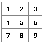

<!-- Property syntax
public Windows.UI.Xaml.Thickness NineGrid { get;  set; }
-->

# Windows.UI.Xaml.Controls.Image.NineGrid

## -description
Gets or sets a value for a nine-grid metaphor that controls how the image can be resized. The nine-grid metaphor enables you to stretch edges and corners of an image differently than its center. See Remarks for more info and an illustration.


## -xaml-syntax
```xaml
<Image NineGrid="left,top,right,bottom" />
```


## -xaml-values
<dl><dt>left,top,right,bottom</dt><dd>left,top,right,bottomAn attribute string that is handled by the Thickness type converter behavior. Specify values for the Left, Top, Right, and Bottom value components of a Thickness in that order, with commas or spaces as separators. Other syntaxes exist that provide symmetrical/uniform values, see Thickness.</dd>
</dl>
## -property-value
A [Thickness](../windows.ui.xaml/thickness.md) value that sets the **Left**, **Top**, **Right**, **Bottom** measurements for the nine-grid resizing metaphor.
## -remarks
When you use nine-grid rendering, you can specify how different areas of the image are stretched. This feature is useful for preserving the detail on image corners when an image scales or stretches.

Nine-grid rendering divides an image into a grid of nine sections:


Nine-grid rendering enables you to preserve the original dimensions of the corners (boxes 1, 3, 7, and 9). The top and bottom (boxes 2 and 8) are stretched horizontally only, and the sides (boxes 4 and 6) are stretched vertically only. The center (box 5) is stretched in both dimensions. To use nine-grid rendering, you create an [Image](image.md) element and specify a value for the NineGrid property—pixel values for the lengths of the left, top, right, and bottom sides of the grid. In XAML, you specify the NineGrid attribute value as a string that specifies pixel values for the sides in left, top, right, bottom order. Internally, this syntax creates a [Thickness](../windows.ui.xaml/thickness.md) object that represents this type of measurement. If you want a uniform value, you can specify just one value that's applied to all four edges.

Applying nine-grid rendering is very useful when the image itself includes some type of border or edge decoration embedded within the image source. For example, imagine you're using an image source for a [Button](button.md) that has the outline as part of an image with transparency. You might want the center area that contains an icon to stretch. But if you stretch the corners you might get aliasing artifacts from rounded corners. Or the border sides might get too thick and wouldn't look as good when scaled. To prevent that, you could use a NineGrid with uniform values that always keep the pixel size of the border the same size as in the image source.

Either in code or in XAML, the values for the [Thickness](../windows.ui.xaml/thickness.md) that you use to set the NineGrid property are device-independent pixel values.

Here's example XAML for an [Image](image.md) element using a NineGrid value:


```xaml
<Image Source="Images/9grid.bmp" NineGrid="30,20,30,20" />
```


A NineGrid value is only relevant for image rendering if the image does not have specific values set for [Width](../windows.ui.xaml/frameworkelement_width.md) and/or [Height](../windows.ui.xaml/frameworkelement_height.md), and where the image is being stretched (image is rendered into a larger container space and the value for [Stretch](image_stretch.md) is not** None**).

## -examples

## -see-also
[Thickness](../windows.ui.xaml/thickness.md), [XAML images sample](https://github.com/microsoftarchive/msdn-code-gallery-microsoft/tree/master/Official%20Windows%20Platform%20Sample/XAML%20images%20sample)
