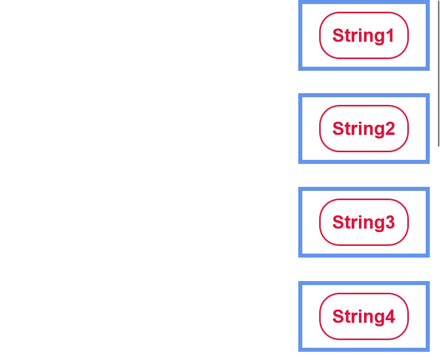

<!-- Property syntax
public Windows.UI.Xaml.Style ItemContainerStyle { get;  set; }
-->

# Windows.UI.Xaml.Controls.ItemsControl.ItemContainerStyle

## -description
Gets or sets the style that is used when rendering the item containers for an [ItemsControl](/uwp/api/windows.ui.xaml.controls.itemscontrol). 


## -xaml-syntax
```xaml
<ItemsControl>
  <ItemsControl.ItemContainerStyle>
    inlineStyle
  </ItemsControl.ItemContainerStyle>
</ItemsControl>
- or -
<ItemsControl ItemContainerStyle="resourceReferenceToStyle"/>
```


## -xaml-values
<dl><dt>inlineStyle</dt><dd>inlineStyle A single Style object element. That Style would typically have multiple setters that set properties on the item container type being targeted. (For ListBox, that type is ListBoxItem.)</dd>
<dt>resourceReferenceToStyle</dt><dd>resourceReferenceToStyle A {StaticResource} markup extension reference to an existing Style from a XAML resource dictionary.</dd>
</dl>

## -property-value
The style applied to the item containers. The default is null.

## -remarks

Derived classes of `ItemsControl` include [Selector](/uwp/api/windows.ui.xaml.controls.primitives.selector) and [MenuFlyoutPresenter](/uwp/api/windows.ui.xaml.controls.menuflyoutpresenter). Derived classes from Selector include [ComboBox](/uwp/api/windows.ui.xaml.controls.combobox), [FlipView](/uwp/api/windows.ui.xaml.controls.flipview), [ListBox](/uwp/api/windows.ui.xaml.controls.listbox), and [ListViewBase](/uwp/api/windows.ui.xaml.controls.listviewbase) (which [ListView](/uwp/api/windows.ui.xaml.controls.listview) and [GridView](/uwp/api/windows.ui.xaml.controls.gridview) are derived from). Therefore the `ItemContainerStyle` class can be used to edit the [Style](/uwp/api/windows.ui.xaml.style) of a `ListViewItem`, `GridViewItem`, and so on. 

For every item in an `ItemsControl`, an item container element is used to display the item. By default the item container is a [ContentPresenter](/uwp/api/Windows.UI.Xaml.Controls.ContentPresenter). But subclasses of `ItemsControl` can override this, for example the container type in a [ListView](/uwp/api/Windows.UI.Xaml.Controls.ListView) is a [ListViewItem](/uwp/api/Windows.UI.Xaml.Controls.ListViewItem). The value of the `ItemContainerStyle` is set as the [FrameworkElement.Style](/uwp/api/Windows.UI.Xaml.FrameworkElement.Style) property of the container.

`ItemContainerStyle` can then be used to change the style of every element generated by an ItemsControl, and provides a lot of flexibility and customization options in that area. Although many styling options are available within the `ItemContainerStyle` class, it is most useful when trying to edit how the _elements containing the data_ are displayed in comparison to one another - changing their spacing, their horizontal alignment, etc. To change the visualization of the _data objects themselves_, such as their background color or font-size, use an [ItemTemplate](/uwp/api/windows.ui.xaml.controls.itemscontrol.itemtemplate). To change the overall layout or orientation of your ItemsControl/its items, look into editing its [ItemsPanel](/uwp/api/windows.ui.xaml.controls.itemscontrol.itemspanel). 

## -examples

This example demonstrates how to create a ListView that holds a list of `String` objects. With the use of the `ItemContainerStyle` class, the `String` objects have their own border and styling while the `ListViewItem` objects have their own set of styles and properties. Note that the item container type in a ListView is a [ListViewItem](/uwp/api/Windows.UI.Xaml.Controls.ListViewItem), and so that is used as the style's TargetType.

```xaml
 <ListView ItemsSource="{x:Bind tempList}" Height="500">
    <ListView.ItemTemplate>
        <DataTemplate x:DataType="x:String">
            <Border BorderBrush="Crimson" BorderThickness="2" CornerRadius="25" Margin="10">
            <TextBlock Text="{x:Bind}" 
                       FontSize="24" 
                       FontFamily="Arial" 
                       FontWeight="Bold" 
                       Foreground="Crimson" 
                       Margin="10"
                       Padding="5"/>
            </Border>
        </DataTemplate>
    </ListView.ItemTemplate>

    <ListView.ItemContainerStyle>
        <Style TargetType="ListViewItem">
            <Setter Property="HorizontalAlignment" Value="Right"/>
            <Setter Property="Margin" Value="15"/>
            <Setter Property="BorderBrush" Value="CornflowerBlue"/>
            <Setter Property="BorderThickness" Value="5"/>
        </Style>
    </ListView.ItemContainerStyle>
</ListView>
```

The above code produces the following:


As you can see in the above example, the data objects (strings) have their own styling provided in a [DataTemplate](/uwp/api/Windows.UI.Xaml.DataTemplate) - this styling includes their rounded crimson border, their crimson font color, font size, and margin from outer elements. 

Each element generated by the `ListView` (each `ListViewItem`) is horizontally aligned to the right, has a thick blue border, and a large margin to separate it from the other elements. Although the data objects inside the ListViewItems are centered, the items themselves are able to be right-aligned. And, although the data objects (strings) only have a small amount of space separating them from other elements, each ListViewItem element is able to be separated by a large amount of space.

These customizations are performed by creating a `ListViewItem` style, as shown above. The style element targets `ListViewItem` type elements, and will be applied to all elements of that type within the scope that the style is defined in - in this case, just the `ListView` displayed. [Setters](/uwp/api/windows.ui.xaml.setter) are then used to give each style property a value - i.e. set the `HorizontalAlignment` to `Right`. These properties and values are what affects the outer `ListViewItem` element.

This example demonstrates how to use the ItemContainerStyle property on a simple ItemsControl. Note that in this case the item container type is a [ContentPresenter](/uwp/api/Windows.UI.Xaml.Controls.ContentPresenter).

```xml
<ItemsControl>
    <ItemsControl.ItemContainerStyle>
        <Style TargetType="ContentPresenter">
            <Setter Property="FontSize" Value="42" />
        </Style>
    </ItemsControl.ItemContainerStyle>
            
    <x:String>Hello</x:String>
    <x:String>World</x:String>
</ItemsControl>
```

## -see-also

[ItemsControl.ItemContainerStyleSelector](/uwp/api/Windows.UI.Xaml.Controls.ItemsControl.ItemContainerStyleSelector)

[ItemsControl.ItemContainerTransitions](/uwp/api/Windows.UI.Xaml.Controls.ItemsControl.ItemContainerTransitions)
