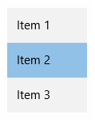

<!-- Class syntax.
public class ListBox : Windows.UI.Xaml.Controls.Primitives.Selector, Windows.UI.Xaml.Controls.IListBox, Windows.UI.Xaml.Controls.IListBox2
-->

# Windows.UI.Xaml.Controls.ListBox

## -description
Presents a list of items the user can select from.


## -xaml-syntax
```xaml
<ListBox .../>
-or-
<ListBox ...>
  oneOrMoreItems
</ListBox>
```

## -remarks

> [!TIP]
> For more info, design guidance, and code examples, see [Lists](/windows/uwp/design/controls-and-patterns/lists#list-boxes).

ListBox lets users select from a pre-defined list of options presented like a text control. Use a ListBox when you want the options to be visible all the time or when users can select more than one option at a time. ListBox controls are always open, so several items can be displayed without user interaction.



> [!NOTE]
> ListBox is useful when you are upgrading a Universal Windows 8 app that uses ListBox, and need to minimize changes. For new apps in Windows 10, we recommend using the [ListView](listview.md) control instead.

If you need to handle pointer events for a [UIElement](../windows.ui.xaml/uielement.md) in a scrollable view (such as a ScrollViewer), you must explicitly disable support for manipulation events on the element in the view by calling [UIElement.CancelDirectmanipulation()](../windows.ui.xaml/uielement_canceldirectmanipulations_1164631120.md). To re-enable manipulation events in the view, call [UIElement.TryStartDirectManipulation()](../windows.ui.xaml/uielement_trystartdirectmanipulation_1983346775.md).

### Using a ListBox

Use a ListBox control to present a list of items that a user can select from. More than one item in a ListBox control is visible at a time. You specify whether the ListBox control allows multiple selections by setting the [SelectionMode](listbox_selectionmode.md) property. You can get or set the selected items for the list box by using the [SelectedItems](listbox_selecteditems.md) property.

### Populating a ListBox

You populate the ListBox control by adding [UIElement](../windows.ui.xaml/uielement.md) items directly to the [Items](itemscontrol_items.md) collection, or by binding the [ItemsSource](itemscontrol_itemssource.md) property to a data source. [ItemsSource](itemscontrol_itemssource.md) items from data will initially clear the [Items](itemscontrol_items.md) collection when the binding is evaluated, so don't set both properties.

ListBox has a dedicated control for its items, [ListBoxItem](listboxitem.md). But when you populate the [Items](itemscontrol_items.md) collection, you can use elements or data, you don't typically use explicit [ListBoxItem](listboxitem.md) objects. What happens internally is that when the ListBox composes its visual tree from its templates, specifically when expanding the [ItemTemplate](itemscontrol_itemtemplate.md), it creates a [ListBoxItem](listboxitem.md) wrapper for each of the objects it's including as items. At run time, the [Items](itemscontrol_items.md) collection still contains the original items you declared. The created [ListBoxItem](listboxitem.md) wrappers are deeper in the visual tree, inside the items panel (see [ItemsPanel](itemscontrol_itemspanel.md)) as its children. You don't usually need direct access to a [ListBoxItem](listboxitem.md) object. But if you want to access the created [ListBoxItem](listboxitem.md) wrappers, you can use Microsoft UI Automation techniques, or use [VisualTreeHelper](../windows.ui.xaml.media/visualtreehelper.md) APIs, to walk into the object tree representation and find them.

### ListBox vs. ListView and GridView

ListBox has many similarities with [ListView](listview.md) or [GridView](gridview.md) (they share the parent class [ItemsControl](itemscontrol.md)), but each control is oriented towards different scenarios. ListBox is best for general UI composition, particularly when the elements are always intended to be selectable, whereas [ListView](listview.md) or [GridView](gridview.md) are best for data binding scenarios, particularly if virtualization or large data sets are involved. For more info on virtualization, see [Using virtualization with a list or grid](/previous-versions/windows/apps/hh780657(v=win.10)).

### Version history

| Windows version | SDK version | Value added |
| -- | -- | -- |
| 1607 | 14393 | SingleSelectionFollowsFocus |

## -examples

> [!TIP]
> For more info, design guidance, and code examples, see [List box](/windows/apps/design/controls/lists#list-boxes).

> [!div class="nextstepaction"]
> [Open the WinUI 2 Gallery app and see the ListBox in action](winui2gallery:/item/ListBox)

> The **WinUI 2 Gallery** app includes interactive examples of most WinUI 2 controls, features, and functionality. Get the app from the [Microsoft Store](https://www.microsoft.com/store/productId/9MSVH128X2ZT) or get the source code on [GitHub](https://github.com/Microsoft/WinUI-Gallery/tree/winui2).

This example demonstrates how to add a collection of [FontFamily](../windows.ui.xaml.media/fontfamily.md) objects directly to a ListBox control.

```xaml
<ListBox>
    <TextBlock Text="Arial" FontFamily="Arial"/>
    <TextBlock Text="Courier New" FontFamily="Courier New"/> 
    <TextBlock Text="Times New Roman" FontFamily="Times New Roman"/>
</ListBox>
```

This example uses data binding to fill a ListBox control with a collection of [FontFamily](../windows.ui.xaml.media/fontfamily.md) objects.

```xaml

<ListBox x:Name="FontsList" Height="20" Width="150" 
         ItemsSource="{x:Bind fonts}" DisplayMemberPath="Source"/>

```

```csharp

ObservableCollection<FontFamily> fonts = new ObservableCollection<FontFamily>();

public BlankPage()
{
    this.InitializeComponent();
    fonts.Add(new FontFamily("Arial"));
    fonts.Add(new FontFamily("Courier New"));
    fonts.Add(new FontFamily("Times New Roman"));
}
```

```vb

Dim fonts As New ObservableCollection(of FontFamily) 

Public Sub New()
    MyBase.New()
    InitializeComponent()    
    fonts.Add(New FontFamily("Arial"))
    fonts.Add(New FontFamily("Courier New"))
    fonts.Add(New FontFamily("Times New Roman"))
End Sub
```


## -see-also
[Selector](../windows.ui.xaml.controls.primitives/selector.md), [ItemsControl](itemscontrol.md), [ListBoxItem](listboxitem.md), [ComboBox](combobox.md), [Controls list](/windows/uwp/design/controls-and-patterns/), [Controls by function](/windows/uwp/controls-and-patterns/controls-by-function)
