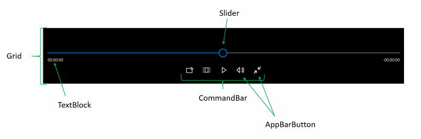
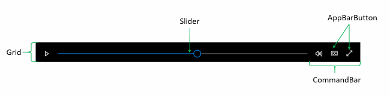

<!-- Class syntax.
public class MediaTransportControls : Windows.UI.Xaml.Controls.Control, Windows.UI.Xaml.Controls.IMediaTransportControls, Windows.UI.Xaml.Controls.IMediaTransportControls2
-->

# Windows.UI.Xaml.Controls.MediaTransportControls

## -description

Represents the playback controls for a media player element.

## -xaml-syntax

```xaml
<MediaTransportControls .../>
```

## -remarks

The media transport controls let users interact with their media by providing a default playback experience comprised of various buttons including play, pause, closed captions, and others. It has many properties to allow for easy customization of the UI and configuration of which buttons are visible or enabled.

You can use the [MediaTransportControls](mediatransportcontrols.md) to make it easy for users to control their audio and video content. The [MediaTransportControls](mediatransportcontrols.md) class is intended to be used only in conjunction with a [MediaElement](mediaelement.md) or [MediaPlayerElement](mediaplayerelement.md) control. It doesn't function as a stand-alone control. You access an instance of [MediaTransportControls](mediatransportcontrols.md) through the [MediaElement.TransportControls](mediaelement_transportcontrols.md) or [MediaPlayerElement.TransportControls](mediaplayerelement_transportcontrols.md) property.


> [!NOTE]
> You can also integrate [MediaElement](mediaelement.md) with the system media transport controls. The system transport controls are the controls that pop up when hardware media keys are pressed, such as the media buttons on keyboards. If the user presses the pause key on a keyboard and your app supports the [SystemMediaTransportControls](../windows.media/systemmediatransportcontrols.md), your app is notified and you can take the appropriate action. For more info, see [System Media Transport Controls](http://msdn.microsoft.com/library/efcf84d0-2f4c-454d-97da-249e9eaa806c).

### Adding basic transport controls to a MediaElement

To use [MediaTransportControls](mediatransportcontrols.md) with a [MediaElement](mediaelement.md), set the [AreTransportControlsEnabled](mediaelement_aretransportcontrolsenabled.md) property to **true** on the [MediaElement](mediaelement.md).

Here's how to enable transport controls for a [MediaElement](mediaelement.md) in XAML.

```xaml
<MediaElement x:Name="mediaElement1" Source="ms-appx:///Assets/video.mp4"
              AreTransportControlsEnabled="True"/>

```

Here's how to do the same thing in code. For simplicity, the code is placed in the `MainPage` constructor. `rootGrid` refers to the [Grid](grid.md) element that is created in MainPage.xaml. It has been named so that the [MediaElement](mediaelement.md) can be added to the XAML tree programmatically.

```csharp
public MainPage()
{
    this.InitializeComponent();

    //Create a MediaElement and enable transport controls.
    MediaElement mediaElement1 = new MediaElement();
    mediaElement1.Source = new Uri("ms-appx:///Assets/video.mp4");
    mediaElement1.AreTransportControlsEnabled = true;
    rootGrid.Children.Add(mediaElement1);
}
```

### Enabling compact mode

By default, the transport controls are shown in 2 rows. To show the transport controls in a single row, set the [IsCompact](mediatransportcontrols_iscompact.md) property to **true**.

A single row layout can provide a better experience when fewer transport controls are needed, like in an audio app. A two row layout can provide a better experience when more transport controls are needed, like in a video app. You should also consider the size of the target device when deciding whether to use the compact mode. For example, on a smaller device such as a phone, using a single row layout might make your transport controls look crowded.

See the  section of this document for more info about the differences in the two layouts.

Here's how to enable the compact mode in XAML.

```xaml
<MediaElement x:Name="mediaElement1" Source="ms-appx:///Assets/audio.wma"
              AreTransportControlsEnabled="True">
    <MediaElement.TransportControls>
        <MediaTransportControls IsCompact="True"/>
    </MediaElement.TransportControls>
</MediaElement>

```

Here's how to do the same thing in code. For simplicity, the code is placed in the `MainPage` constructor. `rootGrid` refers to the [Grid](grid.md) element that is created in MainPage.xaml. It has been named so that the [MediaElement](mediaelement.md) can be added to the XAML tree programmatically.

```csharp
public MainPage()
{
    this.InitializeComponent();

    //Create a MediaElement and enable transport controls.
    MediaElement mediaElement1 = new MediaElement();
    mediaElement1.Source = new Uri("ms-appx:///Assets/audio.wma");
    mediaElement1.AreTransportControlsEnabled = true;

    //Enable compact mode for transport controls.
    mediaElement1.TransportControls.IsCompact = true;
    
    rootGrid.Children.Add(mediaElement1);
}
```

### Hiding, Showing, Enabling, and Disabling Buttons

[MediaTransportControls](mediatransportcontrols.md) includes a seek bar and buttons for common functions. You can control whether a button is shown by setting the **Is*ButtonVisible** property. You can independently control whether a button is enabled by setting the **Is*Enabled** property.

This table shows the built-in transport controls with their associated properties and default values.

<table>
   <tr><th>Element</th><th>Is*Visible</th><th>Is*Enabled</th></tr>
   <tr><td>Seek bar</td><td>[IsSeekBarVisible](mediatransportcontrols_isseekbarvisible.md) (**true**)</td><td>[IsSeekEnabled](mediatransportcontrols_isseekenabled.md) ="**true** "</td></tr>
   <tr><td>Play/pause</td><td>N/A</td><td>N/A</td></tr>
   <tr><td>Fast forward</td><td>[IsFastForwardButtonVisible](mediatransportcontrols_isfastforwardbuttonvisible.md) (**false**)</td><td>[IsFastForwardEnabled](mediatransportcontrols_isfastforwardenabled.md) (**false**)</td></tr>
   <tr><td>Fast rewind</td><td>[IsFastRewindButtonVisible](mediatransportcontrols_isfastrewindbuttonvisible.md) (**false**)</td><td>[IsFastRewindEnabled](mediatransportcontrols_isfastrewindenabled.md) (**false**)</td></tr>
   <tr><td>Stop</td><td>[IsStopButtonVisible](mediatransportcontrols_isstopbuttonvisible.md) (**false**)</td><td>[IsStopEnabled](mediatransportcontrols_isstopenabled.md) (**false**)</td></tr>
   <tr><td>Volume</td><td>[IsVolumeButtonVisible](mediatransportcontrols_isvolumebuttonvisible.md) (**true**)</td><td>[IsVolumeEnabled](mediatransportcontrols_isvolumeenabled.md) (**true**)</td></tr>
   <tr><td>Full screen</td><td>[IsFullWindowButtonVisible](mediatransportcontrols_isfullwindowbuttonvisible.md) (**true**)</td><td>[IsFullWindowEnabled](mediatransportcontrols_isfullwindowenabled.md) (**true**)</td></tr>
   <tr><td>Playback rate</td><td>[IsPlaybackRateButtonVisible](mediatransportcontrols_isplaybackratebuttonvisible.md) (**false**)</td><td>[IsPlaybackRateEnabled](mediatransportcontrols_isplaybackrateenabled.md) (**false**)</td></tr>
   <tr><td>Aspect ratio (zoom)</td><td>[IsZoomButtonVisible](mediatransportcontrols_iszoombuttonvisible.md) (**true**)</td><td>[IsZoomEnabled](mediatransportcontrols_iszoomenabled.md) (**true**)</td></tr>
   <tr><td>Cast</td><td>N/A</td><td>N/A</td></tr>
   <tr><td>Closed captions</td><td>N/A - shown if a closed caption track is available.</td><td>N/A</td></tr>
   <tr><td>Audio track selection</td><td>N/A - shown if multiple audio tracks are available.</td><td>N/A</td></tr>
</table>

There are no properties to hide, show, enable, or disable the play/pause button, closed caption button, audio track selection button, or the cast button. The play/pause and cast buttons are always visible and enabled. The closed caption button is visible whenever closed caption tracks are available, and the audio track selection button is visible whenever multiple audio tracks are available.

To remove these buttons, or to add custom buttons, you must re-template the [MediaTransportControls](mediatransportcontrols.md). If you re-template the control, you can also specify the order in which buttons drop out at different screen sizes. For more info, see [Create custom transport controls](http://msdn.microsoft.com/library/6643a108-a6eb-42bc-b800-22eabd7b731b) and the [Media transport controls sample](http://go.microsoft.com/fwlink/p/?LinkId=620023&amp;amp;clcid=0x409).

Here's how to configure transport control buttons in XAML. In this example, the aspect ratio button is hidden and disabled, and the playback rate button is shown and enabled.

```xaml
<MediaElement x:Name="mediaElement1" Source="ms-appx:///Assets/audio.wma"
              AreTransportControlsEnabled="True">
    <MediaElement.TransportControls>
        <MediaTransportControls IsZoomButtonVisible="False" IsZoomEnabled="False"
                                IsPlaybackRateButtonVisible="True" IsPlaybackRateEnabled="True"/>
    </MediaElement.TransportControls>
</MediaElement>

```

You can configure transport controls exactly the same way in MediaPlayerElement (available starting in Windows 10, version 1607). In the example below we are setting the IsCompactOverlayButtonVisible property (available starting in Windows 10, version 1803).

```xaml
<MediaPlayerElement x:Name="mediaElement1" Source="ms-appx:///Assets/audio.wma"
          AreTransportControlsEnabled="True">
    <MediaPlayerElement.TransportControls>
        <MediaTransportControls IsCompactOverlayButtonVisible="True"/>
    </MediaPlayerElement.TransportControls>
</MediaPlayerElement>

```

Here's how to do the same thing in code. For simplicity, the code is placed in the `MainPage` constructor. `rootGrid` refers to the [Grid](grid.md) element that is created in MainPage.xaml. It has been named so that the [MediaElement](mediaelement.md) can be added to the XAML tree programmatically.

```csharp
public MainPage()
{
    this.InitializeComponent();

    //Create a MediaElement and enable transport controls.
    MediaElement mediaElement1 = new MediaElement();
    mediaElement1.Source = new Uri("ms-appx:///Assets/audio.wma");
    mediaElement1.AreTransportControlsEnabled = true;

    //Configure transport control buttons.
    mediaElement1.TransportControls.IsZoomButtonVisible = false;
    mediaElement1.TransportControls.IsZoomEnabled = false;
    mediaElement1.TransportControls.IsPlaybackRateButtonVisible = true;
    mediaElement1.TransportControls.IsPlaybackRateEnabled = true;
    
    rootGrid.Children.Add(mediaElement1);
}
```

### Anatomy

[MediaTransportControls](mediatransportcontrols.md) is a composite control made up of several other XAML controls, which are all contained within a root [Grid](grid.md) element.

In the default mode, the [Grid](grid.md) has 2 rows. The first row contains a [Slider](slider.md) (the seek bar) that shows the progress of the media file, and lets the user seek forward or backward through the media. Below the [Slider](slider.md) are two [TextBlock](textblock.md) s. These display the elapsed and remaining time. The second row contains a [CommandBar](commandbar.md) with [AppBarButton](appbarbutton.md) s. The [AppBarButton](appbarbutton.md) s let the user perform actions like play and pause the media, change the volume, and make the video full screen.


In the compact mode, the [Slider](slider.md) and [CommandBar](commandbar.md) are shown in a single row. The [TextBlock](textblock.md) s for elapsed and remaining time are hidden.



## -examples

> [!TIP]
> For more info, design guidance, and code examples, see [Create custom transport controls](/windows/uwp/design/controls-and-patterns/custom-transport-controls).
>
> If you have the **XAML Controls Gallery** app installed, click here to [open the app and see the MediaPlayerElement with transport controls in action](xamlcontrolsgallery:/item/MediaPlayerElement).
> + [Get the XAML Controls Gallery app (Microsoft Store)](https://www.microsoft.com/store/productId/9MSVH128X2ZT)
> + [Get the source code (GitHub)](https://github.com/Microsoft/Windows-universal-samples/tree/master/Samples/XamlUIBasics)

## -see-also

[Control](control.md), [Create custom transport controls](http://msdn.microsoft.com/library/6643a108-a6eb-42bc-b800-22eabd7b731b), [Media transport controls sample](http://go.microsoft.com/fwlink/p/?LinkId=620023&amp;amp;clcid=0x409), [Video playback sample](http://go.microsoft.com/fwlink/p/?LinkId=620020&amp;amp;clcid=0x409), [Media transport controls sample (Windows 10)](http://go.microsoft.com/fwlink/p/?LinkId=620023)
