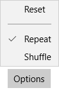

<!-- Class syntax.
public class MenuFlyout : Windows.UI.Xaml.Controls.Primitives.FlyoutBase, Windows.UI.Xaml.Controls.IMenuFlyout, Windows.UI.Xaml.Controls.IMenuFlyout2
-->

# Windows.UI.Xaml.Controls.MenuFlyout

## -description

Represents a flyout that displays a menu of commands.


## -xaml-syntax

```xaml
<MenuFlyout>
  oneOrMoreItems
</MenuFlyout>
```

## -remarks

> [!TIP]
> For more info, design guidance, and code examples, see [Menus and context menus](/windows/uwp/design/controls-and-patterns/menus).

MenuFlyout temporarily displays a list of commands or options related to what the user is currently doing.



Use a [Flyout](flyout.md) control to display single items and a MenuFlyout control to show a menu of items. For more info, see [Menus and context menus](/windows/uwp/controls-and-patterns/menus).

A MenuFlyout control can be used as the value of the [Button.Flyout](button_flyout.md) property. This is usually set in XAML as part of a UI definition of the page. [Button](button.md) is the only control that has a dedicated **Flyout** property. When set as [Button.Flyout](button_flyout.md), the MenuFlyout displays when the button is tapped or otherwise invoked.

To associate a MenuFlyout with other controls, use the [ContextFlyout](../windows.ui.xaml/uielement_contextflyout.md) property that's available on any UIElement.

## Notes for previous versions

> [!NOTE]
> The ContextFlyout property is not available prior to the Windows 10 Anniversary Update (SDK version 14393). For earlier versions, use the [FlyoutBase.AttachedFlyout](/uwp/api/windows.ui.xaml.controls.primitives.flyoutbase.attachedflyout) attached property.

You can use the [FlyoutBase.AttachedFlyout](/uwp/api/windows.ui.xaml.controls.primitives.flyoutbase.attachedflyout) attached property to associate a MenuFlyout with other controls. When a MenuFlyout is assigned to other UI elements using [FlyoutBase.AttachedFlyout](/uwp/api/windows.ui.xaml.controls.primitives.flyoutbase.attachedflyout), you must call either the [ShowAt](../windows.ui.xaml.controls.primitives/flyoutbase_showat_157739403.md) method or the static [ShowAttachedFlyout](../windows.ui.xaml.controls.primitives/flyoutbase_showattachedflyout_1146189011.md) method to display the flyout.

In addition to the members listed above, there are other members of the base class [FlyoutBase](../windows.ui.xaml.controls.primitives/flyoutbase.md) that are often used in typical MenuFlyout scenarios:

+ [FlyoutBase.AttachedFlyout](/uwp/api/windows.ui.xaml.controls.primitives.flyoutbase.attachedflyout): an attached property that associates a MenuFlyout with a particular UI element (this can be any [FrameworkElement](../windows.ui.xaml/frameworkelement.md) derived class).
+ [ShowAttachedFlyout](../windows.ui.xaml.controls.primitives/flyoutbase_showattachedflyout_1146189011.md): a static method that can determine whether a flyout is already associated with a UI element through a [FlyoutBase.AttachedFlyout](/uwp/api/windows.ui.xaml.controls.primitives.flyoutbase.attachedflyout) usage. If so, the method calls [ShowAt](../windows.ui.xaml.controls.primitives/flyoutbase_showat_157739403.md) internally, using the [FrameworkElement](../windows.ui.xaml/frameworkelement.md) that you specified.

### Control style and template

You can modify the default [Style](../windows.ui.xaml/style.md) and [ControlTemplate](controltemplate.md) to give the control a unique appearance. For information about modifying a control's style and template, see [Styling controls](/windows/uwp/controls-and-patterns/styling-controls). The default style, template, and resources that define the look of the control are included in the `generic.xaml` file. For design purposes, `generic.xaml` is available locally with the SDK or NuGet package installation.

- **[WinUI Styles (recommended)](/windows/apps/design/style/xaml-styles#winui-and-styles):** For updated styles from WinUI, see `\Users\<username>\.nuget\packages\microsoft.ui.xaml\<version>\lib\uap10.0\Microsoft.UI.Xaml\Themes\generic.xaml`.
- **Non-WinUI styles:** For built-in styles, see `%ProgramFiles(x86)%\Windows Kits\10\DesignTime\CommonConfiguration\Neutral\UAP\<SDK version>\Generic\generic.xaml`.

Locations might be different if you customized the installation. Styles and resources from different versions of the SDK might have different values.

XAML also includes resources that you can use to modify the colors of a control in different visual states without modifying the control template. Modifying these resources is preferred to setting properties such as [Background](control_background.md) and [Foreground](control_foreground.md). For more info, see the [Light-weight styling](/windows/apps/design/style/xaml-styles#lightweight-styling) section of the [XAML styles](/windows/apps/design/style/xaml-styles) article. Light-weight styling resources are available starting in Windows 10, version 1607 (SDK 14393).

### Version history

| Windows version | SDK version | Value added |
| -- | -- | -- |
| 1809 | 17763 | ShowAt |

## -examples

> [!TIP]
> For more info, design guidance, and code examples, see [Menus and context menus](/windows/uwp/design/controls-and-patterns/menus).
>
> If you have the **WinUI 2 Gallery** app installed, click here to [open the app and see the MenuFlyout in action](winui2gallery:/item/MenuFlyout).
> + [Get the WinUI 2 Gallery app (Microsoft Store)](https://www.microsoft.com/store/productId/9MSVH128X2ZT)
> + [Get the source code (GitHub)](https://github.com/Microsoft/WinUI-Gallery)

This example creates a [MenuFlyout class](/uwp/api/Windows.UI.Xaml.Controls.MenuFlyout) and uses the [ContextFlyout](/uwp/api/windows.ui.xaml.uielement.contextflyout) property, a property available to most controls, to show the [MenuFlyout class](/uwp/api/Windows.UI.Xaml.Controls.MenuFlyout) as a context menu.

```xaml
<Rectangle Height="100" Width="100">
  <Rectangle.ContextFlyout>
    <MenuFlyout>
      <MenuFlyoutItem Text="Change color" Click="ChangeColorItem_Click" />
    </MenuFlyout>
  </Rectangle.ContextFlyout>
  <Rectangle.Fill>
    <SolidColorBrush x:Name="rectangleFill" Color="Red" />
  </Rectangle.Fill>
</Rectangle>
```

```csharp
private void ChangeColorItem_Click(object sender, RoutedEventArgs e)
{
    // Change the color from red to blue or blue to red.
    if (rectangleFill.Color == Windows.UI.Colors.Red)
    {
        rectangleFill.Color = Windows.UI.Colors.Blue;
    }
    else
    {
        rectangleFill.Color = Windows.UI.Colors.Red;
    }
}
```

The next example is nearly identical, but instead of using the [ContextFlyout](/uwp/api/windows.ui.xaml.uielement.contextflyout) property to show the [MenuFlyout class](/uwp/api/Windows.UI.Xaml.Controls.MenuFlyout) as a context menu, the example uses the [FlyoutBase.ShowAttachedFlyout](/uwp/api/windows.ui.xaml.controls.primitives.flyoutbase.showattachedflyout) property to show it as a menu.

```xaml
<Rectangle
  Height="100" Width="100"
  Tapped="Rectangle_Tapped">
  <FlyoutBase.AttachedFlyout>
    <MenuFlyout>
      <MenuFlyoutItem Text="Change color" Click="ChangeColorItem_Click" />
    </MenuFlyout>
  </FlyoutBase.AttachedFlyout>
  <Rectangle.Fill>
    <SolidColorBrush x:Name="rectangleFill" Color="Red" />
  </Rectangle.Fill>
</Rectangle>
```

```csharp
private void Rectangle_Tapped(object sender, TappedRoutedEventArgs e)
{
    FlyoutBase.ShowAttachedFlyout((FrameworkElement)sender);
}

private void ChangeColorItem_Click(object sender, RoutedEventArgs e)
{
    // Change the color from red to blue or blue to red.
    if (rectangleFill.Color == Windows.UI.Colors.Red)
    {
        rectangleFill.Color = Windows.UI.Colors.Blue;
    }
    else
    {
        rectangleFill.Color = Windows.UI.Colors.Red;
    }
}
```

This example shows how you can add and remove menu items at runtime based on changing conditions in your app.

```xaml
<StackPanel Margin="40" Width="220">
    <Rectangle x:Name="Rect1" Height="100" Width="200" 
               Stroke="Black" StrokeThickness="1" Fill="White">
        <Rectangle.ContextFlyout>
            <MenuFlyout x:Name="RectangleColorMenu"/>
        </Rectangle.ContextFlyout>
    </Rectangle>

    <StackPanel>
        <TextBlock TextWrapping="WrapWholeWords"
                   Text="Check colors to include in the menu, then choose a color from the context menu on the rectangle."/>
        <CheckBox Content="Blue" Click="CheckBox_Click" Tag="blue"/>
        <CheckBox Content="Green" Click="CheckBox_Click" Tag="green"/>
        <CheckBox Content="Red" Click="CheckBox_Click" Tag="red"/>
        <CheckBox Content="Yellow" Click="CheckBox_Click" Tag="yellow"/>
    </StackPanel>
</StackPanel>
```

```csharp
private void CheckBox_Click(object sender, RoutedEventArgs e)
{
    // Using the Tag property lets you localize the display name
    // without affecting functionality.
    var cb = (CheckBox)sender;
    if (cb.IsChecked == true)
    {
        AddMenuItem(cb.Tag.ToString(), cb.Content.ToString());
    }
    else
    {
        RemoveMenuItem(cb.Content.ToString());
    }
}

private void AddMenuItem(string colorString, string locColorName)
{
    // Set the color.
    Color newColor = Colors.Blue;
    if (colorString == "green")
        newColor = Colors.Green;
    else if (colorString == "red")
        newColor = Colors.Red;
    else if (colorString == "yellow")
        newColor = Colors.Yellow;

    // Create the menu item.
    var newMenuItem = new MenuFlyoutItem();
    newMenuItem.Text = locColorName;
    newMenuItem.Click += (s, e1) =>
    {
        Rect1.Fill = new SolidColorBrush(newColor);
    };

    // Add the item to the menu.
    RectangleColorMenu.Items.Add(newMenuItem);

    // Sort the menu so it's always consistent.
    var orderedItems =  RectangleColorMenu.Items.OrderBy(i => ((MenuFlyoutItem)i).Text).ToList();
    RectangleColorMenu.Items.Clear();
    foreach (var item in orderedItems)
    {
        RectangleColorMenu.Items.Add(item);
    }
}

private void RemoveMenuItem(string locColorName)
{
    // Get any menu items to remove and remove them.
    var items = RectangleColorMenu.Items.Where(i => ((MenuFlyoutItem)i).Text == locColorName);
    foreach (MenuFlyoutItem item in items)
    {
        RectangleColorMenu.Items.Remove(item);
    }
}
```

## -see-also

[Menus and context menus overview](/windows/uwp/controls-and-patterns/menus), [MenuFlyoutPresenter](menuflyoutpresenter.md), [FlyoutBase](../windows.ui.xaml.controls.primitives/flyoutbase.md), [Flyout](flyout.md), [Button.Flyout](button_flyout.md), [Attached properties overview](/windows/uwp/xaml-platform/attached-properties-overview), [Context menu sample (Windows 10)](https://github.com/Microsoft/Windows-universal-samples/tree/master/Samples/XamlContextMenu), [Commanding sample](https://github.com/Microsoft/Windows-universal-samples/tree/master/Samples/XamlCommanding), [Context menu (XAML) sample](https://github.com/Microsoft/Windows-universal-samples/tree/master/Samples/XamlContextMenu)
