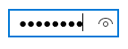

<!-- Class syntax.
public class PasswordBox : Windows.UI.Xaml.Controls.Control, Windows.UI.Xaml.Controls.IPasswordBox, Windows.UI.Xaml.Controls.IPasswordBox2, Windows.UI.Xaml.Controls.IPasswordBox3
-->

# Windows.UI.Xaml.Controls.PasswordBox

## -description
Represents a control for entering passwords.


## -xaml-syntax
```xaml
<PasswordBox .../>
```


## -remarks

> [!TIP]
> For more info, design guidance, and code examples, see [Password box](/windows/uwp/design/controls-and-patterns/password-box).

PasswordBox lets a user enter a masked password.



The user can enter a single line of non-wrapping text in a PasswordBox control. The text is not displayed while it is entered; only password characters that mask the text are displayed. You can specify this password character by setting the [PasswordChar](passwordbox_passwordchar.md) property.

Use the [Password](passwordbox_password.md) property to get or set the content of the PasswordBox. Handle the [PasswordChanged](passwordbox_passwordchanged.md) event to get the [Password](passwordbox_password.md) value while the user enters it.

For more info, see [PasswordBox control guide](/windows/uwp/design/controls-and-patterns/password-box).

### Password reveal mode

The [PasswordRevealMode](passwordbox_passwordrevealmode.md) property lets you customize the password viewing experience. By default, the PasswordBox has a built-in button that the user can press to display the password text. When the user releases it, the password is automatically hidden again. Note that due to security reasons that button is shown only when the PasswordBox receives focus for the first time and a character is entered. If the PasswordBox loses focus and then regains focus, the button is not shown again unless the password is cleared and character entry starts over.

Windows 10, version 1607, introduces a new keyboard shortcut for accessibility. When the focus is in the PasswordBox and the password reveal button is visible, the user can press and hold Alt+F8 to reveal their password. When they let go of either key press, the password is hidden again.


You can hide the password reveal button, or provide a custom UI to let the user reveal the password. For more info and examples, see [PasswordRevealMode](passwordbox_passwordrevealmode.md) and [PasswordBox control guide](/windows/uwp/design/controls-and-patterns/password-box).

> [!NOTE]
> Use the [PasswordRevealMode](passwordbox_passwordrevealmode.md) property instead of the [IsPasswordRevealButtonEnabled](passwordbox_ispasswordrevealbuttonenabled.md) property. [IsPasswordRevealButtonEnabled](passwordbox_ispasswordrevealbuttonenabled.md) is deprecated in Windows 10 and any value is ignored.

### Control style and template

You can modify the default [Style](../windows.ui.xaml/style.md) and [ControlTemplate](controltemplate.md) to give the control a unique appearance. For information about modifying a control's style and template, see [Styling controls](/windows/uwp/controls-and-patterns/styling-controls). The default style, template, and resources that define the look of the control are included in the `generic.xaml` file. For design purposes, `generic.xaml` is available locally with the SDK or NuGet package installation.

- **[WinUI Styles (recommended)](/windows/apps/design/style/xaml-styles#winui-and-styles):** For updated styles from WinUI, see `\Users\<username>\.nuget\packages\microsoft.ui.xaml\<version>\lib\uap10.0\Microsoft.UI.Xaml\Themes\generic.xaml`.
- **Non-WinUI styles:** For built-in styles, see `%ProgramFiles(x86)%\Windows Kits\10\DesignTime\CommonConfiguration\Neutral\UAP\<SDK version>\Generic\generic.xaml`.

Locations might be different if you customized the installation. Styles and resources from different versions of the SDK might have different values.

XAML also includes resources that you can use to modify the colors of a control in different visual states without modifying the control template. Modifying these resources is preferred to setting properties such as [Background](control_background.md) and [Foreground](control_foreground.md). For more info, see the [Light-weight styling](/windows/apps/design/style/xaml-styles#lightweight-styling) section of the [XAML styles](/windows/apps/design/style/xaml-styles) article. Light-weight styling resources are available starting in Windows 10, version 1607 (SDK 14393).

Resources that start with `TextControl` are shared by [TextBox](textbox.md), `PasswordBox`, [RichEditBox](richeditbox.md), and [AutoSuggestBox](autosuggestbox.md). Changes to these resources will affect all four controls.

### Notes for previous versions

> **Windows 8.x**
> Use the [IsPasswordRevealButtonEnabled](passwordbox_ispasswordrevealbuttonenabled.md) property to specify whether the user can see the password, or see only the masking characters.

In Windows, the user reveals the password by pressing and holding a button in the text entry box. The password is automatically hidden when the user stops pressing the button.

In Windows Phone, the user reveals the password by checking a checkbox, so the password can stay shown while the user in entering it. (For more info on implementing this behavior in Universal Windows Platform (UWP) apps, see [PasswordRevealMode](passwordbox_passwordrevealmode.md).)

### Version history

| Windows version | SDK version | Value added |
| -- | -- | -- |
| 1709 | 16299 | PasswordChanging |
| 1809 | 17763 | CanPasteClipboardContent |
| 1809 | 17763 | Description |
| 1809 | 17763 | PasteFromClipboard |
| 1809 | 17763 | SelectionFlyout |

## -examples

> [!TIP]
> For more info, design guidance, and code examples, see [Password box](/windows/apps/design/controls/password-box).

> [!div class="nextstepaction"]
> [Open the WinUI 2 Gallery app and see the PasswordBox in action](winui2gallery:/item/PasswordBox)

> The **WinUI 2 Gallery** app includes interactive examples of most WinUI 2 controls, features, and functionality. Get the app from the [Microsoft Store](https://www.microsoft.com/store/productId/9MSVH128X2ZT) or get the source code on [GitHub](https://github.com/Microsoft/WinUI-Gallery/tree/winui2).

This example shows a PasswordBox control that demonstrates the [Password](passwordbox_password.md) property and the [PasswordChanged](passwordbox_passwordchanged.md) event. When the user enters text into this PasswordBox, it's checked to see if it's the literal value, "Password". If it is, a message is displayed to the user.

```xaml
<PasswordBox x:Name="passwordBox" Width="200" MaxLength="16"
             PasswordChanged="passwordBox_PasswordChanged"/>
           
<TextBlock x:Name="statusText" Margin="10" HorizontalAlignment="Center"/>
```

```csharp

private void passwordBox_PasswordChanged(object sender, RoutedEventArgs e)
{
    if (passwordBox.Password == "Password")
    {
        statusText.Text = "'Password' is not allowed as a password.";
    }
    else
    {
        statusText.Text = string.Empty;
    }
}
```

```vb

Private Sub passwordBox_PasswordChanged(sender As Object, e As RoutedEventArgs)
    If passwordBox.Password = "Password" Then
        statusText.Text = "'Password' is not allowed as a password."
    Else
        statusText.Text = String.Empty
    End If
End Sub
```

## -see-also
[Password box overview](/windows/uwp/design/controls-and-patterns/password-box), [TextBox](textbox.md), [Controls list](/windows/uwp/design/controls-and-patterns/)
