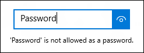

<!-- Property syntax
public Windows.UI.Xaml.Controls.PasswordRevealMode PasswordRevealMode { get;  set; }
-->

# Windows.UI.Xaml.Controls.PasswordBox.PasswordRevealMode

## -description
Gets or sets a value that specifies whether the password is always, never, or optionally obscured.


## -property-value
A value of the enumeration that specifies whether the password is always, never, or optionally obscured. The default is **Peek**.

## -remarks
PasswordRevealMode replaces [IsPasswordRevealButtonEnabled](passwordbox_ispasswordrevealbuttonenabled.md) to give you more options for how the user is able to view their password. The [IsPasswordRevealButtonEnabled](passwordbox_ispasswordrevealbuttonenabled.md) property is ignored.

To change the character used to obscure the password, set the [PasswordChar](passwordbox_passwordchar.md) property.

### Peek mode

By default, the password reveal button (or "peek" button) is shown. The user must continuously press the button to view the password, so that a high level of security is maintained.



The value of this property is not the only factor that determines whether a password reveal button is visible to the user. Other factors include whether the control is displayed above a minimum width, whether the [PasswordBox](passwordbox.md) has focus, and whether the text entry field contains at least one character. Note that due to security reasons the password reveal button is shown only when the [PasswordBox](passwordbox.md) receives focus for the first time and a character is entered. If the [PasswordBox](passwordbox.md) loses focus and then regains focus, the reveal button is not shown again unless the password is cleared and character entry starts over.

> [!NOTE]
> Prior to Windows 10, the password reveal button was not shown by default. If the security of your app requires that the password is always obscured, be sure to set PasswordRevealMode to **Hidden**.


### Hidden and Visible modes

The other [PasswordRevealMode](passwordrevealmode.md) enumeration values, **Hidden** and **Visible**, hide the password reveal button and let you programmatically manage whether the password is obscured.

To always obscure the password, set PasswordRevealMode to **Hidden**. Unless you need the password to be always obscured, you can provide a custom UI to let the user toggle the PasswordRevealMode between **Hidden** and **Visible**.

In previous versions of Windows Phone, [PasswordBox](passwordbox.md) used a [CheckBox](checkbox.md) to toggle whether the password was obscured. You can create a similar UI for your app, as shown in the example. You can also use other controls, like [ToggleButton](../windows.ui.xaml.controls.primitives/togglebutton.md), to let the user switch modes.


## -examples
This example shows how to use a [CheckBox](checkbox.md) to let a user switch the reveal mode of a [PasswordBox](passwordbox.md).

```xaml
<StackPanel Width="200">
    <PasswordBox Name="passwordBox1" 
                 PasswordRevealMode="Hidden"/>
    <CheckBox Name="revealModeCheckBox" Content="Show password"
              IsChecked="False" 
              Checked="CheckBox_Changed" Unchecked="CheckBox_Changed"/>
</StackPanel>
```

```csharp
private void CheckBox_Changed(object sender, RoutedEventArgs e)
{
    if (revealModeCheckBox.IsChecked == true)
    {
        passwordBox1.PasswordRevealMode = PasswordRevealMode.Visible;
    }
    else
    {
        passwordBox1.PasswordRevealMode = PasswordRevealMode.Hidden;
    }
}
```

```vb

Private Sub CheckBox_Changed(sender As Object, e As RoutedEventArgs)
    If revealModeCheckBox.IsChecked = True Then
        passwordBox1.PasswordRevealMode = PasswordRevealMode.Visible
    Else
        passwordBox1.PasswordRevealMode = PasswordRevealMode.Hidden
    End If
End Sub
```


## -see-also
[PasswordRevealMode](passwordrevealmode.md)
